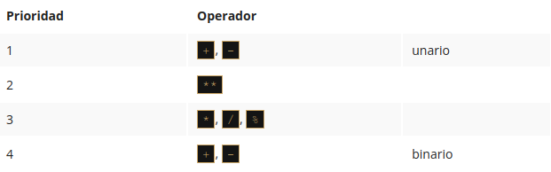
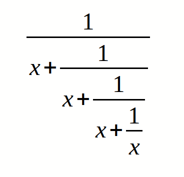

# Fundamentos de Programación en Python

## Módulo 2

* Tipos de datos y métodos básicos de formateo, conversión de datos, entrada y salida de datos.
* Operadores
* Variables

********

### 2.1.1 Tu primer programa

#### ¡Hola, Mundo! 🌎️
```python
print("¡Hola, Mundo!")
```

Como puedes ver, el primer programa consta de las siguientes partes:

* La palabra ```print.```
* Un paréntesis de apertura.
* Una comilla.
* Una línea de texto: ```¡Hola, Mundo!```.
* Otra comilla.
* Un paréntesis de cierre.

Cada uno de los elementos anteriores juega un papel muy importante en el código.

#### La función ```print()``` 😶‍🌫️️

La palabra ```print``` que puedes ver aquí es el nombre de una función. Eso no significa que dondequiera que aparezca esta palabra, será siempre el nombre de una función. El significado de la palabra proviene del contexto en el cual se haya utilizado la palabra.

Una función (en este contexto) es una parte separada del código de computadora el cual es capaz de:

* **Causar algún efecto** (por ejemplo, enviar texto a la terminal, crear un archivo, dibujar una imagen, reproducir un sonido, etc.); esto es algo completamente inaudito en el mundo de las matemáticas.
* **Evaluar un valor o algunos valores** (por ejemplo, la raíz cuadrada de un valor o la longitud de un texto dado); esto es lo que hace que las funciones de Python sean parientes de los conceptos matemáticos.

Además, muchas de las funciones de Python pueden hacer las dos cosas anteriores juntas.

_¿De dónde provienen las funciones?_

* Pueden venir de Python mismo. La función ```print``` es una de este tipo; dicha función es un valor agregado de Python junto con su entorno (está integrada); no tienes que hacer nada especial (por ejemplo, pedirle a alguien algo) si quieres usarla.
* Pueden provenir de uno o varios de los módulos de Python llamados complementos; algunos de los módulos vienen con Python, otros pueden requerir una instalación por separado, cual sea el caso, todos deben estar conectados explícitamente con el código (te mostraremos cómo hacer esto pronto).
* Puedes escribirlas tú mismo, colocando tantas funciones como desees y necesites dentro de su programa para hacerlo más simple, claro y elegante.

El nombre de la función debe ser significativo (el nombre de la función print es evidente), imprime en la terminal.

Como se dijo anteriormente, una función puede tener:

* Un efecto.
* Un resultado.

También hay un tercer componente de la función, muy importante, el o los **argumento**(s).

Las funciones matemáticas usualmente toman un argumento, por ejemplo, sen(x) toma una x, que es la medida de un ángulo.

Las funciones de Python, por otro lado, son más versátiles. Dependiendo de las necesidades individuales, pueden aceptar cualquier número de argumentos, tantos como sea necesario para realizar sus tareas. 

⚠️ Nota: algunas funciones de Python no necesitan ningún argumento. ⚠️

A pesar del número de argumentos necesarios o proporcionados, las funciones de Python demandan fuertemente la presencia de un par de paréntesis - el de apertura y de cierre, respectivamente.

```python
print("¡Hola, Mundo!")
```

El único argumento entregado a la función ```print()``` en este ejemplo es una cadena.

Como se puede ver, la cadena está delimitada por comillas - de hecho, las comillas forman la cadena, recortan una parte del código y le asignan un significado diferente.

Podemos imaginar que las comillas significan algo así: _el texto entre nosotros no es un código. No está diseñado para ser ejecutado, y se debe tomar tal como está._

El nombre de la función (print en este caso) junto con los paréntesis y los argumentos, forman la **invocación de la función**.

Qué sucede cuando Python encuentra una invocación como la que está a continuación?

```python
nombreFunción(argumento)
```

1. Primero, Python comprueba si el nombre especificado es legal (explora sus datos internos para encontrar una función existente del nombre; si esta búsqueda falla, Python cancela el código).
2. En segundo lugar, Python comprueba si los requisitos de la función para el número de argumentos le permiten invocar la función de esta manera (por ejemplo, si una función específica exige exactamente dos argumentos, cualquier invocación que entregue solo un argumento se considerará errónea y abortará la ejecución del código).
3. Tercero, Python deja el código por un momento y salta dentro de la función que se desea invocar; por lo tanto, también toma los argumentos y los pasa a la función.
4. Cuarto, la función ejecuta el código, provoca el efecto deseado (si lo hubiera), evalúa el (los) resultado(s) deseado(s) y termina la tarea.
5. Finalmente, Python regresa al código (al lugar inmediatamente después de la invocación) y reanuda su ejecución.


##### LABORATORIO 🥽️🥼️
Tiempo Estimado
5 minutos

Nivel de dificultad
Muy fácil

**Objetivos**

* Familiarizarse con la función print() y sus capacidades de formateo.
* Experimentar con el código de Python.

**Escenario**

El comando print() , el cual es una de las directivas más sencillas de Python, 
simplemente imprime una línea de texto en la pantalla.

En tu primer laboratorio:

1. Utiliza la función print() para imprimir la linea "¡Hola, Mundo!" en la pantalla.
2. Una vez hecho esto, utiliza la función print() nuevamente, pero esta vez imprime tu nombre.
3. Elimina las comillas dobles y ejecuta el código. Observa la reacción de Python. ¿Qué tipo de error se produce?
4. Luego, elimina los paréntesis, vuelve a poner las comillas dobles y vuelve a ejecutar el código. ¿Qué tipo de error se produce esta vez?
5. Experimenta tanto como puedas. Cambia las comillas dobles a comillas simples, utiliza múltiples funciones print() en la misma línea y luego en líneas diferentes. Observa que es lo que ocurre.


***Tres preguntas importantes deben ser respondidas antes de continuar:***


**¿Cuál es el efecto que causa la función ```print()```?**

El efecto es muy útil y espectacular. La función toma los argumentos (puede aceptar más de un argumento y también puede aceptar menos de un argumento) los convierte en un formato legible para el ser humano si es necesario (como puedes sospechar, las cadenas no requieren esta acción, ya que la cadena ya está legible) y envía los datos resultantes al dispositivo de salida (generalmente la consola); en otras palabras, cualquier cosa que se ponga en la función de ```print()``` aparecerá en la pantalla.

No es de extrañar entonces, que de ahora en adelante, utilizarás ```print()``` muy intensamente para ver los resultados de tus operaciones y evaluaciones.

**¿Qué argumentos espera ```print()```?**

Cualquiera. Te mostraremos pronto que ```print()```) puede operar con prácticamente todos los tipos de datos ofrecidos por Python. Cadenas, números, caracteres, valores lógicos, objetos: cualquiera de estos se puede pasar con éxito a ```print()```.

**¿Qué valor evalúa la función ```print()```?**

Ninguno. Su efecto es suficiente - ```print()``` no evalúa nada.

##### LOS CARACTERES DE ESCAPE Y NUEVA LÍNEA ↖️


Hemos modificado el código de nuevo. Obsérvalo con cuidado.

Hay dos cambios muy sutiles: hemos insertado un par extraño de caracteres dentro del texto. Se ven así: ```\n```.


Curiosamente, mientras tu ves dos caracteres, Python ve solo uno.

La barra invertida (\) tiene un significado muy especial cuando se usa dentro de las cadenas, es llamado el carácter de escape.

La palabra escape debe entenderse claramente- significa que la serie de caracteres en la cadena se escapa (detiene) por un momento (un momento muy corto) para introducir una inclusión especial.

En otras palabras, la barra invertida no significa nada, sino que es solo un tipo de anuncio, de que el siguiente carácter después de la barra invertida también tiene un significado diferente.

La letra *_n_* colocada después de la barra invertida proviene de la palabra _newline_ (nueva linea).

Tanto la barra diagonal inversa como la n forman un símbolo especial denominado carácter de nueva línea (newline character), que incita a la consola a iniciar una nueva línea de salida.

 ##### UTILIZANDO ARGUMENTOS MÚLTIPLES

Hasta ahora se ha probado el comportamiento de la función ```print()``` sin argumentos y con un argumento. También vale la pena intentar alimentar la función ```print()``` con más de un argumento.


```python
print("La Witsi Witsi Arañar" , "subió" , "a su telaraña.")
```

Los argumentos están separados por comas. Se han rodeado de espacios para hacerlos más visibles, pero no es realmente necesario y no se hará más.
En este caso, las comas que separan los argumentos desempeñan un papel completamente diferente a la coma dentro de la cadena. El primero es una parte de la sintaxis de Python, el segundo está destinado a mostrarse en la consola.

Dos conclusiones surgen de este ejemplo:

1. Una función ```print()``` invocada con más de un argumento genera la salida en una sola línea.
2. La función ```print()``` pone un espacio entre los argumentos emitidos por iniciativa propia.

⚠️La forma en que pasamos los argumentos a la función print() es la más común en Python, y se denomina manera posicional (este nombre proviene del hecho de que el significado del argumento está dictado por su posición, por ejemplo, el segundo argumento se emitirá después del primero, y no al revés).⚠️

##### ARGUMENTOS DE PALABRA CLAVE

El mecanismo se llama argumentos de palabras clave. El nombre se deriva del hecho de que el significado de estos argumentos no se toma de su ubicación (posición) sino de la palabra especial (palabra clave) utilizada para identificarlos.

La función print() tiene dos argumentos de palabras clave que se pueden utilizar para estos propósitos. El primero de ellos se llama ***end***.

Para utilizarlo es necesario conocer algunas reglas:

* Un argumento de palabra clave consta de tres elementos: una palabra clave que identifica el argumento (```end``` -termina aquí);  un signo de igual (=); y un valor asignado a ese argumento.
* Cualquier argumento de palabra clave debe ponerse después 
del último argumento posicional (esto es muy importante).

```python
print("Mi nombre es", "Python.", end=" ")
print("Monty Python.")

>>> Mi nombre es Python. Monty Python.
```

Y ahora, es el momento de intentar algo más difícil.

Si observas detenidamente, verás que hemos utilizado el argumento end , pero su cadena asignada está vacía (no contiene ningún carácter).

¿Qué pasará ahora? Ejecuta el programa en el editor para averiguarlo.

Ya que al argumento end se le ha asignado a nada, la función print() tampoco genera nada, una vez que se hayan agotado los argumentos posicionales.

```python
print("Mi nombre es ", end=" UwU ")
print("Monty Python.")

>>> Mi nombre es Monty Python.
```

La cadena asignada al argumento de la palabra clave end puede ser de cualquier longitud. Experimenta con ello si gustas.

```python
print("Mi nombre es", end=" UwU ")
print("Gatovsky.")

>>> Mi nombre es UwU Gatovsky.
```


Se estableció anteriormente que la función ```print()``` separa los argumentos generados con espacios. Este comportamiento también puede ser cambiado.

El argumento de palabra clave que puede hacer esto se denomina **sep** (como separador).

```python
print("Mi", "nombre", "es", "Monty", "Python.", sep="-")

>>> Mi-nombre-es-Monty-Python.
```

La función ```print()``` ahora utiliza un guión, en lugar de un espacio, para separar los argumentos generados.

Nota: el valor del argumento ```sep``` también puede ser una cadena vacía. Pruébalo tu mismo.

Ambos argumentos de palabras clave pueden mezclarse en una invocación, como aquí en la ventana del editor.

El ejemplo no tiene mucho sentido, pero representa visiblemente las interacciones entre end y sep.😉️

```python
print("Mi", "nombre", "es", sep="_", end="*")
print("Monty", "Python.", sep="*", end="*\n")

>>> Mi_nombre_es*Monty*Python.*
```

```python
print("Fundamentos","Programación","en", sep="***", end="...")
print("Python")

>>> Fundamentos***Programación***en...Python
```


*************************

### 2.1.2 Literales de Python

#### Los datos en sí mismos

Ahora que tienes un poco de conocimiento acerca de algunas de las poderosas características que ofrece la función ```print()```, es tiempo de aprender sobre cuestiones nuevas, y un nuevo término - el **literal**.

***Un literal se refiere a datos cuyos valores están determinados por el literal mismo.***

Debido a que es un concepto un poco difícil de entender, un buen ejemplo puede ser muy útil.

Observa los siguientes dígitos:

```python
123
```

¿Puedes adivinar qué valor representa? claro que puedes - es ciento veintitrés.

Que tal este:

```python
c
```

¿Representa algún valor? Tal vez. Puede ser el símbolo de la velocidad de la luz, por ejemplo. También puede representar la constante de integración. Incluso la longitud de una hipotenusa en el Teorema de Pitágoras. Existen muchas posibilidades.

No se puede elegir el valor correcto sin algo de conocimiento adicional.

Y esta es la pista: ```123``` es un literal, y ```c``` no lo es.

Se utilizan literales para ***codificar datos y ponerlos dentro del código***. Ahora mostraremos algunas convenciones que se deben seguir al utilizar Python.

Comencemos con un sencillo experimento, observa el fragmento de código en el editor.

La primera línea luce familiar. La segunda parece ser errónea debido a la falta visible de comillas.

Intenta ejecutarlo.

```python
print("2")
print(2)
print(0x19)
print(1e-2)
print(4**2)
print(5/5)

>>> 2
    2
    25
    0.01
    16
    1.0
```


¿Qué paso? ¿Qué significa?

A través de este ejemplo, encuentras dos tipos diferentes de literales:

* Una cadena, la cual ya conoces.
* Y un número entero, algo completamente nuevo.

La función ```print()``` los muestra exactamente de la misma manera. Sin embargo, internamente, la memoria de la computadora los almacena de dos maneras completamente diferentes. La cadena existe como eso, solo una cadena, una serie de letras.

El número es convertido a una representación maquina (una serie de **bits**). La función ```print()``` es capaz de mostrar ambos en una forma legible para humanos.

**ENTEROS**

Quizá ya sepas un poco acerca de como las computadoras hacen cálculos con números. Tal vez has escuchado del ***sistema binario***, y como es que ese es el sistema que las computadoras utilizan para almacenar números y como es que pueden realizar cualquier tipo de operaciones con ellos.

No exploraremos las complejidades de los sistemas numéricos posicionales, pero se puede afirmar que todos los números manejados por las computadoras modernas son de dos tipos:

* Enteros, es decir, aquellos que no tienen una parte fraccionaria.
* Punto-flotantes (o simplemente flotantes), los cuales contienen (o son capaces de contener) una parte fraccionaría.

Esta definición no es tan precisa, pero es suficiente por ahora.

⚠️ La distinción es muy importante, y la frontera entre estos dos tipos de números es muy estricta. Ambos tipos difieren significativamente en como son almacenados en una computadora y en el rango de valores que aceptan.

La característica del valor numérico que determina el tipo, rango y aplicación se denomina el **tipo**.

⚠️ Si se codifica un literal y se coloca dentro del código de Python, la forma del literal determina la representación (tipo) que Python utilizará para almacenarlo en la memoria.

El proceso es casi como usar lápiz y papel, es simplemente una cadena de dígitos que conforman el número, pero hay una condición, no se deben insertar caracteres que no sean dígitos dentro del número.

Tomemos por ejemplo, el número once millones ciento once mil ciento once. Si tomaras ahorita un lápiz en tu mano, escribirías el siguiente numero: ```11,111,111```, o así: ```11.111.111```, incluso de esta manera: ```11 111 111```.

Es claro que la separación hace que sea más fácil de leer, especialmente cuando el número tiene demasiados dígitos. Sin embargo, Python no acepta estas cosas. Esta **prohibido**.
¿Qué es lo que Python permite? El uso de **guion bajo** en los literales numéricos.

Por lo tanto, el número se puede escribir ya sea así: ```11111111```, o como sigue: ```11_111_111```.

🐍️ Python 3.6 ha introducido el guion bajo en los literales numéricos, permitiendo colocar un guion bajo entre dígitos y después de especificadores de base para mejorar la legibilidad. Esta característica no está disponible en versiones anteriores de Python.

¿Cómo se codifican los números negativos en Python? Como normalmente se hace, agregando un signo de menos. Se puede escribir: ```-11111111```, o ```-11_111_111```.

Los números positivos no requieren un signo positivo antepuesto, pero es permitido, si se desea hacer. Las siguientes líneas describen el mismo número: ```+11111111``` y ```11111111```.

**Enteros: números octales y hexadecimales**

Existen dos convenciones adicionales en Python que no son conocidas en el mundo de las matemáticas. El primero nos permite utilizar un número en su representación **octal**.

Si un numero entero esta precedido por un código ```0O``` o ```0o``` (cero-o), el número será tratado como un valor octal. Esto significa que el número debe contener dígitos en el rango del ```[0..7]``` únicamente.

0o123 es un número octal con un valor (decimal) igual a 83.

```python
print(0o123)

>>> 83
```

La función print() realiza la conversión automáticamente.

La segunda convención nos permite utilizar números en hexadecimal. Dichos números deben ser precedidos por el prefijo ```0x``` o ```0X``` (cero-x).

0x123 es un número hexadecimal con un valor (decimal) igual a 291. La función print() puede manejar estos valores también.

```python
print(0x123)

>>> 291
```

**FLOTANTES**

Ahora es tiempo de hablar acerca de otro tipo, el cual esta designado para representar y almacenar los números que (como lo diría un matemático) tienen una parte decimal no vacía.

Son números que tienen (o pueden tener) una parte fraccionaria después del punto decimal, y aunque esta definición es muy pobre, es suficiente para lo que se desea discutir.

Cuando se usan términos como dos y medio o menos cero punto cuatro, pensamos en números que la computadora considera como números punto-flotante:

```python
2.5
-0.4
```

Como puedes imaginar, el valor de cero punto cuatro puede ser escrito en Python como:

```python
0.4
```

Pero no hay que olvidar esta sencilla regla, se puede omitir el cero cuando es el único dígito antes del punto decimal.

En esencia, el valor 0.4 se puede escribir como:

```python
.4
```

Por ejemplo: el valor de 4.0 puede ser escrito como:
```python
4.
```

Esto no cambiará su tipo ni su valor.

**ENTEROS VS FLOTANTES**

El punto decimal es esencialmente importante para reconocer números punto-flotantes en Python.

Observa estos dos números:

```python
4
4.0
```

Se puede pensar que son idénticos, pero Python los ve de una manera completamente distinta.

4 es un número **entero**, mientras que 4.0 es un número **punto-flotante**.

El punto decimal es lo que determina si es flotante.


Por otro lado, no solo el punto hace que un número sea flotante. Se puede utilizar la letra **e**.

Cuando se desea utilizar números que son muy pequeños o muy grandes, se puede implementar la **notación científica**.

Por ejemplo, la velocidad de la luz, expresada en metros por segundo. Escrita directamente se vería de la siguiente manera: 300000000.

Para evitar escribir tantos ceros, los libros de texto emplean la forma abreviada, la cual probablemente hayas visto: 3 x 10^8.

Se lee de la siguiente manera: tres por diez elevado a la octava potencia.

En Python, el mismo efecto puede ser logrado de una manera similar, observa lo siguiente:

```python
3E8
```

La letra E (también se puede utilizar la letra minúscula e - proviene de la palabra exponente) la cual significa por diez a la n potencia.

Nota:

* El **exponente** (el valor después de la E) debe ser un valor entero.
* La **base** (el valor antes de la E) puede o no ser un valor entero.

**CODIFICANDO FLOTANTES**

Veamos ahora como almacenar números que son muy pequeños (en el sentido de que están muy cerca del cero).

Una constante de física denominada ***"La Constante de Planck"*** (denotada como h), de acuerdo con los libros de texto, tiene un valor de: 6.62607 x 10^-34.

Si se quisiera utilizar en un programa, se debería escribir de la siguiente manera:

```python
6.62607E-34
```

Nota: el hecho de que se haya escogido una de las posibles formas de codificación de un valor flotante no significa que Python lo presentará de la misma manera.

Python podría en ocasiones elegir una **notación diferente**.

Por ejemplo, supongamos que se ha elegido utilizar la siguiente notación:

0.0000000000000000000001

Cuando se corre en Python:

```python
print(0.0000000000000000000001)
```

Este es el resultado:

```python
1e-22
```


Python siempre elige la **presentación más corta del número**, y esto se debe de tomar en consideración al crear literales.


**CADENAS**

Las cadenas se emplean cuando se requiere procesar texto (como nombres de cualquier tipo, direcciones, novelas, etc.), no números.

Ya conoces un poco acerca de ellos, por ejemplo, que las cadenas requieren comillas así como los flotantes necesitan punto decimal.

Este es un ejemplo de una cadena: "Yo soy una cadena."


Sin embargo, hay una cuestión. ¿Cómo se puede codificar una comilla dentro de una cadena que ya está delimitada por comillas?

Supongamos que se desea mostrar un muy sencillo mensaje:

Me gusta  "Monty Python"

¿Cómo se puede hacer esto sin generar un error? Existen dos posibles soluciones.

La primera se basa en el concepto ya conocido del carácter de escape, el cual recordarás se utiliza empleando la diagonal invertida. La diagonal invertida puede también escapar de la comilla. Una comilla precedida por una diagonal invertida cambia su significado, no es un limitador, simplemente es una comilla. Lo siguiente funcionará como se desea:

```python
print("Me gusta \"Monty Python\"")

>>> Me gusta "Monty Python"
```


Nota: ¿Existen dos comillas con escape en la cadena, puedes observar ambas?

La segunda solución puede ser un poco sorprendente. Python puede utilizar una apóstrofe en lugar de una comilla. Cualquiera de estos dos caracteres puede delimitar una cadena, pero para ello se debe ser consistente.

* Si se delimita una cadena con una comilla, se debe cerrar con una comilla.

* Si se inicia una cadena con un apóstrofe, se debe terminar con un apóstrofe.

Este ejemplo funcionará también:

```python
print('Me gusta "Monty Python"')

>>> Me gusta "Monty Python"
```

Nota: en este ejemplo no se requiere nada de escapes.

**VALORES BOOLEANOS**

Para concluir con los literales de Python, existen dos más.

No son tan obvios como los anteriores y se emplean para representar un valor muy abstracto - **la veracidad**.

Cada vez que se le pregunta a Python si un número es más grande que otro, el resultado es la creación de un tipo de dato muy específico - un valor booleano.

El nombre proviene de George Boole (1815-1864), el autor de Las Leyes del Pensamiento, las cuales definen el Algebra Booleana - una parte del algebra que hace uso de dos valores: ***Verdadero*** ✔️ y ***Falso*** ❌️, denotados como 1 y 0.


Un programador escribe un programa, y el programa hace preguntas. Python ejecuta el programa, y provee las respuestas. El programa debe ser capaz de reaccionar acorde a las respuestas recibidas.

Afortunadamente, las computadoras solo conocen dos tipos de respuestas:

* Si, esto es verdad.
* No, esto es falso.

Nunca habrá una respuesta como: No lo sé o probablemente si, pero no estoy seguro.

Python, es entonces, un reptil binario.

Estos dos valores booleanos tienen denotaciones estrictas en Python:

```python
True
False
```

No se pueden cambiar, se deben tomar estos símbolos como son, incluso respetando las mayúsculas y minúsculas.


Reto: ¿Cuál será el resultado del siguiente fragmento de código?

```python
print(True > False)
print(True < False)
```

Ejecuta el código en la terminal. ¿Puedes explicar el resultado?


⚜️**PUNTOS CLAVE**⚜️

1. Literales son notaciones para representar valores fijos en el código. Python tiene varios tipos de literales, es decir, un literal puede ser un número por ejemplo, 123), o una cadena (por ejemplo, "Yo soy un literal.").

2. El **Sistema Binario** es un sistema numérico que emplea 2 como su base. Por lo tanto, un número binario está compuesto por 0s y 1s únicamente, por ejemplo, ```1010``` es ```10``` en decimal.
Los sistemas de numeración Octales y Hexadecimales son similares pues emplean 8 y 16 como sus bases respectivamente. El sistema hexadecimal utiliza los números decimales más seis letras adicionales.

3. Los Enteros (o simplemente **int**) son uno de los tipos numéricos que soporta Python. Son números que no tienen una parte fraccionaria, por ejemplo, 256, o -1 (enteros negativos).

4. Los números **Punto-Flotante** (o simplemente flotantes) son otro tipo numérico que soporta Python. Son números que contienen (o son capaces de contener) una parte fraccionaria, por ejemplo, 1.27.

5. Para codificar un apóstrofe o una comilla dentro de una cadena se puede utilizar el carácter de escape, por ejemplo, 'I\'m happy.', o abrir y cerrar la cadena utilizando un conjunto de símbolos distintos al símbolo que se desea codificar, por ejemplo, "I'm happy." para codificar un apóstrofe, y 'Él dijo "Python", no "typhoon"' para codificar comillas.

6. Los Valores **Booleanos** son dos objetos constantes ***Verdadero** y ***Falso*** empleados para representar valores de verdad (en contextos numéricos 1 es True, mientras que 0 es False).

***EXTRA**

Existe un literal especial más utilizado en Python: el literal **None**. Este literal es llamado un objeto de **NonType** (ningún tipo), y puede ser utilizado para representar la ausencia de un valor. Pronto se hablará más acerca de ello.

******************

### 2.1.3 Operadores

#### Los Operadores Básicos
Un operador es un símbolo del lenguaje de programación, el cual es capaz de realizar operaciones con los valores.

Por ejemplo, como en la aritmética, el signo de + (mas) es un operador el cual es capaz de sumar dos números, dando el resultado de la suma.

Sin embargo, no todos los operadores de Python son tan simples como el signo de mas, veamos algunos de los operadores disponibles en Python, las reglas que se deben seguir para emplearlos, y como interpretar las reglas que realizan.

Se comenzará con los operadores que están asociados con las operaciones aritméticas más conocidas:

```python
+, -, *, /, //, %, **
```


El orden en el que aparecen no es por casualidad. Hablaremos más de ello cuando se hayan visto todos.


***Recuerda: Cuando los datos y operadores se unen, forman juntos expresiones. La expresión más sencilla es el literal.***

#### Operadores aritméticos: exponenciación

Un signo de ```**``` (doble asterisco) es un operador de exponenciación (potencia). El argumento a la izquierda es la base, el de la derecha, el exponente.

Las matemáticas clásicas prefieren una notación con **superíndices**, como el siguiente: 2³. Los editores de texto puros no aceptan esa notación, por lo tanto Python utiliza ** en lugar de la notación matemática, por ejemplo, ```2 ** 3```.

Observa los ejemplos en la ventana del editor.

```python
print(2 ** 3)
print(2 ** 3.)
print(2. ** 3)
print(2. ** 3.)

>>> 8
    8.0
    8.0
    8.0
```


Nota: En los ejemplos, los dobles asteriscos están rodeados de espacios, no es obligatorio hacerlo pero hace que el código sea mas **legible**.

Los ejemplos muestran una característica importante de los operadores numéricos de Python.


❕️**Recuerda**: Es posible formular las siguientes reglas con base en los resultados:

* Cuando ambos ** argumentos son enteros, el resultado es entero también.
* Cuando al menos un ** argumento es flotante, el resultado también es flotante.

Esta es una distinción importante que se debe recordar.

#### Operadores aritméticos: multiplicación
Un símbolo de * (asterisco) es un operador de multiplicación.

Ejecuta el código y revisa si la regla de entero vs flotante aún funciona.

```python
print(2 * 3)
print(2 * 3.)
print(2. * 3)
print(2. * 3.)
```

#### Operadores aritméticos: división

Un símbolo de / (diagonal) es un operador de división.

El valor después de la diagonal es el dividendo, el valor antes de la diagonal es el divisor.

Ejecuta el código y analiza los resultados.

```python
print(6 / 3)
print(6 / 3.)
print(6. / 3)
print(6. / 3.)
```

Deberías de poder observar que hay una excepción a la regla.⚠️

El resultado producido por el operador de división siempre es flotante, sin importar si a primera vista el resultado es flotante: 1 / 2, o si parece ser completamente entero: 2 / 1.

¿Esto ocasiona un problema? Sí, en ocasiones se podrá necesitar que el resultado de una división sea entero, no flotante.

Afortunadamente, Python puede ayudar con eso.


#### Operadores aritméticos: división entera

Un símbolo de // (doble diagonal) es un operador de división entera. Difiere del operador estándar / en dos detalles:

* El resultado carece de la parte fraccionaria, está ausente (para los enteros), o siempre es igual a cero (para los flotantes); esto significa que los resultados siempre son redondeados.
* Se ajusta a la regla entero vs flotante.

Ejecuta el ejemplo debajo y observa los resultados:

```python
print(6 // 3)
print(6 // 3.)
print(6. // 3)
print(6. // 4.)
```

Como se puede observar, una división de entero entre entero da un resultado entero. Todos los demás casos producen flotantes.

```python
2
2.0
2.0
1.0
```


Hagamos algunas pruebas mas avanzadas.

Observa el siguiente fragmento de código:

```python
print(6 // 4)
print(6. // 4)
```

Imagina que se utilizó / en lugar de // - ¿Podrías predecir los resultados?

Si, sería 1.5 en ambos casos. Eso esta claro.

Pero, ¿Qué resultado se debería esperar con una división //?

Ejecuta el código y observa por ti mismo.

```python
1
1.0
```


Lo que se obtiene son dos unos, uno entero y uno flotante.

❕️***El resultado de la división entera siempre se redondea al valor entero inferior mas cercano del resultado de la división no redondeada.*** ❕️

Esto es muy importante: el redondeo siempre va hacia abajo. ⬇️


Observa el código e intenta predecir el resultado nuevamente:

```python
print(-6 // 4)
print(6. // -4)
```

Nota: Algunos de los valores son negativos. Esto obviamente afectara el resultado. ¿Pero cómo?

El resultado es un par de dos negativos. El resultado real (no redondeado) es -1.5 en ambo casos. Sin embargo, los resultados se redondean. El redondeo se hace hacia el valor inferior entero, dicho valor es -2, por lo tanto los resultados son: -2 y -2.0.

```python
-2
-2.0
```

NOTA ⚠️

La division entera también se le suele llamar en inglés **floor division**. Más adelante te cruzarás con este término 😉️

#### Operadores: residuo (módulo)

El siguiente operador es uno muy peculiar, porque no tiene un equivalente dentro de los operadores aritméticos tradicionales.

Su representación gráfica en Python es el símbolo de % (porcentaje), lo cual puede ser un poco confuso.

Piensa en el como una diagonal (operador de división) acompañado por dos pequeños círculos.

El resultado de la operación es el **residuo que queda de la división entera**.

***En otras palabras, es el valor que sobra después de dividir un valor entre otro para producir un resultado entero.***

Nota: el operador en ocasiones también es denominado módulo en otros lenguajes de programación.

Observa el fragmento de código intenta predecir el resultado y después ejecútalo:

```python
print(14 % 4)
```


Como puedes observar, el resultado es dos. Esta es la razón:

* 14 // 4 da como resultado un 3 → esta es la parte entera, es decir el cociente.
* 3 * 4 da como resultado 12 → como resultado de la multiplicación entre el cociente y el divisor.
* 14 - 12 da como resultado 2 → este es el residuo.


El siguiente ejemplo es un poco mas complicado:

```python
print(12 % 4.5)
```

¿Cuál es el resultado?

```python
3.0
```


* 12 // 4.5 = 2.0 
* 2.0 * 4.5 = 9.0
* 12 - 9.0 = 3.0


#### Operadores: como no dividir

Como probablemente sabes, la división entre cero no funciona.

No intentes:

* Dividir entre cero.
* Realizar una división entera entre cero.
* Encontrar el residuo de una división entre cero.

#### Operadores: suma

El símbolo del operador de suma es el + (signo de más), el cual esta completamente alineado a los estándares matemáticos.

De nuevo, observa el siguiente fragmento de código:

```python
print(-4 + 4)
print(-4. + 8)
```

El resultado no debe de sorprenderte. Ejecuta el código y revisa los resultados.

```python
0
4.0
```

#### El operador de resta, operadores unarios y binarios

El símbolo del operador de resta es obviamente - (el signo de menos), sin embargo debes notar que este operador tiene otra función - **puede cambiar el signo de un número.**

Esta es una gran oportunidad para mencionar una distinción muy importante entre operadores **unarios** y **binarios**.

En aplicaciones de resta, el operador de resta espera dos argumentos: el izquierdo (un minuendo en términos aritméticos) y el derecho (un sustraendo).

Por esta razón, el operador de resta es considerado uno de los operadores binarios, así como los demás operadores de suma, multiplicación y división.

Pero el operador negativo puede ser utilizado de una forma diferente, observa la ultima línea de código del siguiente fragmento:

```python
print(-4 - 4)
print(4. - 8)
print(-1.1)

>>> -8
   -4.0
   -1.1
```

Por cierto: también hay un operador + unario. Se puede utilizar de la siguiente manera:

print(+2)

El operador conserva el signo de su único argumento, el de la derecha.

Aunque dicha construcción es sintácticamente correcta, utilizarla no tiene mucho sentido, y sería difícil encontrar una buena razón para hacerlo.

#### Operadores y sus prioridades

Hasta ahora, se ha tratado cada operador como si no tuviera relación con los otros. Obviamente, dicha situación tan simple e ideal es muy rara en la programación real.

También, muy seguido encontrarás más de un operador en una expresión, y entonces esta presunción ya no es tan obvia.

Considera la siguiente expresión:

2 + 3 * 5

Probablemente recordaras de la escuela que las **multiplicaciones preceden a las sumas**.

Seguramente recordaras que primero se debe multiplicar 3 por 5, mantener el 15 en tu memoria y después sumar el 2, dando como resultado el 17.

El fenómeno que causa que algunos operadores actúen antes que otros es conocido como la **jerarquía de prioridades**.⚠️

Python define la jerarquía de todos los operadores, y asume que los operadores de mayor jerarquía deben realizar sus operaciones antes que los de menor jerarquía.

Entonces, si se sabe que la * tiene una mayor prioridad que la +, el resultado final debe de ser obvio.

#### Operadores y sus enlaces

El enlace de un operador determina el orden en que se computan las operaciones de los operadores con la misma prioridad, los cuales se encuentran dentro de una misma expresión.

La mayoría de los operadores de Python tienen un enlazado **hacia la izquierda**, lo que significa que el calculo de la expresión es realizado de izquierda a derecha.‼️

Este simple ejemplo te mostrará como funciona. Observa:

```python
print(9 % 6 % 2)
```


Existen dos posibles maneras de evaluar la expresión:

* De izquierda a derecha: primero 9 % 6 da como resultado 3, y entonces 3 % 2 da como resultado 1.
* De derecha a izquierda: primero 6 % 2 da como resultado 0, y entonces 9 % 0 causa un **error fatal**.

Ejecuta el ejemplo y observa lo que se obtiene.

***El resultado debe ser 1. El operador tiene un enlazado hacia la izquierda. Pero hay una excepción interesante.***

#### Operadores y sus enlaces: exponenciación

Repite el experimento, pero ahora con exponentes.

Utiliza este fragmento de código:

```python
print(2 ** 2 ** 3)
```

Los dos posibles resultados son:

* 2 ** 2 → 4; 4 ** 3 → 64
* 2 ** 3 → 8; 2 ** 8 → 256

Ejecuta el código, ¿Qué es lo que observas?

El resultado muestra claramente que el **OPERADOR DE EXPONENCIACIÓN UTILIZA ENLAZADO HACIA LA DERECHA** ‼️

#### Lista de prioridades

Como eres nuevo a los operadores de Python, no se presenta por ahora una lista completa de las prioridades de los operadores.

En lugar de ello, se mostrarán solo algunos, y se irán expandiendo conforme se vayan introduciendo operadores nuevos.

Observa la siguiente tabla:



Nota: se han enumerado los operadores en orden de la mas alta (1) a la mas baja (4) prioridad.


Intenta solucionar la siguiente expresión:

```python
print(2 * 3 % 5)
```

Ambos operadores (* y %) tienen la misma prioridad, el resultado solo se puede obtener conociendo el sentido del enlazado. ¿Cuál será el resultado?

2 * 3 = 6; 6 // 5 = 1;  1 x 5 = 5; 6 - 5 = 1

#### Operadores y paréntesis

Por supuesto, se permite hacer uso de paréntesis, lo cual cambiará el orden natural del cálculo de la operación.

De acuerdo con las reglas aritméticas, las **sub-expresiones dentro de los paréntesis siempre se calculan primero**.

Se pueden emplear tantos paréntesis como se necesiten, y seguido son utilizados para mejorar la legibilidad de una expresión, aun si no cambian el orden de las operaciones.

Un ejemplo de una expresión con múltiples paréntesis es la siguiente:

```python
print((5 * ((25 % 13) + 100) / (2 * 13)) // 2)
```


Intenta calcular el valor que se calculará en la consola. ¿Cuál es el resultado de la función ```print()```?

```python
10
```


⚜️ **PUNTOS CLAVE**⚜️

1. Una expresión es una combinación de valores (o variables, operadores, llamadas a funciones, aprenderás de ello pronto) las cuales son evaluadas y dan como resultado un valor, por ejemplo, 1+2.

2. Los operadores son símbolos especiales o palabras clave que son capaces de operar en los valores y realizar operaciones matemáticas, por ejemplo, el * multiplica dos valores: x*y.

3. Los operadores aritméticos en Python: + (suma), - (resta), * (multiplicación), / (división clásica: regresan un flotante si uno de los valores es de este tipo), % (módulo: divide el operando izquierdo entre el operando derecho y regresa el residuo de la operación, por ejemplo, 5%2=1), ** (exponenciación: el operando izquierdo se eleva a la potencia del operando derecho, por ejemplo, 2**3=2*2*2=8), // (división entera: retorna el numero resultado de la división, pero redondeado al numero entero inferior más cercano, por ejemplo, 3//2.0=1.0).

4. Un **operador unario** es un operador con solo un operando, por ejemplo, -1, o +3.

5. Un **operador binario** es un operador con dos operados, por ejemplo, 4+5, o 12%5.

6. Algunos operadores actúan antes que otros, a esto se le llama - **jerarquía de prioridades**:
* Unario + y - tienen la prioridad más alta.
* Después: **, después: *, /, y %, y después la prioridad más baja: binaria + y -.
7. Las sub-expresiones dentro de paréntesis siempre se calculan primero, por ejemplo, 15-1*(5*(1+2))=0.

8. Los operadores de **exponenciación utilizan enlazado hacia la derecha**, por ejemplo, 2**2**3=256.

******************

### 2.1.4 Variables

#### ¿Qué son las variables?

Es justo que Python nos permita codificar literales, las cuales contengan valores numéricos y cadenas.

Ya hemos visto que se pueden hacer operaciones aritméticas con estos números: sumar, restar, etc. Esto se hará una infinidad de veces en un programa.

Pero es normal preguntar como es que se pueden almacenar los resultados de estas operaciones, para poder emplearlos en otras operaciones, y así sucesivamente.

¿Cómo almacenar los resultados intermedios, y después utilizarlos de nuevo para producir resultados subsecuentes?

Python ayudará con ello. Python ofrece "cajas" (contenedores) especiales para este propósito, estas cajas son llamadas variables - el nombre mismo sugiere que el contenido de estos contenedores puede variar en casi cualquier forma.

¿Cuáles son los componentes o elementos de una variable en Python?

* Un nombre.
* Un valor (el contenido del contenedor).

Comencemos con lo relacionado al nombre de la variable.

Las variables no aparecen en un programa automáticamente. Como desarrollador, tu debes decidir cuantas variables deseas utilizar en tu programa.

También las debes de nombrar.

‼️Si se desea nombrar una variable, se deben seguir las siguientes reglas:

* El nombre de la variable debe de estar compuesto por MAYUSCULAS, minúsculas, dígitos, y el carácter _ (guion bajo).
* El nombre de la variable debe comenzar con una letra.
* El carácter guion bajo es considerado una letra.
* Las mayúsculas y minúsculas se tratan de forma distinta (un poco diferente que en el mundo real - Alicia y ALICIA son el mismo nombre, pero en Python son dos nombres de variable distintos, subsecuentemente, son dos variables diferentes).
* El nombre de las variables no pueden ser igual a alguna de las palabras reservadas de Python (se explicará más de esto pronto).

#### Nombres correctos e incorrectos de variables

Nota que la misma restricción aplica a los nombres de funciones.

Python no impone restricciones en la longitud de los nombres de las variables, pero eso no significa que un nombre de variable largo sea mejor que uno corto.

Aquí se muestran algunos nombres de variable que son correctos, pero que no siempre son convenientes:

```python
MiVariable, i, t34, Tasa_Cambio, contador, DiasParaNavidad
ElNombreEsTanLargoQueSeCometeranErroresConEl, _
```


Además, Python permite utilizar no solo las letras latinas, sino caracteres específicos de otros idiomas que utilizan otros alfabetos.

Estos nombres de variables también son correctos:

```python
Adiós_Señora, sûr_la_mer, Einbahnstraße, переменная
```


Ahora veamos algunos nombres incorrectos:

```python
10t           # no comienza con letra
Tasa Cambio   # contiene un espacio
```

#### Palabras clave

Observa las palabras que juegan un papel muy importante en cada programa de Python.

```python
['False', 'None', 'True', 'and', 'as', 'assert', 'break',
'class', 'continue', 'def', 'del', 'elif', 'else', 'except',
'finally', 'for', 'from', 'global', 'if', 'import', 'in', 'is',
'lambda', 'nonlocal', 'not', 'or', 'pass', 'raise', 'return',
'try', 'while', 'with', 'yield']
```


Son llamadas **palabras clave** o (mejor dicho) palabras **reservadas**. Son reservadas porque no se deben utilizar como nombres: ni para variables, ni para funciones, ni para cualquier otra cosa que se desee crear.

El significado de la palabra reservada está **predefinido**, y no debe cambiar.

Afortunadamente, debido al hecho de que Python es sensible a mayúsculas y minúsculas, cualquiera de estas palabras se pueden modificar cambiando una o varias letras de mayúsculas a minúsculas o viceversa, creando una nueva palabra, la cual no esta reservada.

Por ejemplo - **no se puede nombrar** a la variable así:

```python
import
```

No se puede tener una variable con ese nombre, esta prohibido, pero se puede hacer lo siguiente:

```python
Import
```


#### Creando variables

¿Qué se puede poner dentro de una variable?

Cualquier cosa.

Se puede utilizar una variable para almacenar cualquier tipo de los valores que ya se han mencionado, y muchos mas de los cuales aun no se han explicado.

El valor de la variable en lo que se ha puesto dentro de ella. Puede variar tanto como se necesite o requiera. El valor puede ser entero, después flotante, y eventualmente ser una cadena.

Hablemos de dos cosas importantes - como son creadas las variables, y como poner valores dentro de ellas (o mejor dicho, como dar o pasarles valores).

RECUERDA ‼️

* Una variable se crea cuando se le asigna un valor. A diferencia de otros lenguajes de programación, no es necesario declararla.
* Si se le asigna cualquier valor a una variable no existente, la variable será automáticamente creada. No se necesita hacer algo más.
* La creación (o su sintaxis) es muy simple: solo utiliza el nombre de la variable deseada, después el signo de igual (=) y el valor que se desea colocar dentro de la variable.


Observa el siguiente fragmento de código:

```python
var = 1
print(var)
```

Consiste de dos simples instrucciones:

* La primera crea una variable llamada var, y le asigna un literal con un valor entero de 1.
* La segunda imprime el valor de la variable recientemente creada en la consola.

#### Utilizando variables

Se tiene permitido utilizar cuantas declaraciones de variables sean necesarias para lograr el objetivo del programa, por ejemplo:

```python
var = 1
balance_cuenta = 1000.0
nombreCliente = 'John Doe'
print(var, balance_cuenta, nombreCliente)
print(var)
```


Sin embargo, no se permite utilizar una variable que no exista, (en otras palabras, una variable a la cual no se le a dado un valor).

Este ejemplo **ocasionará un error**:

```python
var = 1
Var
print(Var)

>>> Traceback (most recent call last):
       File "main.py", line 2, in <module>
          Var
    NameError: name 'Var' is not defined
```

RECUERDA❕️

Se puede utilizar ```print()``` para combinar texto con variables utilizando el operador + para mostrar cadenas con variables, por ejemplo:

```python
var = "3.7.1"
print("Versión de Python: " + var)
```


#### Asignar un nuevo valor a una variable

¿Cómo se le asigna un valor nuevo a una variable que ya ha sido creada? De la misma manera. Solo se necesita el signo de igual.

El signo de igual es de hecho un **operador de asignación**. Aunque esto suene un poco extraño, el operador tiene una sintaxis simple y una interpretación clara y precisa.

Asigna el valor del argumento de la derecha al de la izquierda, aún cuando el argumento de la derecha sea una expresión arbitraria compleja que involucre literales, operadores y variables definidas anteriormente.

Observa el siguiente código:

```python
var = 1
print(var)
var = var + 1
print(var)
```


El código envía dos líneas a la consola:

```python
1
2
```

La primer línea del código crea una nueva variable llamada ```var ``` y le asigna el valor de 1.

La declaración se lee de la siguiente manera: asigna el valor de 1 a una variable llamada var.

De manera mas corta: ***asigna 1 a var***.

Algunos prefieren leer el código así: ***var se convierte en 1***.

La tercera línea le **asigna a la misma variable un nuevo valor** tomado de la variable misma, sumándole 1. Al ver algo así, un matemático probablemente protestaría, ningún valor puede ser igualado a si mismo mas uno. Esto es una contradicción. Pero Python trata el signo = no como igual a, sino como asigna un valor.

Entonces, ¿Cómo se lee esto en un programa?

Toma el valor actual de la variable var, sumale 1 y guárdalo en la variable var.

En efecto, el valor de la variable var ha sido **incrementado** por uno, lo cual no está relacionado con comparar la variable con otro valor.

¿Puedes predecir cuál será el resultado del siguiente fragmento de código?

```python
var = 100
var = 200 + 300
print(var)
```

500 - ¿Porque? Bueno, primero, la variable var es creada y se le asigna el valor de 100. Después, a la misma variable se le asigna un nuevo valor: el resultado de sumarle 200 a 300, lo cual es 500.

\*esto sí es programar\*


#### Operadores Abreviados

Es tiempo de explicar el siguiente conjunto de operadores que harán la vida del programador/desarrollador mas fácil.

Muy seguido, se desea utilizar la misma variable al lado derecho y al lado izquierdo del operador =.

Por ejemplo, si se necesita calcular una serie de valores sucesivos de la potencia de 2, se puede usar el siguiente código:

```python
x = x * 2
```

También, puedes utilizar una expresión como la siguiente si no puedes dormir y estas tratando de resolverlo con alguno de los métodos tradicionales:

```python
oveja = oveja + 1
```

Python ofrece una manera mas corta de escribir operaciones como estas, lo cual se puede codificar de la siguiente manera:

```python
x *= 2
oveja+= 1
```

A continuación se intenta presentar una descripción general para este tipo de operaciones.

Si op es un operador de dos argumentos (esta es una condición muy imporante) y el operador es utilizado en el siguiente contexto:

```python
variable = variable op expresión
```

Puede ser simplificado de la siguiente manera:

***variable op= expresión***

Observa los siguientes ejemplos. Asegúrate de entenderlos todos.

```python
i = i + 2 * j ⇒ i += 2 * j

var = var / 2 ⇒ var /= 2

rem = rem % 10 ⇒ rem %= 10

j = j - (i + var + rem) ⇒ j -= (i + var + rem)

x = x ** 2 ⇒ x **= 2
```

**LABORATORIO** 🥽️🥼️

**Nivel de dificultad**

Fácil

**Objetivos**

Familiarizarse con el concepto de variables y trabajar con ellas.
Realizar operaciones básicas y conversiones.
Experimentar con el código de Python.
Escenario
Millas y kilómetros son unidades de longitud o distancia.

Teniendo en mente que 1 equivale aproximadamente a 1.61 kilómetros, complemente el programa en el editor para que convierta de:

* Millas a kilómetros.
* Kilómetros a millas.

**CONSEJO**
```round()``` Su trabajo es redondear la salida del resultado al numero de decimales especificados en el paréntesis

```python
kilometros = 12.25
millas = 7.38

# 1 milla es igual a 1.61 kilometros
millas_a_kilometros = millas * 1.61
kilometros_a_millas = kilometros / 1.61

print(millas, " millas son ", round(millas_a_kilometros, 2), " kilómetros ")
print(kilometros, " kilómetros son ", round(kilometros_a_millas, 2), " millas ")
```


Salida:

```python
7.38  millas son  11.88  kilómetros 
12.25  kilómetros son  7.61  millas 
```


**LABORATORIO** 🥽️🥼️

**Tiempo Estimado**

10-15 minutos

**Nivel de Dificultad**

Fácil

**Objetivos**

* Familiarizarse con los conceptos de números, operadores y operaciones aritméticas en Python.
* Realizar cálculos básicos.

**Escenario**

Observa el código en el editor: lee un valor flotante, lo coloca en una variable llamada x, e imprime el valor de la variable llamada y. Tu tarea es completar el código para evaluar la siguiente expresión:

3x^3 - 2x^2 + 3x - 1

El resultado debe ser asignado a ```y```.

Recuerda que la notación algebraica clásica muy seguido omite el operador de multiplicación, aquí se debe de incluir de manera explicita. Nota como se cambia el tipo de dato para asegurarnos de que x es del tipo flotante.

Mantén tu código limpio y legible, y pruébalo utilizando los datos que han sido proporcionados. No te desanimes por no lograrlo en el primer intento. Se persistente y curioso.


**Prueba de Datos**

*Datos de Muestra*

```python
x = 0
x = 1
x = -1
```

*Salida Esperada*

```python
y = -1.0
y = 3.0
y = -9.0
```

*código*

```python
#codifica aquí tus datos de prueba.
x = float(-1)
#escribe tu código aquí.
y = 3 * x**3 - 2 * x**2 + 3 * x - 1

print("y =", y)
```


⚜️ **PUNTOS CLAVE** ⚜️

1. Una **variable** es una ubicación nombrada reservada para almacenar valores en la memoria. Una variable es creada o inicializada automáticamente cuando se le asigna un valor por primera vez.

2. Cada variable debe de tener un nombre único - un **identificador**. Un nombre valido debe ser aquel que no contiene espacios, debe comenzar con un guion bajo (_), o una letra, y no puede ser una palabra reservada de Python. El primer carácter puede estar seguido de guiones bajos, letras, y dígitos. Las variables en Python son sensibles a mayúsculas y minúsculas.

3. Python es un lenguaje de tipo **dinámico**, lo que significa que no se necesita declarar variables en él. Para asignar valores a las variables, se utiliza simplemente el **operador de asignación**, es decir el signo de igual (=) por ejemplo, var = 1.

4. También es posible utilizar operadores de asignación compuesta (operadores abreviados) para modificar los valores asignados a las variables, por ejemplo, var += 1, or var /= 5 * 2.

5. Se les puede asignar valores nuevos a variables ya existentes utilizando el operador de asignación o un operador abreviado:

```python
var = 2
print(var)

var = 3
print(var)

var += 1
print(var)
```

6. Se puede combinar texto con variables empleado el operador +, y utilizar la función ```print()``` para mostrar o imprimir los resultados, por ejemplo:

```python
var = "007"
print("Agente " + var)
```

*********

### 2.1.5 Comentarios

#### Poner comentarios en el código: ¿por qué, cuándo y dónde?

Quizá en algún momento será necesario poner algunas palabras en el código dirigidas no a Python, sino a las personas quienes estén leyendo el código con el fin de explicarles como es que funciona, o tal vez especificar el significado de las variables, también para documentar quien es el autor del programa y en que fecha fue escrito.

Un texto insertado en el programa el cual es, omitido en la ejecución, es denominado un comentario.

¿Cómo se colocan este tipo de comentarios en el código fuente? Tiene que ser hecho de cierta manera para que Python no intente interpretarlo como parte del código.

Cuando Python se encuentra con un comentario en el programa, el comentario es completamente transparente, desde el punto de vista de Python, el comentario es solo un espacio vacío, sin importar que tan largo sea.

En Python, un comentario es un texto que comienza con el símbolo ```#``` y se extiende hasta el final de la línea.

Si se desea colocar un comentario que abarca varias líneas, se debe colocar este símbolo en cada línea.

Justo como el siguiente código:

 ```python
#Esta programa calcula la hipotenusa (c)
#a y b son las longitudes de los catetos
a = 3.0
b = 4.0
c = (a ** 2 + b ** 2) ** 0.5 # se utiliza ** en lugar de la raíz cuadrada
print("c =", c)
```

Los desarrolladores buenos y responsables describen cada pieza importante de código, por ejemplo, el explicar el rol de una variable; aunque la mejor manera de comentar una variable es dándole un nombre que no sea ambiguo.

Por ejemplo, si una variable determinada esta diseñada para almacenar el área de un cuadrado, el nombre areaCuadrado será muchísimo mejor que tiaJuana.

El primer nombre dado a la variable se puede definir como auto-comentable.

Los comentarios pueden ser útiles en otro aspecto, se pueden utilizar para marcar un fragmento de código que actualmente no se necesita, cual sea la razón.

```python
#Este es un programa de prueba
x = 1
y = 2
#y = y + x
print(x + y)
```

⚜️ **PUNTOS CLAVE** ⚜️

1. Los comentarios pueden ser utilizados para colocar información adicional en el código. Son omitidos al momento de la ejecución. Dicha información es para los lectores que están manipulando el código. En Python, un comentario es un fragmento de texto que comienza con un ```#```. El comentario se extiende hasta el final de la línea.

2. Si deseas colocar un comentario que abarque varias líneas, es necesario colocar un ```#``` al inicio de cada línea. Además, se puede utilizar un comentario para marcar un fragmento de código que no es necesaria en el momento y no se desea ejecutar. (observa la ultima línea de código del siguiente fragmento), por ejemplo:

```python
#Este programa imprime
#un saludo en pantalla
print("Hola!")  # Se invoca la función print() function
#print("Soy Python.")
```

3. Cuando sea posible, se deben auto comentar los nombres de las variables, por ejemplo, si se están utilizando dos variables para almacenar la altura y longitud de algo, los nombres altura y longitud son una mejor elección que mivar1 y mivar2.

4. Es importante utilizar los comentarios para que los programas sean más fáciles de entender, además de emplear variables legibles y significativas en el código. Sin embargo, es igualmente importante no utilizar nombres de variables que sean confusos, o dejar comentarios que contengan información incorrecta.

5. Los comentarios pueden ser muy útiles cuando tu estas leyendo tu propio código después de un tiempo (es común que los desarrolladores olviden lo que su propio código hace), y cuando otros están leyendo tu código (les puede ayudar a comprender que es lo que hacen tus programas y como es que lo hacen).

***********************

### 2.1.6 Cómo hablar con una computadora

#### La función ```input()```

Ahora se introducirá una nueva función, la cual pareciese ser un reflejo de la función ```print()```.

¿Por que? Bueno, ```print()``` envía datos a la consola.

Esta nueva función obtiene datos de ella.

```print()``` no tiene un resultado utilizable. La importancia de esta nueva función es que regresa un valor muy utilizable.

La función ```input()``` es capaz de leer datos que fueron introducidos por el usuario y pasar esos datos al programa en ejecución.

Todos los programas leen y procesan datos. Un programa que no obtiene datos de entrada del usuario es un programa sordo.

Observa el ejemplo:

```python
print("Dime algo...")
algo = input()
print("Mmm...", algo, "...¿en serio?")
```


Se muestra un ejemplo muy sencillo de como utilizar la función ```input()```.

‼️ Nota:

* El programa solicita al usuario que inserte algún dato desde la consola (seguramente utilizando el teclado, aunque también es posible introducir datos utilizando la voz o alguna imagen).
* La función input() es invocada sin argumentos (es la manera mas sencilla de utilizar la función); la función pondrá la consola en modo de entrada; aparecerá un cursor que parpadea, y podrás introducir datos con el teclado, al terminar presiona la tecla Enter; todos los datos introducidos serán enviados al programa a través del resultado de la función.
* Nota: el resultado debe ser asignado a una variable; esto es crucial, si no se hace los datos introducidos se perderán.
* Después se utiliza la función print() para mostrar los datos que se obtuvieron, con algunas observaciones adicionales.
Intenta ejecutar el código y permite que la función te muestre lo que puede hacer.

#### La función input() con un argumento

La función input() puede hacer algo más: puede mostrar un mensaje al usuario sin la ayuda de la función print().

Se ha modificado el ejemplo un poco, observa el código:

```python
algo = input("Dime algo...")
print("Mmm...", algo, "...¿En serio?")
```


Nota:

* La función input() al ser invocada con un argumento, contiene una cadena con un mensaje.
* El mensaje será mostrado en consola antes de que el usuario tenga oportunidad de escribir algo.
* Después de esto input() hará su trabajo.

Esta variante de la invocación de la función input() simplifica el código y lo hace más claro.

#### El resultado de la función input()

Se ha dicho antes, pero hay que decirlo sin ambigüedades una vez más: ***el resultado de la función input() es una cadena***.

Una cadena que contiene todos los caracteres que el usuario introduce desde el teclado. No es un entero ni un flotante.

Esto significa que no se debe utilizar como un argumento para operaciones matemáticas, por ejemplo, no se pueden utilizar estos datos para elevarlos al cuadrado, para dividirlos entre algo o por algo.

```python
cualquierNumero = input("Inserta un número: ")
algo = cualquierNumero ** 2.0
print(cualquierNumero, "al cuadrado es", algo)

>>> Inserta un número: 3
Traceback (most recent call last):
  File "main.py", line 2, in <module>
    algo = cualquierNumero ** 2.0
TypeError: unsupported operand type(s) for ** or pow(): 'str' and 'float'
```

#### Conversión de datos o casting

Python ofrece dos simples funciones para especificar un tipo de dato y resolver este problema, aquí están: int() y float().

Sus nombres indican cual es su función:

* La función int() toma un argumento (por ejemplo, una cadena: int(string)) e intenta convertirlo a un valor entero; si llegase a fallar, el programa entero fallará también (existe una manera de solucionar esto, se explicará mas adelante).
* La función float() toma un argumento (por ejemplo, una cadena: float(string)) e intenta convertirlo a flotante (el resto es lo mismo).

Esto es muy simple y muy efectivo. Sin embargo, estas funciones se pueden invocar directamente pasando el resultado de la función input() directamente. No hay necesidad de emplear variables como almacenamiento intermedio.

```python
algo = float(input("Inserta un número: "))
resultado = algo ** 2.0
print(algo, "al cuadrado es", resultado)

>>> Inserta un número: 5
5.0 al cuadrado es 25.0
```


#### Operadores de cadenas - introducción
Es tiempo de regresar a estos dos operadores aritméticos: + y *.

Ambos tienen una función secundaría. Son capaces de hacer algo más que sumar y multiplicar.

Los hemos visto en acción cuando sus argumentos son (flotantes o enteros).

Ahora veremos que son capaces también de manejar o manipular cadenas, aunque, en una manera muy específica.

**CONCATENACIÓN**

El sigo de + (más), al ser aplicado a dos cadenas, se convierte en un operador de concatenación:

```python
string + string
```


Simplemente concatena (junta) dos cadenas en una. Además, puede ser utilizado más de una vez en una misma expresión.

En contraste con el operador aritmético, el operador de concatenación no es conmutativo, por ejemplo, "ab" + "ba" no es lo mismo que "ba" + "ab".

No olvides, si se desea que el signo + sea un concatenador, no un sumador, solo se debe asegurar que ambos argumentos sean cadenas.

No se pueden mezclar los tipos de datos aquí.

Este es un programa sencillo que muestra como funciona el signo + como concatenador:

```python
nom = input("¿Me puedes dar tu nombre por favor? ")
ape = input("¿Me puedes dar tu apellido por favor? ")
print("Gracias.")
print("\nTu nombre es " + nom + " " + ape + ".")

>>> ¿Me puedes dar tu nombre por favor? gato
¿Me puedes dar tu apellido por favor? ilinov
Gracias.

Tu nombre es gato ilinov.
```


Nota: El utilizar + para concatenar cadenas te permite construir la salida de una manera más precisa, en comparación de utilizar únicamente la función print(), aún cuando se enriquezca con los argumentos end= y sep=.

**REPLICACIÓN**

El signo de ```*``` (asterisco), cuando es aplicado a una cadena y a un número (o a un número y cadena) se convierte en un operador de replicación.

```python
cadena * número
número * cadena
```

Replica la cadena el numero de veces indicado por el número.

Por ejemplo:

* "James" * 3 nos da "JamesJamesJames".
* 3 * "an" nos da "ananan".
* 5 * "2" (o "2" * 5) da como resultado "22222" (no 10).

‼️**RECUERDA**

***Un número menor o igual que cero produce una cadena vacía.***


Este sencillo programa "dibuja" un rectángulo, haciendo uso del operador (+), pero en un nuevo rol:

```python
print("+" + 10 * "-" + "+")
print(("|" + " " * 10 + "|\n") * 5, end="")
print("+" + 10 * "-" + "+")

>>>
+----------+
|          |
|          |
|          |
|          |
|          |
+----------+
```


#### Conversión de tipos de datos: str()

A estas alturas ya sabes como emplear las funciones ```int()``` y ```float()``` para convertir una cadena a un número.

Este tipo de conversión no es en un solo sentido. También se puede convertir un numero a una cadena, lo cual es más fácil y rápido, esta operación es posible hacerla siempre.

Una función capaz de hacer esto se llama ```str()```:

```python
str(número)
```

Sinceramente, puede hacer mucho más que transformar números en cadenas, eso lo veremos después.


#### El "triángulo rectángulo" de nuevo

Este es el programa del "triángulo rectángulo" visto anteriormente:

```python
cateto_a = float(input("Ingresa la longitud del primer cateto: "))
cateto_b = float(input("Ingresa la longitud del segundo cateto: "))
print("La longitud de la hipotenusa es: " + str((cateto_a**2 + cateto_b**2) ** .5))
```

Se ha modificado un poco para mostrar cómo es que la función ```str()``` trabaja. Gracias a esto, podemos pasar el resultado entero a la función ```print()``` como una sola cadena, sin utilizar las comas.

**LABORATORIO** 🥽️🥼️

**Tiempo Estimado**

5-10 minutos

**Nivel de Dificultad**

Fácil

**Objetivos**

* Familiarizarse con la entrada y salida de datos en Python.
* Evaluar expresiones simples.

**Escenario**

La tarea es completar el código para evaluar y mostrar el resultado de cuatro operaciones aritméticas básicas.

El resultado debe ser mostrado en consola.

Quizá no podrás proteger el código de un usuario que intente dividir entre cero. Por ahora, no hay que preocuparse por ello.

```python
#ingresa un valor flotante para la variable a aquí
#ingresa un valor flotante para la variable b aquí

#muestra el resultado de la suma aquí 
#muestra el resultado de la resta aquí
#muestra el resultado de la multiplicación aquí
#muestra el resultado de la división aquí

print("\n¡Eso es todo, amigos!")
```


**LABORATORIO** 🥽️🥼️

**Tiempo estimado**

20 minutos

**Nivel de dificultad**

Intermedio

**Objetivos**

* Familiarizarse con los conceptos de números, operadores y expresiones aritméticas en Python.
* Comprender la precedencia y asociatividad de los operadores de Python, así como el correcto uso de los paréntesis.

**Escenario**

La tarea es completar el código para poder evaluar la siguiente expresión:



El resultado debe de ser asignado a ```y```. Se cauteloso, observa los operadores y priorízalos. Utiliza cuantos paréntesis sean necesarios.

Puedes utilizar variables adicionales para acortar la expresión (sin embargo, no es muy necesario). Prueba tu código cuidadosamente.

**Datos de Prueba**

Entrada de muestra: 1

Salida esperada:

```python
y = 0.6000000000000001
```

Entrada de muestra: 10

Salida esperada:

```python
y = 0.09901951266867294
```

Entrada de muestra: 100

Salida esperada:

```python
y = 0.009999000199950014
```

Entrada de muestra: -5

Salida esperada:

```python
y = -0.19258202567760344
```


```python
x = float(input("Ingresa el valor para x: "))

#coloca tu código aquí

print("y =", y)
```

Respuesta:

```python
x = float(input("Ingresa el valor para x: "))

#coloca tu código aquí
y = 1 / (x +( 1 / (x + (1 /( x + (1 / x))))))

print("y =", y)

>>> Ingresa el valor para x: 1
y = 0.6000000000000001
Ingresa el valor para x: 10
y = 0.09901951266867294
Ingresa el valor para x: 100
y = 0.009999000199950014
Ingresa el valor para x: -5
y = -0.19258202567760344
```


**LABORATORIO** 🥽️🥼️

**Tiempo estimado** 

15-20 minutos

**Nivel de dificultad**

Fácil

**Objetivos**

* Mejorar la habilidad de implementar números, operadores y operaciones aritméticas en Python.
* Utilizar la función print() y sus capacidades de formateo.
* Aprender a expresar fenómenos del día a día en términos de un lenguaje de programación.

**Escenario**

La tarea es preparar un código simple para evaluar o encontrar el tiempo final de un periodo de tiempo dado, expresándolo en horas y minutos. Las horas van de 0 a 23 y los minutes de 0 a 59. El resultado debe ser mostrado en la consola.

Por ejemplo, si el evento comienza a las 12:17 y dura 59 minutos, terminará a las 13:16.

**Datos de Prueba** 

Entrada de muestra:

```python
12
17
59
```

Salida esperada: 13:16

Entrada de muestra:

```python
23
58
642
```

Salida esperada: 10:40


Entrada de muestra:
```python
0
1
2939
```

Salida esperada: 1:0

Pista: utilizar el operador % puede ser clave para el éxito.

```python
hora = int(input("Hora de inicio (horas): "))
min = int(input("Minuto de inicio (minutos): "))
dura = int(input("Duración del evento (minutos): "))

#coloca tu código aqui
totalmin = min + dura

horasTranscurso = 0

while totalmin >= 60:
    totalmin -= 60
    horasTranscurso += 1

totalhora = hora + horasTranscurso 
while totalhora >=24:
    totalhora -= 24
    

print("Horas transcurridas: ", horasTranscurso)
print("Minutos trasncurridos: ", totalmin)
print("hora final: {}:{}".format(totalhora, totalmin))
```


Al chil no se me ocurrió como hacerlo con % 


⚜️ **Puntos Clave** ⚜️

1. La función ```print()``` envía datos a la consola, mientras que la función ```input()``` obtiene datos de la consola.

2. La función ```input()``` viene con un parámetro inicial: un mensaje de tipo cadena para el usuario. Permite escribir un mensaje antes de la entrada del usuario, por ejemplo:

```python
nombre = input("Ingresa tu nombre: ")
print("Hola, " + nombre + ". ¡Un gusto conocerte!")
```


3. Cuando la función ```input()``` es llamada o invocada, el flujo del programa se detiene, el símbolo del cursor se mantiene parpadeando (le está indicando al usuario que tome acción ya que la consola está en modo de entrada) hasta que el usuario haya ingresado un dato y/o haya presionado la tecla Enter.

**Consejo**: La característica mencionada anteriormente de la función ```input()``` puede ser utilizada para pedirle al usuario que termine o finalice el programa. Observa el siguiente código:

```python
nombre = input("Ingresa tu nombre: ")
print("Hola, " + nombre + ". ¡Un gusto conocerte!")

print("\nPresiona la tecla Enter para finalizar el programa.")
input()
print("FIN.")
```

4. El resultado de la función ```input()``` es una cadena. Se pueden unir cadenas unas con otras a través del operador de concatenación (+). Observa el siguiente código:

```python
num1 = input("Ingresa el primer número: ") # Ingresa 12
num2 = input("Ingresa el segundo número: ") # Ingresa 21
print(num1 + num2) # el programa regresa 1221
```

5. También se pueden multiplicar (* - replicación) cadenas, por ejemplo:

```python
miEntrada = ("Ingresa Algo: ") # Ejemplo: hola
print(miEntrada * 3) # Salida esperada: holaholahola
```


