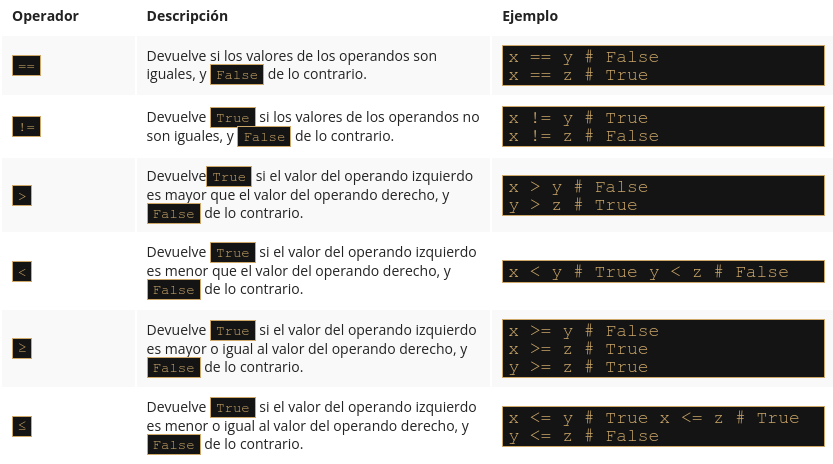

# Módulo 3

En este módulo, aprenderás sobre:

* Valores booleanos.
* Instrucciones if-elif-else.
* Bucles while y for.
* Control de flujo.
* Operaciones lógicas y bit a bit.
* Listas y arreglos.

*****

## 3.1.1 Tomando decisiones en Python 🐍️


### Preguntas y respuestas


Un programador escribe un programa y **el programa hace preguntas**.

Una computadora ejecuta el programa y **proporciona las respuestas**. El programa debe ser capaz de **reaccionar de acuerdo con las respuestas recibidas**.

Afortunadamente, las computadoras solo conocen dos tipos de respuestas:

* Si, es cierto.
* No, esto es falso.

Nunca obtendrás una respuesta como Déjame pensar 🤔️ ..., no lo sé 😒️, o probablemente sí, pero no lo sé con seguridad 🙃️

***Para hacer preguntas, Python utiliza un conjunto de operadores muy especiales***. 

### Comparación: operador de igualdad 

Pregunta: ¿**Son dos valores iguales**?

Para hacer esta pregunta, se utiliza el ```==``` Operador (igual igual).

No olvides esta importante distinción:

* ```=``` es un operador de asignación, por ejemplo, ```a = b``` assigna a la varable a el valor de b.
* ```==``` es una pregunta ¿**Son estos valores iguales**?; ```a == b``` compara a y b.

Es un **operador binario** *con enlazado a la izquierda*. Necesita dos argumentos y verifica si son iguales. ‼️


**Ejercicios**

Ahora vamos a hacer algunas preguntas. Intenta adivinar las respuestas.

1. ¿Cuál es el resultado de la siguiente comparación?

```python
2 == 2
```

**True (verdadero)** - por supuesto, 2 es igual a 2. Python responderá True (Recuerda este par de literales predefinidos, True y False - También son palabras clave de Python).

2. ¿Cuál es el resultado de la siguiente comparación?

```python
2 == 2.
```

Esta pregunta no es tan fácil como la primera. Por suerte, Python es capaz de convertir el valor entero en su equivalente real, y en consecuencia, la respuesta es **True**

3. Cuál es el resultado de la siguiente comparación?

```python
1 == 2
```

Esto debería ser fácil. La respuesta será (o mejor dicho, siempre es) **False**.

### Igualdad: El operador igual a (==)

El operador ```==``` (igual a) compara los valores de dos operandos. Si son iguales, el resultado de la comparación es **True**. Si no son iguales, el resultado de la comparación es **False**.

Observa la comparación de igualdad a continuación: ¿Cuál es el resultado de esta operación?

```python
var == 0
```

⚠️ Ten en cuenta que no podemos encontrar la respuesta si no sabemos qué valor está almacenado actualmente en la variable (var).

Ahora imagina a un programador que sufre de insomnio, y tiene que contar las ovejas negras y blancas por separado siempre y cuando haya exactamente el doble de ovejas negras que de las blancas 😮‍💨️

La pregunta será la siguiente:

```python
ovejasNegras == 2 * ovejasBlancas
```

Debido a la baja prioridad de el operador == ,la pregunta será tratada como la siguiente:

```python
ovejasNegras == (2 * ovejaBlancas)
```

Entonces, vamos a practicar la comprensión del operador ==  ¿Puedes adivinar la salida del código a continuación?

```python
var = 0 # asignando 0 a var
print(var == 0)

var = 1 # asignando 1 a var
print(var == 0)

>>> True
    False
```


### Desigualdad: el operador no es igual a (!=)

El operador ```!=``` (no es igual a) también compara los valores de dos **operandos**. Aquí está la diferencia: si son iguales, el resultado de la comparación es **False**. Si no son iguales, el resultado de la comparación es **True**.

Ahora echa un vistazo a la comparación de desigualdad a continuación: ¿Puedes adivinar el resultado de esta operación?


```python
var = 0 # asignando 0 a var
print(var != 0)

var = 1 # asignando 1 a var
print(var != 0)

>>> False
    True
```

### Operadores de Comparación: Mayor que

También se puede hacer una pregunta de comparación usando el operador ```>``` (mayor que).

Si deseas saber si hay más ovejas negras que blancas, puedes escribirlo de la siguiente manera:

```python
ovejasNegras > ovejasBlancas # mayor que.
```

**True** lo confirma; **False** lo niega.


### Operadores de Comparación: Mayor o igual que

El operador mayor que tiene otra variante especial, una variante no estricta, pero se denota de manera diferente que la notación aritmética clásica: ```>=``` (mayor o igual que).

Hay dos signos subsecuentes, no uno.

Ambos operadores (estrictos y no estrictos), así como los otros dos que se analizan en la siguiente sección, ***son operadores binarios con enlace en el lado izquierdo***, y su prioridad es mayor que la mostrada por ```==``` y ```!=```

Si queremos saber si tenemos que usar un gorro o no, nos hacemos la siguiente pregunta:

```python
centigradosAfuera ≥ 0.0 # mayor o igual a
``` 

### Operadores de Comparación: Menor o igual que

Como probablemente ya hayas adivinado, los operadores utilizados en este caso son: El operador ```<``` (menor que) y su hermano **no estricto**: ```<=``` (menor o igual que).

Mira este ejemplo simple:

```python
velocidadMph < 85 # menor que. Estricto
velocidadMph ≤ 85 # menor o igual que. No estricto
```

Vamos a comprobar si existe un riesgo de ser multados (la primera pregunta es estricta, la segunda no).


Ahora necesitamos actualizar nuestra tabla de prioridades , y poner todos los nuevos operadores en ella. Ahora se ve como a continuación:


**LABORATORIO** 🥽️🥼️

**Tiempo Estimado**

5 minutos

**Nivel de dificultad**

Muy Fácil

**Objetivos**

* Familiarizarse con la función input().
* Familiarizarse con los operadores de comparación en Python.

**Escenario**

Usando uno de los operadores de comparación en Python, escribe un programa simple de dos líneas que tome el parámetro n como entrada, que es un entero, e imprime False si n es menor que 100, y True si n es mayor o igual que 100.

No debes crear ningún bloque if (hablaremos de ellos muy pronto). Prueba tu código usando los datos que te proporcionamos.

**Datos de prueba**

Ejemplo de entrada 
```python
55
```

Resultado esperado: False

Ejemplo de entrada
```python
99
```

Resultado esperado: False

Ejemplo de entrada
```python
100
```

Resultado esperado: True


### Condiciones y ejecución condicional

Para tomar decisiones, Python ofrece una instrucción especial. Debido a su naturaleza y su aplicación, se denomina **instrucción condicional** (o declaración condicional).

Existen varias variantes de la misma. Comenzaremos con la más simple, aumentando la dificultad lentamente.

La primera forma de una declaración condicional, que puede ver a continuación, está escrita de manera muy informal pero figurada:

```python
if cierto_o_no:
    hacer_esto_si_cierto
```

Esta declaración condicional consta de los siguientes elementos, estrictamente necesarios en este orden:

* La palabra clave if.
* Uno o más espacios en blanco.
* Una expresión (una pregunta o una respuesta) cuyo valor se interpretar únicamente en términos de True (cuando su valor no sea cero) y False (cuando sea igual a cero).
* Unos dos puntos seguido de una nueva línea.
* Una instrucción con sangría o un conjunto de instrucciones (se requiere absolutamente al menos una instrucción); la sangría se puede lograr de dos maneras: insertando un número particular de espacios (la recomendación es usar cuatro espacios de sangría), o usando el tabulador; nota: si hay mas de una instrucción en la parte con sangría, la sangría debe ser la misma en todas las líneas; aunque puede parecer lo mismo si se mezclan tabuladores con espacios, **es importante que todas las sangrías sean exactamente iguales Python 3 no permite mezclar espacios y tabuladores para la sangría** ⚠️

*¿Cómo funciona esta declaración?*

Si la expresión cierto_o_no representa la verdad (es decir, su valor no es igual a cero),la(s) declaración(es) con sangría se ejecutará.
Si la expresión cierto_o_no no representa la verdad (es decir, su valor es igual a cero), las declaraciones con sangría se omitirá , y la siguiente instrucción ejecutada será la siguiente al nivel de la sangría original.

En la vida real, a menudo expresamos un deseo:

```python
si el clima es bueno, 
    saldremos a caminar
después, almorzaremos
```

Como puedes ver, almorzar NO es una actividad condicional y no depende del clima.

Sabiendo que condiciones influyen en nuestro comportamiento y asumiendo que tenemos las funciones sin parámetros *irACaminar()* y *almorzar()*, podemos escribir el siguiente fragmento de código:

```python
if ClimaEsBueno:
    irAcaminar()
almorzar()
```


### Ejecución condicional: La declaración if

Si un determinado desarrollador de Python sin dormir se queda dormido cuando cuenta 120 ovejas, y el procedimiento de inducción del sueño se puede implementar como una función especial llamada `dormirSoñar()`, todo el código toma la siguiente forma:

```python
if contadordeOvejas >= 120: #evalúa una expresión de prueba.
    dormirSoñar() #se ejecuta si la expresión de prueba es Verdadera. 
```

***Hemos dicho que las declaraciones condicionales deben tener sangría***. Esto crea una estructura muy legible, demostrando claramente todas las rutas de ejecución posibles en el código.

Echa un vistazo al siguiente código:

```python
if contadorOvejas >= 120:
    hacerCama()
    tomarDucha()
    dormirSoñar()
alimentarPerros()
```

Como puedes ver, tender la cama, tomar una ducha y dormir y soñar se ejecutan condicionalmente, cuando `contadorOvejas` alcanza el límite deseado.

Alimentar a los perros, sin embargo, siempre se hace (es decir, la función `alimentarPerros()` no tiene sangría y no pertenece al bloque `if`, lo que significa que siempre se ejecuta).

### Ejecución condicional: la declaración if-else

Comenzamos con una frase simple que decía: *Si el clima es bueno, saldremos a caminar*.

**Nota**: no hay una palabra sobre lo que sucederá si el clima es malo. Solo sabemos que no saldremos al aire libre, pero no sabemos que podríamos hacer. Es posible que también queramos planificar algo en caso de mal tiempo 🤔️

Podemos decir, por ejemplo: *Si el clima es bueno, saldremos a caminar, de lo contrario, iremos al cine*


Python nos permite expresar dichos planes alternativos. Esto se hace con una segunda forma, ligeramente mas compleja, de la declaración condicional, la declaración `if-else` :

```python
if condición_true_or_false:
    ejecuta_si_condición_true
 else: 
    ejecuta_si_condición_false
```

Por lo tanto, hay una nueva palabra: `else` - esta es una *palabra reservada* ‼️

La parte del código que comienza con else dice que hacer si no se cumple la condición especificada por el if (observa los **dos puntos** después de la palabra).

La ejecución de `if-else` es la siguiente:

* Si la condición se evalúa como `Verdadero` (su valor **no es igual a cero**), la instrucción `ejecuta_si_condición_true` se ejecuta, y la declaración condicional llega a su fin.
* Si la condición se evalúa como `Falso` (**es igual a cero**), la instrucción `ejecuta_si_condición_false` se ejecuta, y la declaración condicional llega a su fin.

### La declaración if-else: más de ejecución condicional

Al utilizar esta forma de declaración condicional, podemos describir nuestros planes de la siguiente manera:

```python
if climaEsBueno:
    irACaminar()
else:
    irAlCine()
almorzar()
```

Si el clima es bueno, saldremos a caminar. De lo contrario, iremos al cine. No importa si el clima es bueno o malo, almorzaremos después (después de la caminata o después de ir al cine).

Todo lo que hemos dicho sobre la sangría funciona de la misma manera dentro de la rama `else` :

```python
if climaEsBueno:
    irACaminar()
    Diviertirse()
else:
    irAlCine()
    disfrutaLaPelicula()
almorzar()
```

### Declaraciones if-else anidadas

Ahora, analicemos dos casos especiales de la declaración condicional.

Primero, considera el caso donde la instrucción colocada después del `if`  es otro `if`.

😶‍🌫️️ Lee lo que hemos planeado para este domingo. Si hay buen clima, saldremos a caminar. Si encontramos un buen restaurante, almorzaremos allí. De lo contrario, vamos a comer un sandwich. Si hay mal clima, iremos al cine. Si no hay boletos, iremos de compras al centro comercial más cercano.

Escribamos lo mismo en Python. Considera cuidadosamente el código aquí:

```python
if climaEsBueno:
    if encontramosBuenRestaurante:
        almorzar()
    else:
        comerSandwich() 
else:
    if hayBoletosDisponibles:
        irAlCine()
    else:
        irDeCompras()
```

**Aquí hay dos puntos importantes**:

* Este uso de la declaración `if` se conoce como anidamiento; recuerda que cada `else` se refiere al `if` que se encuentra en el **mismo nivel de sangría**; se necesita saber esto para determinar cómo se relacionan los *`ifs`* y los *`elses`*.
* Considera como la sangría **mejora la legibilidad** y hace que el código sea más fácil de entender y rastrear.

### La declaración elif

El segundo caso especial presenta otra nueva palabra clave de Python: `elif`. Como probablemente sospechas, es una forma más corta de `else-if`.

`elif` se usa para **verificar más de una condición**, y para **detener** cuando se encuentra la primera declaración verdadera.

Nuestro siguiente ejemplo se parece a la anidación, pero las similitudes son muy leves. Nuevamente, cambiaremos nuestros planes y los expresaremos de la siguiente manera: si hay buen clima, saldremos a caminar, de lo contrario, si obtenemos entradas, iremos al cine, de lo contrario, si hay mesas libres en el restaurante, vamos a almorzar; si todo falla, regresaremos a casa y jugaremos ajedrez 🤔️

¿Has notado cuantas veces hemos usado la palabra de lo *contrario*? Esta es la etapa en la que la palabra clave `elif` desempeña su función.

Escribamos el mismo escenario usando Python:

```python
if climaBueno:
    iraCaminar()
elif hayBoletosDisponibles:
    IralCine()
elif mesasLibres:
    almorzar()
else:
    jugarAjedrezEnCasa()
```

La forma de ensamblar las siguientes declaraciones `if-elif-else` a veces se denomina **cascada**.

Observa de nuevo como la sangría **mejora la legibilidad del código**.

‼️ Se debe prestar atención adicional a este caso:

* No debes usar `else` sin un `if` precedente.
* `else` siempre es **la última rama de la cascada**, independientemente de si has usado elif o no.
* `else` es una parte **opcional** de la cascada, y puede omitirse.
* Si hay una rama `else` en la cascada, solo se ejecuta una de todas las ramas.
* Si no hay una rama `else`, es posible que no se ejecute ninguna de las opciones disponibles.


Esto puede sonar un poco desconcertante, pero ojalá que algunos ejemplos simples ayuden a comprenderlo mejor. 

### Analizando ejemplos de código

Ahora te mostraremos algunos programas simples pero completos. No los explicaremos en detalle, porque consideramos que los comentarios (y los nombres de las variables) dentro del código son guías suficientes.

**Todos los programas resuelven el mismo problema: encuentran el número mayor y lo imprimen**.


Ejemplo 1:

Comenzaremos con el caso más simple: ¿Cómo identificar el mayor de los dos números? :

```python
#lee dos números
numero1 = int (input("Ingresa el primer número:"))
numero2 = int (input("Ingresa el segundo número:"))

#elegir el número más grande
if numero1> numero2:
    nmasGrande = numero1
else:
    nmasGrande = numero2

#imprimir el resultado
print("El número más grande es:", nmasGrande)
```

****

Ejemplo 2:

Ahora vamos a mostrarte un hecho intrigante. Python tiene una característica interesante, mira el código a continuación:

```python
#lee dos números
numero1 = int (input("Ingresa el primer número:"))
numero2 = int (input("Ingresa el segundo número:"))

#elegir el número más grande
if numero1 > numero2: nmasGrande = numero1
else: nmasGrande = numero2

#imprimir el resultado
print("El número más grande es: ", nmasGrande)
```

🗒️ **Nota**: si alguna de las ramas de `if-elif-else` contiene una sola instrucción, puedes codificarla de forma más completa (no es necesario que aparezca una línea con sangría después de la palabra clave), pero solo continúa la línea después de los dos puntos).

Sin embargo, este estilo puede ser engañoso, y no lo vamos a usar en nuestros programas futuros, pero definitivamente vale la pena saber si quieres leer y entender los programas de otra persona.

****

Ejemplo 3

*Encontremos el mayor de los tres números.*

Suponemos que el primer valor es el más grande. Luego verificamos esta hipótesis con los dos valores restantes.

Observa el siguiente código:

```python
#lee tres números
numero1 = int (input("Ingresa el primer número:"))
numero2 = int (input("Ingresa el segundo número:"))
numero3 = int (input("Ingresa el tercer número:"))

#asumimos temporalmente que el primer número
#es el más grande
#lo verificaremos pronto
nmasGrande = numero1

#comprobamos si el segundo número es más grande que el mayor número actual
#y actualiza el número más grande si es necesario
if numero2 > nmasGrande:
    nmasGrande = numero2

#comprobamos si el tercer número es más grande que el mayor número actual
#y actualiza el número más grande si es necesario
if numero3 > nmasGrande:
    nmasGrande = numero3

#imprimir el resultado
print("El número más grande es:", nmasGrande)
```


Este método es significativamente más simple que tratar de encontrar el número más grande comparando todos los pares de números posibles (es decir, el primero con el segundo, el segundo con el tercero y el tercero con el primero). Intenta reconstruir el código por ti mismo.

### Pseudocódigo e introducción a los ciclos o bucles

Ahora deberías poder escribir un programa que encuentre el mayor de cuatro, cinco, seis o incluso diez números.

Ya conoces el esquema, por lo que ampliar el tamaño del problema no será particularmente complejo.

¿Pero qué sucede si te pedimos que escribas un programa que encuentre el mayor de doscientos números? ¿Te imaginas el código?

Necesitarás doscientas variables. Si doscientas variables no son lo suficientemente complicadas, intenta imaginar la búsqueda del número más grande de un millón.

Imagina un código que contiene 199 declaraciones condicionales y doscientas invocaciones de la función `input()`. Por suerte, no necesitas lidiar con eso. Hay un enfoque más simple.

Por ahora ignoraremos los requisitos de la sintaxis de Python e intentaremos analizar el problema sin pensar en la programación real. En otras palabras, intentaremos escribir el **algoritmo**, y cuando estemos contentos con él, lo implementaremos.

En este caso, utilizaremos un tipo de notación que no es un lenguaje de programación real (no se puede compilar ni ejecutar), pero está formalizado, es conciso y se puede leer. Se llama **pseudocódigo**.

Veamos nuestro pseudocódigo a continuación:

```pseint
línea 01  numeroMayor = -999999999
línea 02  numero = int(input())
línea 03  if numero == -1:
línea 04  print(numeroMayor)
línea 05  exit()
línea 06  if numero > numeroMayor:
línea 07  numeroMayor = numero
línea 08  vaya a la línea 02
```

Qué está pasando en él?

* En primer lugar, podemos simplificar el programa si, al comienzo del código, asignamos la variable `numeroMayor` con un valor que será más pequeño que cualquiera de los números ingresados. Usaremos `-999999999` para ese propósito.
* En segundo lugar, asumimos que nuestro algoritmo no sabrá por adelantado cuántos números se entregarán al programa. Esperamos que el usuario ingrese todos los números que desee; el algoritmo funcionará bien con cien y con mil números. ¿Cómo hacemos eso?
* Hacemos un trato con el usuario: cuando se ingresa el valor `-1`, será una señal de que no hay más datos y que el programa debe finalizar su trabajo.
* De lo contrario, si el valor ingresado no es igual a `-1`, el programa leerá otro número, y así sucesivamente.

El truco se basa en la suposición de que cualquier parte del código se puede realizar más de una vez, precisamente, tantas veces como sea necesario.

La ejecución de una determinada parte del código más de una vez se denomina bucle. El significado de este término es probablemente obvio para ti.

Las líneas 02 a 08 forman un bucle. Los pasaremos tantas veces como sea necesario para revisar todos los valores ingresados.

Python a menudo viene con muchas funciones integradas que harán el trabajo por ti. Por ejemplo, para encontrar el número más grande de todos, puede usar una función incorporada de Python llamada `max()`. Puedes usarlo con múltiples argumentos. Analiza el código de abajo:

```python
#lee tres números
numero1 = int(input("Ingresa el primer número:"))
numero2 = int(input("Ingresa el segundo número:"))
numero3 = int(input("Ingresa el tercer número:"))

#verifica cuál de los números es el mayor
#y pásalo a la variable de mayor número

numeroMayor = max(numero1,numero2,numero3)

#imprimir el resultado
print("El número más grande es:", numeroMayor)
```

De la misma manera, puedes usar la función `min()` para devolver el número más bajo. 

Vamos a hablar sobre estas (y muchas otras) funciones pronto. Por el momento, nuestro enfoque se centrará en la ejecución condicional y los bucles para permitirte ganar más confianza en la programación y enseñarte las habilidades que te permitirán comprender y aplicar los dos conceptos en tu código. Entonces, por ahora, no estamos tomando atajos.

**LABORATORIO** 🥽️🥼️

**Tiempo estimado**

5-10 minutos

**Nivel de dificultad**

Fácil

**Objetivos**

* Familiarizarse con la función input().
* Familiarizarse con los operadores de comparación en Python.
* Familiarizarse con el concepto de ejecución condicional.

**Escenario**

Espatifilo, más comúnmente conocida como la planta de Cuna de Moisés o flor de la paz, es una de las plantas para interiores más populares que filtra las toxinas dañinas del aire. Algunas de las toxinas que neutraliza incluyen benceno, formaldehído y amoníaco.


Imagina que tu programa de computadora ama estas plantas. Cada vez que recibe una entrada en forma de la palabra Espatifilo, grita involuntariamente a la consola la siguiente cadena:  *"¡Espatifilo es la mejor planta de todas!"* 


Escribe un programa que utilice el concepto de ejecución condicional, tome una cadena como entrada y que:

* Imprima el enunciado "Si, ¡El Espatifilo es la mejor planta de todos los tiempos!"  en la pantalla si la cadena ingresada es "Espatifilo".
* Imprima "No, ¡quiero un gran Espatifilo!" si la cadena ingresada es "espatifilo".
* Imprima  "¡Espatifilo! ¡No [entrada]!"  de lo contrario. Nota: [entrada] es la cadena que se toma como entrada.

Prueba tu código con los datos que te proporcionamos. ¡Y hazte de un Espatifilo también!


**Datos de prueba**

Entrada de muestra: `espatifilo`

Resultado esperado: `No, ¡quiero un gran Espatifilo!`

Entrada de ejemplo: `pelargonio`

Resultado esperado: `!Espatifilo! ¡No pelargonio!`

Entrada de muestra: `Espatifilo`

Resultado esperado: `Si, ¡El Espatifilo es la mejor planta de todos los tiempos!`

**LABORATORIO** 🥽️🥼️

**Tiempo estimado**

10-15 minutos

**Nivel de dificultad**

Fácil/Medio

**Objetivos**

Familiarizar al estudiante con:

* Utilizar la instrucción `if-else` para ramificar la ruta de control.
* Construir un programa completo que resuelva problemas simples de la vida real.

**Escenario**

Érase una vez una tierra - una tierra de leche y miel, habitada por gente feliz y próspera. La gente pagaba impuestos, por supuesto, su felicidad tenía límites. El impuesto más importante, denominado Impuesto Personal de Ingresos (IPI, para abreviar) tenía que pagarse una vez al año y se evaluó utilizando la siguiente regla:

* Si el ingreso del ciudadano no era superior a 85,528 pesos, el impuesto era igual al 18% del ingreso menos 556 pesos y 2 centavos (esta fue la llamada exención fiscal ).
* Si el ingreso era superior a esta cantidad, el impuesto era igual a 14,839 pesos y 2 centavos, más el 32% del excedente sobre 85,528 pesos.

Tu tarea es escribir una calculadora de impuestos.

Debe aceptar un valor de punto flotante: el ingreso.
A continuación, debe imprimir el impuesto calculado, redondeado a pesos totales. Hay una función llamada `round()` que hará el redondeo por ti, la encontrarás en el código de esqueleto del editor.

🗒️ **Nota**: Este país feliz nunca devuelve dinero a sus ciudadanos. Si el impuesto calculado es menor que cero, solo significa que no hay impuesto (el impuesto es igual a cero). Ten esto en cuenta durante tus cálculos.

Observa el código en el editor: solo lee un valor de entrada y genera un resultado, por lo que debes completarlo con algunos cálculos inteligentes.

Prueba tu código con los datos que hemos proporcionado.

```python
ingreso=float(input("Ingrese el ingreso anual:"))

#
#Coloca tu código aquí.
#

impuesto=round(impuesto, 0)
print("El impuesto es: ", impuesto, "pesos")
```

**Datos de prueba**

Entrada de muestra: `10000`

Resultado esperado: `El impuesto es: 1244.0 pesos`

Entrada de muestra: `100000`

Resultado esperado: El impuesto es: 19470.0 pesos

Entrada de muestra: `1000`

Resultado esperado: `El impuesto es: 0.0 pesos`

Entrada de muestra: `-100`

Resultado esperado: `El impuesto es: 0.0 pesos`


**LABORATORIO** 🥽️🥼️

**Tiempo estimado**

10-15 minutos

**Nivel de dificultad**

Fácil/Medio

**Objetivos**

Familiarizar al estudiante con:

* Utilizar la declaración `if-elif-else`.
* Encontrar la implementación adecuada de reglas definidas verbalmente.
* Emplear el código de prueba usando entrada y salida de muestra.

**Escenario**

Como seguramente sabrás, debido a algunas razones astronómicas, el año pueden ser bisiesto o común . Los primeros tienen una duración de 366 días, mientras que los últimos tienen una duración de 365 días.

Desde la introducción del calendario gregoriano (en 1582), se utiliza la siguiente regla para determinar el tipo de año:

* Si el número del año no es divisible entre cuatro, es un año común.
* De lo contrario, si el número del año no es divisible entre 100, es un año bisiesto.
* De lo contrario, si el número del año no es divisible entre 400, es un año común.
* De lo contrario, es un año bisiesto.

Observa el código en el editor: solo lee un número de año y debe completarse con las instrucciones que implementan la prueba que acabamos de describir.

```python
año = int(input("Introduzca un año:"))

#
#Coloca tu código aquí.
#
```


El código debe mostrar uno de los dos mensajes posibles, que son Año bisiesto o Año común, según el valor ingresado.

Sería bueno verificar si el año ingresado cae en la era gregoriana y emitir una advertencia de lo contrario: No dentro del período del calendario gregoriano. Consejo: utiliza los operadores != y %.


**Datos de prueba**

Entrada de muestra: `2000`

Resultado esperado: `Año bisiesto`

Entrada de muestra: `2015`

Resultado esperado: `Año común` 

Entrada de muestra: `1999`

Resultado esperado: `Año común` 

Entrada de muestra: `1996`

Resultado esperado: `Año bisiesto` 

Entrada de muestra: `1580`

Resultado esperado: `No dentro del período del calendario gregoriano`


⚜️ **PUNTOS CLAVE** ⚜️

1. Los operadores de comparación (o también denominados relacionales) se utilizan para comparar valores. La siguiente tabla ilustra cómo funcionan los operadores de comparación, asumiendo que x=0, y=1 y z=0:



2. Cuando desea ejecutar algún código solo si se cumple una determinada condición, puede usar una declaración condicional:
* una única declaración `if`, por ejemplo
```python
x = 10

if x == 10: # condición
    print("x es igual a 10") # ejecutado si la condición es verdadera
```

* Una serie de declaraciones `if`, por ejemplo:

```python
x = 10

if x > 5: # condición uno
    print("x es mayor que 5") # ejecutado si la condición uno es verdadera

if x <10: # condición dos
    print("x es menor que 10") # ejecutado si la condición dos es verdadera

if x == 10: # condición tres
     print("x es igual a 10") # ejecutado si la condición tres es verdadera
```

🗒️ **NOTA:** Cada declaración `if` se prueba por separado.

* Una declaración de `if-else`, por ejemplo:

```python
x = 10

if x < 10: # condición
    print ("x es menor que 10") # ejecutado si la condición es Verdadera

else:
    print ("x es mayor o igual a 10") # ejecutado si la condición es False
```


* Una serie de declaraciones `if` seguidas de un `else`, por ejemplo:

```python
x = 10

if x > 5: # Verdadero
    print("x > 5")

if x > 8: # Verdadero
    print("x > 8")

if x > 10: # Falso
    print("x > 10")

else:
    print("Se ejecutará el else")
```

🗒️ **NOTA:** Cada `if` se prueba por separado. El cuerpo de `else` se ejecuta si el último `if` es False.

* La declaración  `if-elif-else`, por ejemplo:

 ```python
x = 10

if  x == 10: # Verdadero
    print("x == 10")

if x > 15: # Falso
    print("x > 15")

elif x > 10: # Falso
    print("x > 10")

elif x > 5: # Verdadero
    print("x > 5")

else:
    print("No se ejecutará el else")
```


🗒️ **NOTA: ** Si la condición para `if` es False, el programa verifica las condiciones de los bloques `elif` posteriores: el primer `elif` que sea True es el que se ejecuta. Si todas las condiciones son False, se ejecutará el bloque `else`.

* Declaraciones condicionales anidadas, ejemplo:

```python
x = 10

if x > 5: # Verdadero
    if x == 6: # Falso
        print("anidado: x == 6")
    elif x == 10: # Verdadero
        print("anidado: x == 10")
    else:
        print("anidado: else")
else:
    print("else")
```


****

## 3.1.2 Ciclos en Python

### Ciclos o bucles en el código con while

¿Estás de acuerdo con la declaración presentada a continuación?

*mientras haya algo que hacer hazlo*

Ten en cuenta que este registro también declara que, si no hay nada que hacer, nada ocurrirá.

En general, en Python, un ciclo se puede representar de la siguiente manera:

```python
while expresión_condicional:
    instrucción
```

Si observas algunas similitudes con la instrucción `if`, está bien. De hecho, la diferencia sintáctica es solo una: usa la palabra `while` en lugar de la palabra `if`.

La **diferencia semántica** es más importante: cuando se cumple la condición, `if` realiza sus declaraciones sólo una vez; `while` repite la ejecución siempre que la condición se evalúe como True.

🗒️ **Nota**: todas las reglas relacionadas con sangría también se aplican aquí. Te mostraremos esto pronto.

Observa el algoritmo a continuación:

```python
while expresión_condicional:
    instrucción_uno
    instruccion_dos
    instrucción_tres
    :
    :
    instrucción_n
```

Ahora, es importante recordar que:

* Si deseas ejecutar más de una declaración dentro de un `while`, debes (como con `if`) poner sangría a todas las instrucciones de la misma manera.
* Una instrucción o conjunto de instrucciones ejecutadas dentro del `while` se llama el **cuerpo del ciclo**.
* Si la condición es `False` (igual a cero) tan pronto como se compruebe por primera vez, el cuerpo no se ejecuta ni una sola vez (ten en cuenta la analogía de no tener que hacer nada si no hay nada que hacer).
* El cuerpo debe poder cambiar el valor de la condición, porque si la condición es `True` al principio, el cuerpo podría funcionar continuamente hasta el infinito. Observa que hacer una cosa generalmente disminuye la cantidad de cosas por hacer.

### Un bucle o ciclo infinito

Un ciclo infinito, también denominado ciclo sin fin, es una **secuencia de instrucciones** en un programa que se repite indefinidamente (ciclo sin fin).

Este es un ejemplo de un ciclo que no puede finalizar su ejecución:

```python
while True:
    print("Estoy atrapado dentro de un ciclo")
```

Este ciclo imprimirá infinitamente *"Estoy atrapado dentro de un ciclo"*. En la pantalla.

Analiza el programa cuidadosamente. Localiza el cuerpo del ciclo y descubre como se sale del cuerpo:

```python
#Almacenaremos el número más grande actual aquí
numero Mayor = -999999999

#Ingresa el primer valor
numero = int(input ("Introduzca un número o escriba -1 para detener:"))

#Si el número no es igual a -1, continuaremos
 while numero != -1:
    # ¿Es el número más grande que el número más grande?
    if numero > numeroMayor:
        # Sí si, actualiza el mayor númeroNúmero
        numeroMayor = numero
    # Ingresa el siguiente número
    numero = int (input("Introduce un número o escribe -1 para detener:"))

#Imprimir el número más grande
print("El número más grande es:", numeroMayor)
```

Veamos otro ejemplo utilizando el ciclo `while`. Sigue los comentarios para descubrir la idea y la solución.

```python
# programa que lee una secuencia de números
# y cuenta cuántos números son pares y cuántos son impares
# programa termina cuando se ingresa cero

numerosImpares = 0
numerosPares = 0

# lee el primer número
numero = int (input ("Introduce un número o escriba 0 para detener:"))

# 0 termina la ejecución
while numero != 0:
    # verificar si el número es impar
    if numero % 2 == 1:
        # aumentar el contador de números impares
        numerosImpares += 1
    else:
        # aumentar el contador de números pares
        numerosPares += 1
    # lee el siguiente número
    numero = int (input ("Introduce un número o escriba 0 para detener:"))

# imprimir resultados
print("Números impares: ", numerosImpares)
print("Números pares: ", numerosPares)
```


Ciertas expresiones se pueden simplificar sin cambiar el comportamiento del programa.

Intenta recordar cómo Python interpreta la verdad de una condición y ten en cuenta que estas dos formas son equivalentes:

`while numero != 0:` y `while numero:`

La condición que verifica si un número es impar también puede codificarse en estas formas equivalentes:

`if numero % 2 == 1:` e `if numero % 2:`


Observa el fragmento de código a continuación:

```python
contador = 5
while contador != 0:
    print("Dentro del ciclo: ", contador)
    contador -= 1
print("Fuera del ciclo", contador)
```


Este código está destinado a imprimir la cadena *"Dentro del ciclo"* y el valor almacenado en la variable contador durante un ciclo dado exactamente cinco veces. Una vez que la condición se haya cumplido (la variable contador ha alcanzado 0), se sale del ciclo y aparece el mensaje *"Fuera del ciclo"*. así como el valor almacenado en contador se imprime.

**RECUERDA**❕️

No te sientas obligado a codificar tus programas de una manera que siempre sea la más corta y la más compacta. La legibilidad puede ser un factor más importante. Manten tu código listo para un nuevo programador.

**LABORATORIO** 🥽️🥼️

**Tiempo estimado**

15 minutos

**Nivel de dificultad**

Fácil

**Objetivos**

Familiarizar al estudiante con:

* Utilizar el ciclo while.
* Reflejar situaciones de la vida real en código de computadora.

**Escenario**

Un mago junior ha elegido un número secreto. Lo ha escondido en una variable llamada `númeroSecreto`. Quiere que todos los que ejecutan su programa jueguen el juego Adivina el número secreto, y adivina qué número ha elegido para ellos. ¡Quienes no adivinen el número quedarán atrapados en un ciclo sin fin para siempre! Desafortunadamente, él no sabe cómo completar el código.

Tu tarea es ayudar al mago a completar el código en el editor de tal manera que el código:

* Pedirá al usuario que ingrese un número entero.
* Utilizará un ciclo `while`.
* Comprobará si el número ingresado por el usuario es el mismo que el número escogido por el mago. Si el número elegido por el usuario es diferente al número secreto del mago, el usuario debería ver el mensaje *"¡Ja, ja! ¡Estás atrapado en mi ciclo!"*  y se le solicitará que ingrese un número nuevamente. Si el número ingresado por el usuario coincide con el número escogido por el mago, el número debe imprimirse en la pantalla, y el mago debe decir las siguientes palabras: *"¡Bien hecho, muggle! Eres libre ahora"*.
¡El mago está contando contigo! No lo decepciones.


**INFO EXTRA** 😶‍🌫️️

Por cierto, mira la función `print()`. La forma en que lo hemos utilizado aquí se llama impresión **multilínea**. Puede utilizar comillas triples para imprimir cadenas en varias líneas para facilitar la lectura del texto o crear un diseño especial basado en texto. Experimenta con ello.

```python
numeroSecreto = 777

print(
"""
+==================================+
| Bienvenido a mi juego, muggle!   |
| Introduce un número entero       |
| y adivina qué número he          |
| elegido para ti.                 |
| Entonces,                        |
| ¿Cuál es el número secreto?      |
+==================================+
""")
```


### Ciclos(bucles) en el código con for

Otro tipo de ciclo disponible en Python proviene de la observación de que a veces es más importante contar los "giros o vueltas" del ciclo que verificar las condiciones.

Imagina que el cuerpo de un ciclo debe ejecutarse exactamente cien veces. Si deseas utilizar el ciclo `while` para hacerlo, puede tener este aspecto:

```python
i = 0
while i < 100:
    # hacer_algo()
    i += 1 
```

Sería bueno si alguien pudiera hacer esta cuenta aburrida por ti. ¿Es eso posible?

Por supuesto que lo es, hay un ciclo especial para este tipo de tareas, y se llama `for`.

En realidad, el ciclo `for` está diseñado para realizar tareas más complicadas, puede "explorar" grandes colecciones de datos elemento por elemento. Te mostraremos como hacerlo pronto, pero ahora presentaremos una variante más sencilla de su aplicación.

Echa un vistazo al fragmento:

 ```python
for i in range (100):
    #hacer algo()
    pass
```


Hay algunos elementos nuevos. Déjanos contarte sobre ellos:

* La palabra reservada `for` abre el ciclo `for`; nota - No hay condición después de eso; no tienes que pensar en las condiciones, ya que se verifican internamente, sin ninguna intervención.
* Cualquier variable después de la palabra reservada `for` es la variable de control del ciclo; cuenta los giros del ciclo y lo hace automáticamente.
* La palabra reservada `in` introduce un elemento de sintaxis que describe el rango de valores posibles que se asignan a la variable de control.
* La función `range()` (esta es una función muy especial) es responsable de generar todos los valores deseados de la variable de control; en nuestro ejemplo, la función creará (incluso podemos decir que alimentará el ciclo con) valores subsiguientes del siguiente conjunto: 0, 1, 2 .. 97, 98, 99; nota: en este caso, la función `range()` comienza su trabajo desde 0 y lo finaliza un paso (un número entero) antes del valor de su argumento.
* Nota la palabra clave `pass` dentro del cuerpo del ciclo - no hace nada en absoluto; es una instrucción vacía : la colocamos aquí porque la sintaxis del ciclo `for` exige al menos una instrucción dentro del cuerpo (por cierto, `if`, `elif`, `else` y `while` expresan lo mismo).

Nuestros próximos ejemplos serán un poco más modestos en el número de repeticiones de ciclo.


Echa un vistazo al fragmento de abajo. ¿Puedes predecir su salida?

```python
for i in range(10):
    print("El valor de i es actualmente", i)
```

Ejecuta el código para verificar si tenías razón.

🗒️ **Nota** :

* El ciclo se ha ejecutado diez veces (es el argumento de la función `range()`).
* El valor de la última variable de control es 9 (no 10, ya que comienza desde 0 , no desde 1).
* La invocación de la función `range() puede estar equipada con dos argumentos, no solo uno:

```python
for i in range (2, 8):
    print("El valor de i es actualmente", i)
```

En este caso, el primer argumento determina el **valor inicial** (primero) de la variable de control.

El último argumento muestra el primer valor que no se asignará a la variable de control.

🗒️ **Nota**: la función `range()` solo acepta enteros como argumentos y genera secuencias de enteros.

¿Puedes adivinar la salida del programa? Ejecútalo para comprobar si ahora también estabas en lo cierto.

* El primer valor mostrado es 2 (tomado del primer argumento de `range()`).
* El último es 7 (aunque el segundo argumento de `range()` es 8).

### Más sobre el ciclo for y la función range() con tres argumentos

La función `range()` también puede aceptar tres argumentos: Echa un vistazo al código del editor.

```python
for i in range(2, 8, 3):
    print("El valor de i es actualmente", i)
```

El tercer argumento es un incremento: es un valor agregado para controlar la variable en cada giro del ciclo (como puedes sospechar, el valor predeterminado del incremento es 1 ).

¿Puedes decirnos cuántas líneas aparecerán en la consola y qué valores contendrán?

Ejecuta el programa para averiguar si tenías razón.


Deberías poder ver las siguientes líneas en la ventana de la consola:

* El valor de i es actualmente 2
* El valor de i es actualmente 5 

⚠️ ¿Sabes por qué? El primer argumento pasado a la función `range()` nos dice cual es el número de inicio de la secuencia (por lo tanto, 2 en la salida). El segundo argumento le dice a la función dónde detener la secuencia (la función genera números hasta el número indicado por el segundo argumento, pero no lo incluye). Finalmente, el tercer argumento indica el paso, que en realidad significa la diferencia entre cada número en la secuencia de números generados por la función.

`2`(número inicial) → `5` (2 incremento por `3` es igual a `5` - el número está dentro del rango de `2` a `8`) → `8` (`5` incremento por `3` es igual a `8` - el número no está dentro del rango de `2` a `8`, porque el parámetro de parada no está incluido en la secuencia de números generados por la función).

🗒️ **Nota**: si el conjunto generado por la función `range()` está vacío, el ciclo no ejecutará su cuerpo en absoluto.

Al igual que aquí, no habrá salida:

```python
for i in range(1, 1):
    print("El valor de i es actualmente", i)
```

🗒️ **Nota**: el conjunto generado por `range()` debe ordenarse en un orden ascendente. No hay forma de forzar el `range()` para crear un conjunto en una forma diferente. Esto significa que el segundo argumento de `range()` debe ser mayor que el primero.

Por lo tanto, tampoco habrá salida aquí:

```python
for i in range(2, 1):
    print ("El valor de i es actualmente", i)
``` 

Echemos un vistazo a un programa corto cuya tarea es escribir algunas de las primeras potencias de dos:

```python
pow = 1
for exp in range(16):
    print ("2 a la potencia de", exp, "es", pow)
    pow *= 2 

```

La variable `exp` se utiliza como una **variable de control** para el ciclo e indica el valor actual del exponente. La propia exponenciación se sustituye multiplicando por dos. Dado que 2⁰ es igual a 1, después 2 × 1 es igual a 2¹, 2 × 2¹ es igual a 2², y así sucesivamente. ¿Cuál es el máximo exponente para el cual nuestro programa aún imprime el resultado?
Ejecuta el código y verifica si la salida coincide con tus expectativas.

### Las declaraciones break y continue

Hasta ahora, hemos tratado el cuerpo del ciclo como una secuencia indivisible e inseparable de instrucciones que se realizan completamente en cada giro del ciclo. Sin embargo, como desarrollador, podrías enfrentar las siguientes opciones:

Parece que no es necesario continuar el ciclo en su totalidad; se debe abstener de seguir ejecutando el cuerpo del ciclo e ir más allá.
Parece que necesitas comenzar el siguiente giro del ciclo sin completar la ejecución del turno actual.
Python proporciona dos instrucciones especiales para la implementación de estas dos tareas. Digamos por razones de precisión que su existencia en el lenguaje no es necesaria: un programador experimentado puede codificar cualquier algoritmo sin estas instrucciones. Tales adiciones, que no mejoran el poder expresivo del lenguaje, sino que solo simplifican el trabajo del desarrollador, a veces se denominan dulces sintácticos o azúcar sintáctica.

Estas dos instrucciones son:

* Break: Sale del ciclo inmediatamente, e incondicionalmente termina la operación del ciclo; el programa comienza a ejecutar la instrucción más cercana después del cuerpo del ciclo.
* Continue: Se comporta como si el programa hubiera llegado repentinamente al final del cuerpo; el siguiente turno se inicia y la expresión de condición se prueba de inmediato.

**Ambas palabras son palabras clave reservadas**.

Ahora te mostraremos dos ejemplos simples para ilustrar como funcionan las dos instrucciones. Mira el código en el editor. Ejecuta el programa y analiza la salida. Modifica el código y experimenta.

```python
# break - ejemplo

print("La instrucción break:")
for i in range(1,6):
    if i == 3:
        break
    print("Dentro del ciclo.", i)
print("Fuera del ciclo.")

# continua - ejemplo

print("\nLa instrucción continue:")
for i in range(1,6):
    if i == 3:
        continue
    print("Dentro del ciclo.", i)
print("Fuera del ciclo.")

>>> La instrucción break:
Dentro del ciclo. 1
Dentro del ciclo. 2
Fuera del ciclo.

La instrucción continue:
Dentro del ciclo. 1
Dentro del ciclo. 2
Dentro del ciclo. 4
Dentro del ciclo. 5
Fuera del ciclo.
```

Regresemos a nuestro programa que reconoce el más grande entre los números ingresados. Lo convertiremos dos veces, usando las instrucciones de `break` y `continue`.

Analiza el código y determina como usarías alguno de ellos.

La variante `break` va aquí:

```python
numeroMayor = -99999999
contador = 0

while True:
    numero = int (input ("Ingresa un número o escribe -1 para finalizar el programa:"))
    if numero == -1:
        break
    contador = 1
    if numero > numeroMayor:
        numeroMayor = numero

if contador != 0:
    print("El número más grande es", numeroMayor)
else:
    print("No ha ingresado ningún número")
```

Ejecútalo, pruébalo y experimenta con él.

Y ahora la variante `continue`:

```python
numeroMayor = -99999999
contador = 0

numero = int (input("Ingresa un número o escribe -1 para finalizar el programa:"))

while numero != -1:
    if numero == -1:
        continue
    contador = 1

    if numero > numeroMayor:
        numeroMayor = numero
    numero = int (input ("Ingresa un número o escribe -1 para finalizar el programa:"))

if contador:
    print("El número más grande es", numeroMayor)
else:
    print("No ha ingresado ningún número")
```

Otra vez: ejecútalo, pruébalo y experimenta con él.

**RECUERDA** La sentencia `continue` se usa para omitir el bloque actual y avanzar a la siguiente iteración, sin ejecutar las declaraciones dentro del ciclo.

**LABORATORIO** 🥽️🥼️

**Tiempo estimado**

10-15 minutos

**Nivel de dificultad**

Fácil

**Objetivos**

Familiarizar al estudiante con:

* Utilizar la instrucción `continue` en los ciclos.
* Reflejar situaciones de la vida real en código de computadora.

**Escenario**

La sentencia `continue` se usa para omitir el bloque actual y avanzar a la siguiente iteración, sin ejecutar las declaraciones dentro del ciclo.

Se puede usar tanto con `while` y ciclos `for`.

Tu tarea aquí es muy especial: ¡Debes diseñar un devorador de vocales! Escribe un programa que use:

* Un ciclo for.
* El concepto de ejecución condicional (if-elif-else).
* La declaración continue.

Tu programa debe:

* Pedir al usuario que ingrese una palabra.
* Utiliza userWord = userWord.upper() para convertir la palabra ingresada por el usuario a mayúsculas; hablaremos sobre los llamados métodos de cadena y el upper() muy pronto, no te preocupes.
* Utiliza la ejecución condicional y la instrucción continue para "comer" las siguientes vocales A , E , I , O , U de la palabra ingresada.
* Imprime las letras no consumidas en la pantalla, cada una de ellas en una línea separada.

Prueba tu programa con los datos que le proporcionamos.

```python
#Indicar al usuario que ingrese una palabra
#y asignarlo a la variable userWord.

for letra in userWord:
    # Completa el cuerpo del ciclo for.
```

**Datos de prueba**

Entrada de muestra: `Gregory`

Salida esperada:

```python
G
R
G
R
Y
```

Entrada de muestra: `abstemious`

Salida esperada:

```python
B
S
T
M
S
```

Entrada de muestra: `IOUEA`

Salida esperada:
```python

```


### El while y la opción else

Ambos ciclos, `while` y `for`, tienen una característica interesante (y rara vez se usa).

Te mostraremos cómo funciona: intenta juzgar por ti mismo si es utilizable.

En otras palabras, trata de convencerte si la función es valiosa y útil, o solo es *azúcar sintáctica*.

```python
i = 1
while i < 5:
    print (i)
    i += 1
else:
    print("else:", i)
```

Echa un vistazo al fragmento en el editor. Hay algo extraño al final: la palabra clave `else`.

Como pudiste haber sospechado, los ciclos también pueden tener la rama `else`, como los `if`.

La rama `else` del ciclo siempre se ejecuta una vez, independientemente de si el ciclo ha entrado o no en su cuerpo .

¿Puedes adivinar la salida? Ejecuta el programa para comprobar si tenías razón.

Modifica el fragmento un poco para que el ciclo no tenga oportunidad de ejecutar su cuerpo ni una sola vez:

```python
i = 5
while i < 5:
    print(i)
    i += 1
else:
    print("else:", i)
```

El estado de `while` es Falso al principio, ¿puedes verlo?

Ejecuta y prueba el programa, y verifica si se ha ejecutado o no la rama `else`.

### El ciclo for y la rama else

Los ciclos `for` se comportan de manera un poco diferente: echa un vistazo al fragmento en el editor y ejecútalo.

```python
for i in range(5):
    print(i)
else:
    print("else:", i)
```

La salida puede ser un poco sorprendente.

La variable `i` conserva su último valor.


Modifica el código un poco para realizar un experimento más.

```python
i = 111
for i in range(2, 1):
    print(i)
else:
    print("else:", i)
```

¿Puedes adivinar la salida?

El cuerpo del ciclo no se ejecutará aquí en absoluto. 🗒️ Nota: hemos asignado la variable `i`antes del ciclo.

Ejecuta el programa y verifica su salida.

***Cuando el cuerpo del ciclo no se ejecuta, la variable de control conserva el valor que tenía antes del ciclo.***

🗒️ **Nota**: si la variable de control no existe antes de que comience el ciclo, no existirá cuando la ejecución llegue a la rama `else`.

⚠️ Ahora vamos a informarte sobre otros tipos de variables. Nuestras variables actuales solo pueden almacenar un valor a la vez, pero hay variables que pueden hacer mucho más; pueden almacenar tantos valores como desees

**LABORATORIO**

**Tiempo estimado**

20-30 minutos

**Nivel de dificultad** 

Medio

**Objetivos** 

Familiarizar al estudiante con:

*Utilizar el ciclo while.
* Encontrar la implementación adecuada de reglas definidas verbalmente.
* Reflejar situaciones de la vida real en código de computadora.

**Escenario**

Escucha esta historia: Un niño y su padre, un programador de computadoras, juegan con bloques de madera. Están construyendo una pirámide.

Su pirámide es un poco rara, ya que en realidad es una pared en forma de pirámide, es plana. La pirámide se apila de acuerdo con un principio simple: cada capa inferior contiene un bloque más que la capa superior.


Tu tarea es escribir un programa que lea la cantidad de bloques que tienen los constructores, y generar la altura de la pirámide que se puede construir utilizando estos bloques.

Nota: La altura se mide por el número de capas completas: si los constructores no tienen la cantidad suficiente de bloques y no pueden completar la siguiente capa, terminan su trabajo inmediatamente.

Prueba tu código con los datos que hemos proporcionado.

```python
bloques = int("Ingrese el número de bloques:"))

#
#Escribe tu código aquí.
#
print("La altura de la pirámide:", altura)
```

**Datos de prueba**

Entrada de muestra: `6`

Producto esperado: `La altura de la pirámide es: 3`

Entrada de muestra: `20`

Salida esperada: `La altura de la pirámide es: 5`

Entrada de muestra: `1000`

Resultado esperado: `La altura de la pirámide es: 44`

Entrada de muestra: `2`

Salida esperada: `La altura de la pirámide es: 1`

⚜️ **PUNTOS CLAVE** ⚜️

1. Hay dos tipos de ciclos en Python: while y for:

* El ciclo `while` ejecuta una sentencia o un conjunto de declaraciones siempre que una condición booleana especificada sea verdadera, por ejemplo:

```python
#Ejemplo 1
while True:
    print("Atascado en un ciclo infinito")

#Ejemplo 2
contador = 5
while contador > 2:
    print(contador)
    contador -= 1
```

* El ciclo `for` ejecuta un conjunto de sentencias muchas veces; se usa para iterar sobre una secuencia (por ejemplo, una lista, un diccionario, una tupla o un conjunto; pronto aprenderás sobre ellos) u otros objetos que son iterables (por ejemplo, cadenas). Puedes usar el ciclo for para iterar sobre una secuencia de números usando la función incorporada range. Mira los ejemplos a continuación:

```python
#Ejemplo 1
palabra = "Python"
for letter in palabra:
    print(letter, fin = "*")

#Ejemplo 2
for i in range(1, 10):
    if i % 2 == 0:
        print(i)
```

2. Puedes usar las sentencias `break` y `continue` para cambiar el flujo de un ciclo:

* Utiliza `break` para salir de un ciclo, por ejemplo:

```python
texto = "OpenEDG Python Institute"
for letter in texto:
    if letter == "P":
        break
    print(letter, end= "")
```

Utiliza `continue` para omitir la iteración actual, y continuar con la siguiente iteración, por ejemplo:

```python
text = "pyxpyxpyx"
for letter in text:
    if letter == "x":
        continue
    print(letter, end= "")
```

3. Los ciclos `while` y `for` también pueden tener una cláusula `else` en Python. La cláusula `else` se ejecuta después de que el ciclo finalice su ejecución siempre y cuando no haya terminado con `break`, por ejemplo:

```python
n = 0

while n != 3:
    print(n)
    n += 1
else:
    print(n, "else")

print()

for i in range(0, 3):
    print(i)
else:
    print(i, "else")
```

4. La función `range()` genera una secuencia de números. Acepta enteros y devuelve objetos de rango. La sintaxis de `range()` tiene el siguiente aspecto: `range(start, stop, step)`, donde:

* start es un parámetro opcional que especifica el número de inicio de la secuencia (0 por defecto).
* stop es un parámetro opcional que especifica el final de la secuencia generada (no está incluido).
* step es un parámetro opcional que especifica la diferencia entre los números en la secuencia es (1 por defecto).

Código de ejemplo:

```python
for i in range(3):
    print(i, end=" ") # salidas: 0 1 2

for i in range(6, 1, -2):
    print(i, end=" ") # salidas: 6, 4, 2
```


