# Módulo 3

En este módulo, aprenderás sobre:

* Valores booleanos.
* Instrucciones if-elif-else.
* Bucles while y for.
* Control de flujo.
* Operaciones lógicas y bit a bit.
* Listas y arreglos.

*****

## 3.1.1 Tomando decisiones en Python 🐍️


### Preguntas y respuestas


Un programador escribe un programa y **el programa hace preguntas**.

Una computadora ejecuta el programa y **proporciona las respuestas**. El programa debe ser capaz de **reaccionar de acuerdo con las respuestas recibidas**.

Afortunadamente, las computadoras solo conocen dos tipos de respuestas:

* Si, es cierto.
* No, esto es falso.

Nunca obtendrás una respuesta como Déjame pensar 🤔️ ..., no lo sé 😒️, o probablemente sí, pero no lo sé con seguridad 🙃️

***Para hacer preguntas, Python utiliza un conjunto de operadores muy especiales***. 

### Comparación: operador de igualdad 

Pregunta: ¿**Son dos valores iguales**?

Para hacer esta pregunta, se utiliza el ```==``` Operador (igual igual).

No olvides esta importante distinción:

* ```=``` es un operador de asignación, por ejemplo, ```a = b``` assigna a la varable a el valor de b.
* ```==``` es una pregunta ¿**Son estos valores iguales**?; ```a == b``` compara a y b.

Es un **operador binario** *con enlazado a la izquierda*. Necesita dos argumentos y verifica si son iguales. ‼️


**Ejercicios**

Ahora vamos a hacer algunas preguntas. Intenta adivinar las respuestas.

1. ¿Cuál es el resultado de la siguiente comparación?

```python
2 == 2
```

**True (verdadero)** - por supuesto, 2 es igual a 2. Python responderá True (Recuerda este par de literales predefinidos, True y False - También son palabras clave de Python).

2. ¿Cuál es el resultado de la siguiente comparación?

```python
2 == 2.
```

Esta pregunta no es tan fácil como la primera. Por suerte, Python es capaz de convertir el valor entero en su equivalente real, y en consecuencia, la respuesta es **True**

3. Cuál es el resultado de la siguiente comparación?

```python
1 == 2
```

Esto debería ser fácil. La respuesta será (o mejor dicho, siempre es) **False**.

### Igualdad: El operador igual a (==)

El operador ```==``` (igual a) compara los valores de dos operandos. Si son iguales, el resultado de la comparación es **True**. Si no son iguales, el resultado de la comparación es **False**.

Observa la comparación de igualdad a continuación: ¿Cuál es el resultado de esta operación?

```python
var == 0
```

⚠️ Ten en cuenta que no podemos encontrar la respuesta si no sabemos qué valor está almacenado actualmente en la variable (var).

Ahora imagina a un programador que sufre de insomnio, y tiene que contar las ovejas negras y blancas por separado siempre y cuando haya exactamente el doble de ovejas negras que de las blancas 😮‍💨️

La pregunta será la siguiente:

```python
ovejasNegras == 2 * ovejasBlancas
```

Debido a la baja prioridad de el operador == ,la pregunta será tratada como la siguiente:

```python
ovejasNegras == (2 * ovejaBlancas)
```

Entonces, vamos a practicar la comprensión del operador ==  ¿Puedes adivinar la salida del código a continuación?

```python
var = 0 # asignando 0 a var
print(var == 0)

var = 1 # asignando 1 a var
print(var == 0)

>>> True
    False
```


### Desigualdad: el operador no es igual a (!=)

El operador ```!=``` (no es igual a) también compara los valores de dos **operandos**. Aquí está la diferencia: si son iguales, el resultado de la comparación es **False**. Si no son iguales, el resultado de la comparación es **True**.

Ahora echa un vistazo a la comparación de desigualdad a continuación: ¿Puedes adivinar el resultado de esta operación?


```python
var = 0 # asignando 0 a var
print(var != 0)

var = 1 # asignando 1 a var
print(var != 0)

>>> False
    True
```

### Operadores de Comparación: Mayor que

También se puede hacer una pregunta de comparación usando el operador ```>``` (mayor que).

Si deseas saber si hay más ovejas negras que blancas, puedes escribirlo de la siguiente manera:

```python
ovejasNegras > ovejasBlancas # mayor que.
```

**True** lo confirma; **False** lo niega.


### Operadores de Comparación: Mayor o igual que

El operador mayor que tiene otra variante especial, una variante no estricta, pero se denota de manera diferente que la notación aritmética clásica: ```>=``` (mayor o igual que).

Hay dos signos subsecuentes, no uno.

Ambos operadores (estrictos y no estrictos), así como los otros dos que se analizan en la siguiente sección, ***son operadores binarios con enlace en el lado izquierdo***, y su prioridad es mayor que la mostrada por ```==``` y ```!=```

Si queremos saber si tenemos que usar un gorro o no, nos hacemos la siguiente pregunta:

```python
centigradosAfuera ≥ 0.0 # mayor o igual a
```

### Operadores de Comparación: Menor o igual que

Como probablemente ya hayas adivinado, los operadores utilizados en este caso son: El operador ```<``` (menor que) y su hermano **no estricto**: ```<=``` (menor o igual que).

Mira este ejemplo simple:

```python
velocidadMph < 85 # menor que. Estricto
velocidadMph ≤ 85 # menor o igual que. No estricto
```

Vamos a comprobar si existe un riesgo de ser multados (la primera pregunta es estricta, la segunda no).


Ahora necesitamos actualizar nuestra tabla de prioridades , y poner todos los nuevos operadores en ella. Ahora se ve como a continuación:


**LABORATORIO** 🥽️🥼️

**Tiempo Estimado**

5 minutos

**Nivel de dificultad**

Muy Fácil

**Objetivos**

* Familiarizarse con la función input().
* Familiarizarse con los operadores de comparación en Python.

**Escenario**

Usando uno de los operadores de comparación en Python, escribe un programa simple de dos líneas que tome el parámetro n como entrada, que es un entero, e imprime False si n es menor que 100, y True si n es mayor o igual que 100.

No debes crear ningún bloque if (hablaremos de ellos muy pronto). Prueba tu código usando los datos que te proporcionamos.

**Datos de prueba**

Ejemplo de entrada 
```python
55
```

Resultado esperado: False

Ejemplo de entrada
```python
99
```

Resultado esperado: False

Ejemplo de entrada
```python
100
```

Resultado esperado: True


### Condiciones y ejecución condicional

Para tomar decisiones, Python ofrece una instrucción especial. Debido a su naturaleza y su aplicación, se denomina **instrucción condicional** (o declaración condicional).

Existen varias variantes de la misma. Comenzaremos con la más simple, aumentando la dificultad lentamente.

La primera forma de una declaración condicional, que puede ver a continuación, está escrita de manera muy informal pero figurada:

```python
if cierto_o_no:
    hacer_esto_si_cierto
```

Esta declaración condicional consta de los siguientes elementos, estrictamente necesarios en este orden:

* La palabra clave if.
* Uno o más espacios en blanco.
* Una expresión (una pregunta o una respuesta) cuyo valor se interpretar únicamente en términos de True (cuando su valor no sea cero) y False (cuando sea igual a cero).
* Unos dos puntos seguido de una nueva línea.
* Una instrucción con sangría o un conjunto de instrucciones (se requiere absolutamente al menos una instrucción); la sangría se puede lograr de dos maneras: insertando un número particular de espacios (la recomendación es usar cuatro espacios de sangría), o usando el tabulador; nota: si hay mas de una instrucción en la parte con sangría, la sangría debe ser la misma en todas las líneas; aunque puede parecer lo mismo si se mezclan tabuladores con espacios, **es importante que todas las sangrías sean exactamente iguales Python 3 no permite mezclar espacios y tabuladores para la sangría** ⚠️

*¿Cómo funciona esta declaración?*

Si la expresión cierto_o_no representa la verdad (es decir, su valor no es igual a cero),la(s) declaración(es) con sangría se ejecutará.
Si la expresión cierto_o_no no representa la verdad (es decir, su valor es igual a cero), las declaraciones con sangría se omitirá , y la siguiente instrucción ejecutada será la siguiente al nivel de la sangría original.

En la vida real, a menudo expresamos un deseo:

```python
si el clima es bueno, 
    saldremos a caminar
después, almorzaremos
```

Como puedes ver, almorzar NO es una actividad condicional y no depende del clima.

Sabiendo que condiciones influyen en nuestro comportamiento y asumiendo que tenemos las funciones sin parámetros *irACaminar()* y *almorzar()*, podemos escribir el siguiente fragmento de código:

```python
if ClimaEsBueno:
    irAcaminar()
almorzar()
```


### Ejecución condicional: La declaración if

Si un determinado desarrollador de Python sin dormir se queda dormido cuando cuenta 120 ovejas, y el procedimiento de inducción del sueño se puede implementar como una función especial llamada `dormirSoñar()`, todo el código toma la siguiente forma:

```python
if contadordeOvejas >= 120: #evalúa una expresión de prueba.
    dormirSoñar() #se ejecuta si la expresión de prueba es Verdadera. 
```

***Hemos dicho que las declaraciones condicionales deben tener sangría***. Esto crea una estructura muy legible, demostrando claramente todas las rutas de ejecución posibles en el código.

Echa un vistazo al siguiente código:

```python
if contadorOvejas >= 120:
    hacerCama()
    tomarDucha()
    dormirSoñar()
alimentarPerros()
```

Como puedes ver, tender la cama, tomar una ducha y dormir y soñar se ejecutan condicionalmente, cuando `contadorOvejas` alcanza el límite deseado.

Alimentar a los perros, sin embargo, siempre se hace (es decir, la función `alimentarPerros()` no tiene sangría y no pertenece al bloque `if`, lo que significa que siempre se ejecuta).

### Ejecución condicional: la declaración if-else

Comenzamos con una frase simple que decía: *Si el clima es bueno, saldremos a caminar*.

**Nota**: no hay una palabra sobre lo que sucederá si el clima es malo. Solo sabemos que no saldremos al aire libre, pero no sabemos que podríamos hacer. Es posible que también queramos planificar algo en caso de mal tiempo 🤔️

Podemos decir, por ejemplo: *Si el clima es bueno, saldremos a caminar, de lo contrario, iremos al cine*


Python nos permite expresar dichos planes alternativos. Esto se hace con una segunda forma, ligeramente mas compleja, de la declaración condicional, la declaración `if-else` :

```pythonExpresiones lógicas
Creemos una variable llamada var y asignémosle 1. Las siguientes condiciones son equivalentes a pares:

print(var > 0)
print(not (var <= 0))

print(var != 0)
print(not (var == 0))

Puedes estar familiarizado con las leyes de De Morgan. Dicen que:

La negación de una conjunción es la separación de las negaciones.

La negación de una disyunción es la conjunción de las negaciones.


Escribamos lo mismo usando Python:

not (p and q) == (not p) or (not q) 
not (p or q) == (not p) and (not q)
if condición_true_or_false:
    ejecuta_si_condición_true
 else: 
    ejecuta_si_condición_false
```

Por lo tanto, hay una nueva palabra: `else` - esta es una *palabra reservada* ‼️

La parte del código que comienza con else dice que hacer si no se cumple la condición especificada por el if (observa los **dos puntos** después de la palabra).

La ejecución de `if-else` es la siguiente:

* Si la condición se evalúa como `Verdadero` (su valor **no es igual a cero**), la instrucción `ejecuta_si_condición_true` se ejecuta, y la declaración condicional llega a su fin.
* Si la condición se evalúa como `Falso` (**es igual a cero**), la instrucción `ejecuta_si_condición_false` se ejecuta, y la declaración condicional llega a su fin.

### La declaración if-else: más de ejecución condicional

Al utilizar esta forma de declaración condicional, podemos describir nuestros planes de la siguiente manera:

```python
if climaEsBueno:
    irACaminar()
else:
    irAlCine()
almorzar()
```

Si el clima es bueno, saldremos a caminar. De lo contrario, iremos al cine. No importa si el clima es bueno o malo, almorzaremos después (después de la caminata o después de ir al cine).

Todo lo que hemos dicho sobre la sangría funciona de la misma manera dentro de la rama `else` :

```python
if climaEsBueno:
    irACaminar()
    Diviertirse()
else:
    irAlCine()
    disfrutaLaPelicula()
almorzar()
```

### Declaraciones if-else anidadas

Ahora, analicemos dos casos especiales de la declaración condicional.

Primero, considera el caso donde la instrucción colocada después del `if`  es otro `if`.

😶‍🌫️️ Lee lo que hemos planeado para este domingo. Si hay buen clima, saldremos a caminar. Si encontramos un buen restaurante, almorzaremos allí. De lo contrario, vamos a comer un sandwich. Si hay mal clima, iremos al cine. Si no hay boletos, iremos de compras al centro comercial más cercano.

Escribamos lo mismo en Python. Considera cuidadosamente el código aquí:

```python
if climaEsBueno:
    if encontramosBuenRestaurante:
        almorzar()
    else:
        comerSandwich() 
else:
    if hayBoletosDisponibles:
        irAlCine()
    else:
        irDeCompras()
```

**Aquí hay dos puntos importantes**:

* Este uso de la declaración `if` se conoce como anidamiento; recuerda que cada `else` se refiere al `if` que se encuentra en el **mismo nivel de sangría**; se necesita saber esto para determinar cómo se relacionan los *`ifs`* y los *`elses`*.
* Considera como la sangría **mejora la legibilidad** y hace que el código sea más fácil de entender y rastrear.

### La declaración elif

El segundo caso especial presenta otra nueva palabra clave de Python: `elif`. Como probablemente sospechas, es una forma más corta de `else-if`.

`elif` se usa para **verificar más de una condición**, y para **detener** cuando se encuentra la primera declaración verdadera.

Nuestro siguiente ejemplo se parece a la anidación, pero las similitudes son muy leves. Nuevamente, cambiaremos nuestros planes y los expresaremos de la siguiente manera: si hay buen clima, saldremos a caminar, de lo contrario, si obtenemos entradas, iremos al cine, de lo contrario, si hay mesas libres en el restaurante, vamos a almorzar; si todo falla, regresaremos a casa y jugaremos ajedrez 🤔️

¿Has notado cuantas veces hemos usado la palabra de lo *contrario*? Esta es la etapa en la que la palabra clave `elif` desempeña su función.

Escribamos el mismo escenario usando Python:

```python
if climaBueno:
    iraCaminar()
elif hayBoletosDisponibles:
    IralCine()
elif mesasLibres:
    almorzar()
else:
    jugarAjedrezEnCasa()
```

La forma de ensamblar las siguientes declaraciones `if-elif-else` a veces se denomina **cascada**.

Observa de nuevo como la sangría **mejora la legibilidad del código**.

‼️ Se debe prestar atención adicional a este caso:

* No debes usar `else` sin un `if` precedente.
* `else` siempre es **la última rama de la cascada**, independientemente de si has usado elif o no.
* `else` es una parte **opcional** de la cascada, y puede omitirse.
* Si hay una rama `else` en la cascada, solo se ejecuta una de todas las ramas.
* Si no hay una rama `else`, es posible que no se ejecute ninguna de las opciones disponibles.


Esto puede sonar un poco desconcertante, pero ojalá que algunos ejemplos simples ayuden a comprenderlo mejor. 

### Analizando ejemplos de código

Ahora te mostraremos algunos programas simples pero completos. No los explicaremos en detalle, porque consideramos que los comentarios (y los nombres de las variables) dentro del código son guías suficientes.

**Todos los programas resuelven el mismo problema: encuentran el número mayor y lo imprimen**.


Ejemplo 1:

Comenzaremos con el caso más simple: ¿Cómo identificar el mayor de los dos números? :

```python
#lee dos números
numero1 = int (input("Ingresa el primer número:"))
numero2 = int (input("Ingresa el segundo número:"))

#elegir el número más grande
if numero1> numero2:
    nmasGrande = numero1
else:
    nmasGrande = numero2

#imprimir el resultado
print("El número más grande es:", nmasGrande)
```

****

Ejemplo 2:

Ahora vamos a mostrarte un hecho intrigante. Python tiene una característica interesante, mira el código a continuación:

```python
#lee dos números
numero1 = int (input("Ingresa el primer número:"))
numero2 = int (input("Ingresa el segundo número:"))

#elegir el número más grande
if numero1 > numero2: nmasGrande = numero1
else: nmasGrande = numero2

#imprimir el resultado
print("El número más grande es: ", nmasGrande)
```

🗒️ **Nota**: si alguna de las ramas de `if-elif-else` contiene una sola instrucción, puedes codificarla de forma más completa (no es necesario que aparezca una línea con sangría después de la palabra clave), pero solo continúa la línea después de los dos puntos).

Sin embargo, este estilo puede ser engañoso, y no lo vamos a usar en nuestros programas futuros, pero definitivamente vale la pena saber si quieres leer y entender los programas de otra persona.

****

Ejemplo 3

*Encontremos el mayor de los tres números.*

Suponemos que el primer valor es el más grande. Luego verificamos esta hipótesis con los dos valores restantes.

Observa el siguiente código:

```python
#lee tres números
numero1 = int (input("Ingresa el primer número:"))
numero2 = int (input("Ingresa el segundo número:"))
numero3 = int (input("Ingresa el tercer número:"))

#asumimos temporalmente que el primer número
#es el más grande
#lo verificaremos pronto
nmasGrande = numero1

#comprobamos si el segundo número es más grande que el mayor número actual
#y actualiza el número más grande si es necesario
if numero2 > nmasGrande:
    nmasGrande = numero2

#comprobamos si el tercer número es más grande que el mayor número actual
#y actualiza el número más grande si es necesario
if numero3 > nmasGrande:
    nmasGrande = numero3

#imprimir el resultado
print("El número más grande es:", nmasGrande)
```


Este método es significativamente más simple que tratar de encontrar el número más grande comparando todos los pares de números posibles (es decir, el primero con el segundo, el segundo con el tercero y el tercero con el primero). Intenta reconstruir el código por ti mismo.

### Pseudocódigo e introducción a los ciclos o bucles

Ahora deberías poder escribir un programa que encuentre el mayor de cuatro, cinco, seis o incluso diez números.

Ya conoces el esquema, por lo que ampliar el tamaño del problema no será particularmente complejo.

¿Pero qué sucede si te pedimos que escribas un programa que encuentre el mayor de doscientos números? ¿Te imaginas el código?

Necesitarás doscientas variables. Si doscientas variables no son lo suficientemente complicadas, intenta imaginar la búsqueda del número más grande de un millón.

Imagina un código que contiene 199 declaraciones condicionales y doscientas invocaciones de la función `input()`. Por suerte, no necesitas lidiar con eso. Hay un enfoque más simple.

Por ahora ignoraremos los requisitos de la sintaxis de Python e intentaremos analizar el problema sin pensar en la programación real. En otras palabras, intentaremos escribir el **algoritmo**, y cuando estemos contentos con él, lo implementaremos.

En este caso, utilizaremos un tipo de notación que no es un lenguaje de programación real (no se puede compilar ni ejecutar), pero está formalizado, es conciso y se puede leer. Se llama **pseudocódigo**.

Veamos nuestro pseudocódigo a continuación:

```pseint
línea 01  numeroMayor = -999999999
línea 02  numero = int(input())
línea 03  if numero == -1:
línea 04  print(numeroMayor)
línea 05  exit()
línea 06  if numero > numeroMayor:
línea 07  numeroMayor = numero
línea 08  vaya a la línea 02
```

Qué está pasando en él?

* En primer lugar, podemos simplificar el programa si, al comienzo del código, asignamos la variable `numeroMayor` con un valor que será más pequeño que cualquiera de los números ingresados. Usaremos `-999999999` para ese propósito.
* En segundo lugar, asumimos que nuestro algoritmo no sabrá por adelantado cuántos números se entregarán al programa. Esperamos que el usuario ingrese todos los números que desee; el algoritmo funcionará bien con cien y con mil números. ¿Cómo hacemos eso?
* Hacemos un trato con el usuario: cuando se ingresa el valor `-1`, será una señal de que no hay más datos y que el programa debe finalizar su trabajo.
* De lo contrario, si el valor ingresado no es igual a `-1`, el programa leerá otro número, y así sucesivamente.

El truco se basa en la suposición de que cualquier parte del código se puede realizar más de una vez, precisamente, tantas veces como sea necesario.

La ejecución de una determinada parte del código más de una vez se denomina bucle. El significado de este término es probablemente obvio para ti.

Las líneas 02 a 08 forman un bucle. Los pasaremos tantas veces como sea necesario para revisar todos los valores ingresados.

Python a menudo viene con muchas funciones integradas que harán el trabajo por ti. Por ejemplo, para encontrar el número más grande de todos, puede usar una función incorporada de Python llamada `max()`. Puedes usarlo con múltiples argumentos. Analiza el código de abajo:

```python
#lee tres números
numero1 = int(input("Ingresa el primer número:"))
numero2 = int(input("Ingresa el segundo número:"))
numero3 = int(input("Ingresa el tercer número:"))

#verifica cuál de los números es el mayor
#y pásalo a la variable de mayor número

numeroMayor = max(numero1,numero2,numero3)

#imprimir el resultado
print("El número más grande es:", numeroMayor)
```

De la misma manera, puedes usar la función `min()` para devolver el número más bajo. 

Vamos a hablar sobre estas (y muchas otras) funciones pronto. Por el momento, nuestro enfoque se centrará en la ejecución condicional y los bucles para permitirte ganar más confianza en la programación y enseñarte las habilidades que te permitirán comprender y aplicar los dos conceptos en tu código. Entonces, por ahora, no estamos tomando atajos.

**LABORATORIO** 🥽️🥼️

**Tiempo estimado**

5-10 minutos

**Nivel de dificultad**

Fácil

**Objetivos**

* Familiarizarse con la función input().
* Familiarizarse con los operadores de comparación en Python.
* Familiarizarse con el concepto de ejecución condicional.

**Escenario**

Espatifilo, más comúnmente conocida como la planta de Cuna de Moisés o flor de la paz, es una de las plantas para interiores más populares que filtra las toxinas dañinas del aire. Algunas de las toxinas que neutraliza incluyen benceno, formaldehído y amoníaco.


Imagina que tu programa de computadora ama estas plantas. Cada vez que recibe una entrada en forma de la palabra Espatifilo, grita involuntariamente a la consola la siguiente cadena:  *"¡Espatifilo es la mejor planta de todas!"* 


Escribe un programa que utilice el concepto de ejecución condicional, tome una cadena como entrada y que:

* Imprima el enunciado "Si, ¡El Espatifilo es la mejor planta de todos los tiempos!"  en la pantalla si la cadena ingresada es "Espatifilo".
* Imprima "No, ¡quiero un gran Espatifilo!" si la cadena ingresada es "espatifilo".
* Imprima  "¡Espatifilo! ¡No [entrada]!"  de lo contrario. Nota: [entrada] es la cadena que se toma como entrada.

Prueba tu código con los datos que te proporcionamos. ¡Y hazte de un Espatifilo también!


**Datos de prueba**

Entrada de muestra: `espatifilo`

Resultado esperado: `No, ¡quiero un gran Espatifilo!`

Entrada de ejemplo: `pelargonio`

Resultado esperado: `!Espatifilo! ¡No pelargonio!`

Entrada de muestra: `Espatifilo`

Resultado esperado: `Si, ¡El Espatifilo es la mejor planta de todos los tiempos!`

**LABORATORIO** 🥽️🥼️

**Tiempo estimado**

10-15 minutos

**Nivel de dificultad**

Fácil/Medio

**Objetivos**

Familiarizar al estudiante con:

* Utilizar la instrucción `if-else` para ramificar la ruta de control.
* Construir un programa completo que resuelva problemas simples de la vida real.

**Escenario**

Érase una vez una tierra - una tierra de leche y miel, habitada por gente feliz y próspera. La gente pagaba impuestos, por supuesto, su felicidad tenía límites. El impuesto más importante, denominado Impuesto Personal de Ingresos (IPI, para abreviar) tenía que pagarse una vez al año y se evaluó utilizando la siguiente regla:

* Si el ingreso del ciudadano no era superior a 85,528 pesos, el impuesto era igual al 18% del ingreso menos 556 pesos y 2 centavos (esta fue la llamada exención fiscal ).
* Si el ingreso era superior a esta cantidad, el impuesto era igual a 14,839 pesos y 2 centavos, más el 32% del excedente sobre 85,528 pesos.

Tu tarea es escribir una calculadora de impuestos.

Debe aceptar un valor de punto flotante: el ingreso.
A continuación, debe imprimir el impuesto calculado, redondeado a pesos totales. Hay una función llamada `round()` que hará el redondeo por ti, la encontrarás en el código de esqueleto del editor.

🗒️ **Nota**: Este país feliz nunca devuelve dinero a sus ciudadanos. Si el impuesto calculado es menor que cero, solo significa que no hay impuesto (el impuesto es igual a cero). Ten esto en cuenta durante tus cálculos.

Observa el código en el editor: solo lee un valor de entrada y genera un resultado, por lo que debes completarlo con algunos cálculos inteligentes.

Prueba tu código con los datos que hemos proporcionado.

```python
ingreso=float(input("Ingrese el ingreso anual:"))

#
#Coloca tu código aquí.
#

impuesto=round(impuesto, 0)
print("El impuesto es: ", impuesto, "pesos")
```

**Datos de prueba**

Entrada de muestra: `10000`

Resultado esperado: `El impuesto es: 1244.0 pesos`

Entrada de muestra: `100000`

Resultado esperado: El impuesto es: 19470.0 pesos

Entrada de muestra: `1000`

Resultado esperado: `El impuesto es: 0.0 pesos`

Entrada de muestra: `-100`

Resultado esperado: `El impuesto es: 0.0 pesos`


**LABORATORIO** 🥽️🥼️

**Tiempo estimado**

10-15 minutos

**Nivel de dificultad**

Fácil/Medio

**Objetivos**

Familiarizar al estudiante con:

* Utilizar la declaración `if-elif-else`.
* Encontrar la implementación adecuada de reglas definidas verbalmente.
* Emplear el código de prueba usando entrada y salida de muestra.

**Escenario**

Como seguramente sabrás, debido a algunas razones astronómicas, el año pueden ser bisiesto o común . Los primeros tienen una duración de 366 días, mientras que los últimos tienen una duración de 365 días.

Desde la introducción del calendario gregoriano (en 1582), se utiliza la siguiente regla para determinar el tipo de año:

* Si el número del año no es divisible entre cuatro, es un año común.
* De lo contrario, si el número del año no es divisible entre 100, es un año bisiesto.
* De lo contrario, si el número del año no es divisible entre 400, es un año común.
* De lo contrario, es un año bisiesto.

Observa el código en el editor: solo lee un número de año y debe completarse con las instrucciones que implementan la prueba que acabamos de describir.

```python
año = int(input("Introduzca un año:"))

#
#Coloca tu código aquí.
#
```


El código debe mostrar uno de los dos mensajes posibles, que son Año bisiesto o Año común, según el valor ingresado.

Sería bueno verificar si el año ingresado cae en la era gregoriana y emitir una advertencia de lo contrario: No dentro del período del calendario gregoriano. Consejo: utiliza los operadores != y %.


**Datos de prueba**

Entrada de muestra: `2000`

Resultado esperado: `Año bisiesto`

Entrada de muestra: `2015`

Resultado esperado: `Año común` 

Entrada de muestra: `1999`

Resultado esperado: `Año común` 

Entrada de muestra: `1996`

Resultado esperado: `Año bisiesto` 

Entrada de muestra: `1580`

Resultado esperado: `No dentro del período del calendario gregoriano`


⚜️ **PUNTOS CLAVE** ⚜️

1. Los operadores de comparación (o también denominados relacionales) se utilizan para comparar valores. La siguiente tabla ilustra cómo funcionan los operadores de comparación, asumiendo que x=0, y=1 y z=0:


2. Cuando desea ejecutar algún código solo si se cumple una determinada condición, puede usar una declaración condicional:
* una única declaración `if`, por ejemplo
```python
x = 10

if x == 10: # condición
    print("x es igual a 10") # ejecutado si la condición es verdadera
```

* Una serie de declaraciones `if`, por ejemplo:

```python
x = 10

if x > 5: # condición uno
    print("x es mayor que 5") # ejecutado si la condición uno es verdadera

if x <10: # condición dos
    print("x es menor que 10") # ejecutado si la condición dos es verdadera

if x == 10: # condición tres
     print("x es igual a 10") # ejecutado si la condición tres es verdadera
```

🗒️ **NOTA:** Cada declaración `if` se prueba por separado.

* Una declaración de `if-else`, por ejemplo:

```python
x = 10

if x < 10: # condición
    print ("x es menor que 10") # ejecutado si la condición es Verdadera

else:
    print ("x es mayor o igual a 10") # ejecutado si la condición es False
```


* Una serie de declaraciones `if` seguidas de un `else`, por ejemplo:

```python
x = 10

if x > 5: # Verdadero
    print("x > 5")

if x > 8: # Verdadero
    print("x > 8")

if x > 10: # Falso
    print("x > 10")

else:
    print("Se ejecutará el else")
```

🗒️ **NOTA:** Cada `if` se prueba por separado. El cuerpo de `else` se ejecuta si el último `if` es False.

* La declaración  `if-elif-else`, por ejemplo:

 ```python
x = 10

if  x == 10: # Verdadero
    print("x == 10")

if x > 15: # Falso
    print("x > 15")

elif x > 10: # Falso
    print("x > 10")

elif x > 5: # Verdadero
    print("x > 5")

else:
    print("No se ejecutará el else")
 ```


🗒️ **NOTA: ** Si la condición para `if` es False, el programa verifica las condiciones de los bloques `elif` posteriores: el primer `elif` que sea True es el que se ejecuta. Si todas las condiciones son False, se ejecutará el bloque `else`.

* Declaraciones condicionales anidadas, ejemplo:

```python
x = 10

if x > 5: # Verdadero
    if x == 6: # Falso
        print("anidado: x == 6")
    elif x == 10: # Verdadero
        print("anidado: x == 10")
    else:
        print("anidado: else")
else:
    print("else")
```


****

## 3.1.2 Ciclos en Python

### Ciclos o bucles en el código con while

¿Estás de acuerdo con la declaración presentada a continuación?

*mientras haya algo que hacer hazlo*

Ten en cuenta que este registro también declara que, si no hay nada que hacer, nada ocurrirá.

En general, en Python, un ciclo se puede representar de la siguiente manera:

```python
while expresión_condicional:
    instrucción
```

Si observas algunas similitudes con la instrucción `if`, está bien. De hecho, la diferencia sintáctica es solo una: usa la palabra `while` en lugar de la palabra `if`.

La **diferencia semántica** es más importante: cuando se cumple la condición, `if` realiza sus declaraciones sólo una vez; `while` repite la ejecución siempre que la condición se evalúe como True.

🗒️ **Nota**: todas las reglas relacionadas con sangría también se aplican aquí. Te mostraremos esto pronto.

Observa el algoritmo a continuación:

```python
while expresión_condicional:
    instrucción_uno
    instruccion_dos
    instrucción_tres
    :
    :
    instrucción_n
```

Ahora, es importante recordar que:

* Si deseas ejecutar más de una declaración dentro de un `while`, debes (como con `if`) poner sangría a todas las instrucciones de la misma manera.
* Una instrucción o conjunto de instrucciones ejecutadas dentro del `while` se llama el **cuerpo del ciclo**.
* Si la condición es `False` (igual a cero) tan pronto como se compruebe por primera vez, el cuerpo no se ejecuta ni una sola vez (ten en cuenta la analogía de no tener que hacer nada si no hay nada que hacer).
* El cuerpo debe poder cambiar el valor de la condición, porque si la condición es `True` al principio, el cuerpo podría funcionar continuamente hasta el infinito. Observa que hacer una cosa generalmente disminuye la cantidad de cosas por hacer.

### Un bucle o ciclo infinito

Un ciclo infinito, también denominado ciclo sin fin, es una **secuencia de instrucciones** en un programa que se repite indefinidamente (ciclo sin fin).

Este es un ejemplo de un ciclo que no puede finalizar su ejecución:

```python
while True:
    print("Estoy atrapado dentro de un ciclo")
```

Este ciclo imprimirá infinitamente *"Estoy atrapado dentro de un ciclo"*. En la pantalla.

Analiza el programa cuidadosamente. Localiza el cuerpo del ciclo y descubre como se sale del cuerpo:

```python
#Almacenaremos el número más grande actual aquí
numero Mayor = -999999999

#Ingresa el primer valor
numero = int(input ("Introduzca un número o escriba -1 para detener:"))

#Si el número no es igual a -1, continuaremos
 while numero != -1:
    # ¿Es el número más grande que el número más grande?
    if numero > numeroMayor:
        # Sí si, actualiza el mayor númeroNúmero
        numeroMayor = numero
    # Ingresa el siguiente número
    numero = int (input("Introduce un número o escribe -1 para detener:"))

#Imprimir el número más grande
print("El número más grande es:", numeroMayor)
```

Veamos otro ejemplo utilizando el ciclo `while`. Sigue los comentarios para descubrir la idea y la solución.

```python
# programa que lee una secuencia de números
# y cuenta cuántos números son pares y cuántos son impares
# programa termina cuando se ingresa cero

numerosImpares = 0
numerosPares = 0

# lee el primer número
numero = int (input ("Introduce un número o escriba 0 para detener:"))

# 0 termina la ejecución
while numero != 0:
    # verificar si el número es impar
    if numero % 2 == 1:
        # aumentar el contador de números impares
        numerosImpares += 1
    else:
        # aumentar el contador de números pares
        numerosPares += 1
    # lee el siguiente número
    numero = int (input ("Introduce un número o escriba 0 para detener:"))

# imprimir resultados
print("Números impares: ", numerosImpares)
print("Números pares: ", numerosPares)
```


Ciertas expresiones se pueden simplificar sin cambiar el comportamiento del programa.

Intenta recordar cómo Python interpreta la verdad de una condición y ten en cuenta que estas dos formas son equivalentes:

`while numero != 0:` y `while numero:`

La condición que verifica si un número es impar también puede codificarse en estas formas equivalentes:

`if numero % 2 == 1:` e `if numero % 2:`


Observa el fragmento de código a continuación:

```python
contador = 5
while contador != 0:
    print("Dentro del ciclo: ", contador)
    contador -= 1
print("Fuera del ciclo", contador)
```


Este código está destinado a imprimir la cadena *"Dentro del ciclo"* y el valor almacenado en la variable contador durante un ciclo dado exactamente cinco veces. Una vez que la condición se haya cumplido (la variable contador ha alcanzado 0), se sale del ciclo y aparece el mensaje *"Fuera del ciclo"*. así como el valor almacenado en contador se imprime.

**RECUERDA**❕️

No te sientas obligado a codificar tus programas de una manera que siempre sea la más corta y la más compacta. La legibilidad puede ser un factor más importante. Manten tu código listo para un nuevo programador.

**LABORATORIO** 🥽️🥼️

**Tiempo estimado**

15 minutos

**Nivel de dificultad**

Fácil

**Objetivos**

Familiarizar al estudiante con:

* Utilizar el ciclo while.
* Reflejar situaciones de la vida real en código de computadora.

**Escenario**

Un mago junior ha elegido un número secreto. Lo ha escondido en una variable llamada `númeroSecreto`. Quiere que todos los que ejecutan su programa jueguen el juego Adivina el número secreto, y adivina qué número ha elegido para ellos. ¡Quienes no adivinen el número quedarán atrapados en un ciclo sin fin para siempre! Desafortunadamente, él no sabe cómo completar el código.

Tu tarea es ayudar al mago a completar el código en el editor de tal manera que el código:

* Pedirá al usuario que ingrese un número entero.
* Utilizará un ciclo `while`.
* Comprobará si el número ingresado por el usuario es el mismo que el número escogido por el mago. Si el número elegido por el usuario es diferente al número secreto del mago, el usuario debería ver el mensaje *"¡Ja, ja! ¡Estás atrapado en mi ciclo!"*  y se le solicitará que ingrese un número nuevamente. Si el número ingresado por el usuario coincide con el número escogido por el mago, el número debe imprimirse en la pantalla, y el mago debe decir las siguientes palabras: *"¡Bien hecho, muggle! Eres libre ahora"*.
¡El mago está contando contigo! No lo decepciones.


**INFO EXTRA** 😶‍🌫️️

Por cierto, mira la función `print()`. La forma en que lo hemos utilizado aquí se llama impresión **multilínea**. Puede utilizar comillas triples para imprimir cadenas en varias líneas para facilitar la lectura del texto o crear un diseño especial basado en texto. Experimenta con ello.

```python
numeroSecreto = 777

print(
"""
+==================================+
| Bienvenido a mi juego, muggle!   |
| Introduce un número entero       |
| y adivina qué número he          |
| elegido para ti.                 |
| Entonces,                        |
| ¿Cuál es el número secreto?      |
+==================================+
""")
```


### Ciclos(bucles) en el código con for

Otro tipo de ciclo disponible en Python proviene de la observación de que a veces es más importante contar los "giros o vueltas" del ciclo que verificar las condiciones.

Imagina que el cuerpo de un ciclo debe ejecutarse exactamente cien veces. Si deseas utilizar el ciclo `while` para hacerlo, puede tener este aspecto:

```python
i = 0
while i < 100:
    # hacer_algo()
    i += 1 
```

Sería bueno si alguien pudiera hacer esta cuenta aburrida por ti. ¿Es eso posible?

Por supuesto que lo es, hay un ciclo especial para este tipo de tareas, y se llama `for`.

En realidad, el ciclo `for` está diseñado para realizar tareas más complicadas, puede "explorar" grandes colecciones de datos elemento por elemento. Te mostraremos como hacerlo pronto, pero ahora presentaremos una variante más sencilla de su aplicación.

Echa un vistazo al fragmento:

 ```python
for i in range (100):
    #hacer algo()
    pass
 ```


Hay algunos elementos nuevos. Déjanos contarte sobre ellos:

* La palabra reservada `for` abre el ciclo `for`; nota - No hay condición después de eso; no tienes que pensar en las condiciones, ya que se verifican internamente, sin ninguna intervención.
* Cualquier variable después de la palabra reservada `for` es la variable de control del ciclo; cuenta los giros del ciclo y lo hace automáticamente.
* La palabra reservada `in` introduce un elemento de sintaxis que describe el rango de valores posibles que se asignan a la variable de control.
* La función `range()` (esta es una función muy especial) es responsable de generar todos los valores deseados de la variable de control; en nuestro ejemplo, la función creará (incluso podemos decir que alimentará el ciclo con) valores subsiguientes del siguiente conjunto: 0, 1, 2 .. 97, 98, 99; nota: en este caso, la función `range()` comienza su trabajo desde 0 y lo finaliza un paso (un número entero) antes del valor de su argumento.
* Nota la palabra clave `pass` dentro del cuerpo del ciclo - no hace nada en absoluto; es una instrucción vacía : la colocamos aquí porque la sintaxis del ciclo `for` exige al menos una instrucción dentro del cuerpo (por cierto, `if`, `elif`, `else` y `while` expresan lo mismo).

Nuestros próximos ejemplos serán un poco más modestos en el número de repeticiones de ciclo.


Echa un vistazo al fragmento de abajo. ¿Puedes predecir su salida?

```python
for i in range(10):
    print("El valor de i es actualmente", i)
```

Ejecuta el código para verificar si tenías razón.

🗒️ **Nota** :

* El ciclo se ha ejecutado diez veces (es el argumento de la función `range()`).
* El valor de la última variable de control es 9 (no 10, ya que comienza desde 0 , no desde 1).
* La invocación de la función `range() puede estar equipada con dos argumentos, no solo uno:

```python
for i in range (2, 8):
    print("El valor de i es actualmente", i)
```

En este caso, el primer argumento determina el **valor inicial** (primero) de la variable de control.

El último argumento muestra el primer valor que no se asignará a la variable de control.

🗒️ **Nota**: la función `range()` solo acepta enteros como argumentos y genera secuencias de enteros.

¿Puedes adivinar la salida del programa? Ejecútalo para comprobar si ahora también estabas en lo cierto.

* El primer valor mostrado es 2 (tomado del primer argumento de `range()`).
* El último es 7 (aunque el segundo argumento de `range()` es 8).

### Más sobre el ciclo for y la función range() con tres argumentos

La función `range()` también puede aceptar tres argumentos: Echa un vistazo al código del editor.

```python
for i in range(2, 8, 3):
    print("El valor de i es actualmente", i)
```

El tercer argumento es un incremento: es un valor agregado para controlar la variable en cada giro del ciclo (como puedes sospechar, el valor predeterminado del incremento es 1 ).

¿Puedes decirnos cuántas líneas aparecerán en la consola y qué valores contendrán?

Ejecuta el programa para averiguar si tenías razón.


Deberías poder ver las siguientes líneas en la ventana de la consola:

* El valor de i es actualmente 2
* El valor de i es actualmente 5 

⚠️ ¿Sabes por qué? El primer argumento pasado a la función `range()` nos dice cual es el número de inicio de la secuencia (por lo tanto, 2 en la salida). El segundo argumento le dice a la función dónde detener la secuencia (la función genera números hasta el número indicado por el segundo argumento, pero no lo incluye). Finalmente, el tercer argumento indica el paso, que en realidad significa la diferencia entre cada número en la secuencia de números generados por la función.

`2`(número inicial) → `5` (2 incremento por `3` es igual a `5` - el número está dentro del rango de `2` a `8`) → `8` (`5` incremento por `3` es igual a `8` - el número no está dentro del rango de `2` a `8`, porque el parámetro de parada no está incluido en la secuencia de números generados por la función).

🗒️ **Nota**: si el conjunto generado por la función `range()` está vacío, el ciclo no ejecutará su cuerpo en absoluto.

Al igual que aquí, no habrá salida:

```python
for i in range(1, 1):
    print("El valor de i es actualmente", i)
```

🗒️ **Nota**: el conjunto generado por `range()` debe ordenarse en un orden ascendente. No hay forma de forzar el `range()` para crear un conjunto en una forma diferente. Esto significa que el segundo argumento de `range()` debe ser mayor que el primero.

Por lo tanto, tampoco habrá salida aquí:

```python
for i in range(2, 1):
    print ("El valor de i es actualmente", i)
```

Echemos un vistazo a un programa corto cuya tarea es escribir algunas de las primeras potencias de dos:

```python
pow = 1
for exp in range(16):
    print ("2 a la potencia de", exp, "es", pow)
    pow *= 2 

```

La variable `exp` se utiliza como una **variable de control** para el ciclo e indica el valor actual del exponente. La propia exponenciación se sustituye multiplicando por dos. Dado que 2⁰ es igual a 1, después 2 × 1 es igual a 2¹, 2 × 2¹ es igual a 2², y así sucesivamente. ¿Cuál es el máximo exponente para el cual nuestro programa aún imprime el resultado?
Ejecuta el código y verifica si la salida coincide con tus expectativas.

### Las declaraciones break y continue

Hasta ahora, hemos tratado el cuerpo del ciclo como una secuencia indivisible e inseparable de instrucciones que se realizan completamente en cada giro del ciclo. Sin embargo, como desarrollador, podrías enfrentar las siguientes opciones:

Parece que no es necesario continuar el ciclo en su totalidad; se debe abstener de seguir ejecutando el cuerpo del ciclo e ir más allá.
Parece que necesitas comenzar el siguiente giro del ciclo sin completar la ejecución del turno actual.
Python proporciona dos instrucciones especiales para la implementación de estas dos tareas. Digamos por razones de precisión que su existencia en el lenguaje no es necesaria: un programador experimentado puede codificar cualquier algoritmo sin estas instrucciones. Tales adiciones, que no mejoran el poder expresivo del lenguaje, sino que solo simplifican el trabajo del desarrollador, a veces se denominan dulces sintácticos o azúcar sintáctica.

Estas dos instrucciones son:

* Break: Sale del ciclo inmediatamente, e incondicionalmente termina la operación del ciclo; el programa comienza a ejecutar la instrucción más cercana después del cuerpo del ciclo.
* Continue: Se comporta como si el programa hubiera llegado repentinamente al final del cuerpo; el siguiente turno se inicia y la expresión de condición se prueba de inmediato.

**Ambas palabras son palabras clave reservadas**.

Ahora te mostraremos dos ejemplos simples para ilustrar como funcionan las dos instrucciones. Mira el código en el editor. Ejecuta el programa y analiza la salida. Modifica el código y experimenta.

```python
# break - ejemplo

print("La instrucción break:")
for i in range(1,6):
    if i == 3:
        break
    print("Dentro del ciclo.", i)
print("Fuera del ciclo.")

# continua - ejemplo

print("\nLa instrucción continue:")
for i in range(1,6):
    if i == 3:
        continue
    print("Dentro del ciclo.", i)
print("Fuera del ciclo.")

>>> La instrucción break:
Dentro del ciclo. 1
Dentro del ciclo. 2
Fuera del ciclo.

La instrucción continue:
Dentro del ciclo. 1
Dentro del ciclo. 2
Dentro del ciclo. 4
Dentro del ciclo. 5
Fuera del ciclo.
```

Regresemos a nuestro programa que reconoce el más grande entre los números ingresados. Lo convertiremos dos veces, usando las instrucciones de `break` y `continue`.

Analiza el código y determina como usarías alguno de ellos.

La variante `break` va aquí:

```python
numeroMayor = -99999999
contador = 0

while True:
    numero = int (input ("Ingresa un número o escribe -1 para finalizar el programa:"))
    if numero == -1:
        break
    contador = 1
    if numero > numeroMayor:
        numeroMayor = numero

if contador != 0:
    print("El número más grande es", numeroMayor)
else:
    print("No ha ingresado ningún número")
```

Ejecútalo, pruébalo y experimenta con él.

Y ahora la variante `continue`:

```python
numeroMayor = -99999999
contador = 0

numero = int (input("Ingresa un número o escribe -1 para finalizar el programa:"))

while numero != -1:
    if numero == -1:
        continue
    contador = 1

    if numero > numeroMayor:
        numeroMayor = numero
    numero = int (input ("Ingresa un número o escribe -1 para finalizar el programa:"))

if contador:
    print("El número más grande es", numeroMayor)
else:
    print("No ha ingresado ningún número")
```

Otra vez: ejecútalo, pruébalo y experimenta con él.

**RECUERDA** La sentencia `continue` se usa para omitir el bloque actual y avanzar a la siguiente iteración, sin ejecutar las declaraciones dentro del ciclo.

**LABORATORIO** 🥽️🥼️

**Tiempo estimado**

10-15 minutos

**Nivel de dificultad**

Fácil

**Objetivos**

Familiarizar al estudiante con:

* Utilizar la instrucción `continue` en los ciclos.
* Reflejar situaciones de la vida real en código de computadora.

**Escenario**

La sentencia `continue` se usa para omitir el bloque actual y avanzar a la siguiente iteración, sin ejecutar las declaraciones dentro del ciclo.

Se puede usar tanto con `while` y ciclos `for`.

Tu tarea aquí es muy especial: ¡Debes diseñar un devorador de vocales! Escribe un programa que use:

* Un ciclo for.
* El concepto de ejecución condicional (if-elif-else).
* La declaración continue.

Tu programa debe:

* Pedir al usuario que ingrese una palabra.
* Utiliza userWord = userWord.upper() para convertir la palabra ingresada por el usuario a mayúsculas; hablaremos sobre los llamados métodos de cadena y el upper() muy pronto, no te preocupes.
* Utiliza la ejecución condicional y la instrucción continue para "comer" las siguientes vocales A , E , I , O , U de la palabra ingresada.
* Imprime las letras no consumidas en la pantalla, cada una de ellas en una línea separada.

Prueba tu programa con los datos que le proporcionamos.

```python
#Indicar al usuario que ingrese una palabra
#y asignarlo a la variable userWord.

for letra in userWord:
    # Completa el cuerpo del ciclo for.
```

**Datos de prueba**

Entrada de muestra: `Gregory`

Salida esperada:

```python
G
R
G
R
Y
```

Entrada de muestra: `abstemious`

Salida esperada:

```python
B
S
T
M
S
```

Entrada de muestra: `IOUEA`

Salida esperada:
```python

```


### El while y la opción else

Ambos ciclos, `while` y `for`, tienen una característica interesante (y rara vez se usa).

Te mostraremos cómo funciona: intenta juzgar por ti mismo si es utilizable.

En otras palabras, trata de convencerte si la función es valiosa y útil, o solo es *azúcar sintáctica*.

```python
i = 1
while i < 5:
    print (i)
    i += 1
else:
    print("else:", i)
```

Echa un vistazo al fragmento en el editor. Hay algo extraño al final: la palabra clave `else`.

Como pudiste haber sospechado, los ciclos también pueden tener la rama `else`, como los `if`.

La rama `else` del ciclo siempre se ejecuta una vez, independientemente de si el ciclo ha entrado o no en su cuerpo .

¿Puedes adivinar la salida? Ejecuta el programa para comprobar si tenías razón.

Modifica el fragmento un poco para que el ciclo no tenga oportunidad de ejecutar su cuerpo ni una sola vez:

```python
i = 5
while i < 5:
    print(i)
    i += 1
else:
    print("else:", i)
```

El estado de `while` es Falso al principio, ¿puedes verlo?

Ejecuta y prueba el programa, y verifica si se ha ejecutado o no la rama `else`.

### El ciclo for y la rama else

Los ciclos `for` se comportan de manera un poco diferente: echa un vistazo al fragmento en el editor y ejecútalo.

```python
for i in range(5):
    print(i)
else:
    print("else:", i)
```

La salida puede ser un poco sorprendente.

La variable `i` conserva su último valor.


Modifica el código un poco para realizar un experimento más.

```python
i = 111
for i in range(2, 1):
    print(i)
else:
    print("else:", i)
```

¿Puedes adivinar la salida?

El cuerpo del ciclo no se ejecutará aquí en absoluto. 🗒️ Nota: hemos asignado la variable `i`antes del ciclo.

Ejecuta el programa y verifica su salida.

***Cuando el cuerpo del ciclo no se ejecuta, la variable de control conserva el valor que tenía antes del ciclo.***

🗒️ **Nota**: si la variable de control no existe antes de que comience el ciclo, no existirá cuando la ejecución llegue a la rama `else`.

⚠️ Ahora vamos a informarte sobre otros tipos de variables. Nuestras variables actuales solo pueden almacenar un valor a la vez, pero hay variables que pueden hacer mucho más; pueden almacenar tantos valores como desees

**LABORATORIO**

**Tiempo estimado**

20-30 minutos

**Nivel de dificultad** 

Medio

**Objetivos** 

Familiarizar al estudiante con:

*Utilizar el ciclo while.
* Encontrar la implementación adecuada de reglas definidas verbalmente.
* Reflejar situaciones de la vida real en código de computadora.

**Escenario**

Escucha esta historia: Un niño y su padre, un programador de computadoras, juegan con bloques de madera. Están construyendo una pirámide.

Su pirámide es un poco rara, ya que en realidad es una pared en forma de pirámide, es plana. La pirámide se apila de acuerdo con un principio simple: cada capa inferior contiene un bloque más que la capa superior.


Tu tarea es escribir un programa que lea la cantidad de bloques que tienen los constructores, y generar la altura de la pirámide que se puede construir utilizando estos bloques.

Nota: La altura se mide por el número de capas completas: si los constructores no tienen la cantidad suficiente de bloques y no pueden completar la siguiente capa, terminan su trabajo inmediatamente.

Prueba tu código con los datos que hemos proporcionado.

```python
bloques = int("Ingrese el número de bloques:"))

#
#Escribe tu código aquí.
#
print("La altura de la pirámide:", altura)
```

**Datos de prueba**

Entrada de muestra: `6`

Producto esperado: `La altura de la pirámide es: 3`

Entrada de muestra: `20`

Salida esperada: `La altura de la pirámide es: 5`

Entrada de muestra: `1000`

Resultado esperado: `La altura de la pirámide es: 44`

Entrada de muestra: `2`

Salida esperada: `La altura de la pirámide es: 1`

⚜️ **PUNTOS CLAVE** ⚜️

1. Hay dos tipos de ciclos en Python: while y for:

* El ciclo `while` ejecuta una sentencia o un conjunto de declaraciones siempre que una condición booleana especificada sea verdadera, por ejemplo:

```python
#Ejemplo 1
while True:
    print("Atascado en un ciclo infinito")

#Ejemplo 2
contador = 5
while contador > 2:
    print(contador)
    contador -= 1
```

* El ciclo `for` ejecuta un conjunto de sentencias muchas veces; se usa para iterar sobre una secuencia (por ejemplo, una lista, un diccionario, una tupla o un conjunto; pronto aprenderás sobre ellos) u otros objetos que son iterables (por ejemplo, cadenas). Puedes usar el ciclo for para iterar sobre una secuencia de números usando la función incorporada range. Mira los ejemplos a continuación:

```python
#Ejemplo 1
palabra = "Python"
for letter in palabra:
    print(letter, fin = "*")

#Ejemplo 2
for i in range(1, 10):
    if i % 2 == 0:
        print(i)
```

2. Puedes usar las sentencias `break` y `continue` para cambiar el flujo de un ciclo:

* Utiliza `break` para salir de un ciclo, por ejemplo:

```python
texto = "OpenEDG Python Institute"
for letter in texto:
    if letter == "P":
        break
    print(letter, end= "")
```

Utiliza `continue` para omitir la iteración actual, y continuar con la siguiente iteración, por ejemplo:

```python
text = "pyxpyxpyx"
for letter in text:
    if letter == "x":
        continue
    print(letter, end= "")
```

3. Los ciclos `while` y `for` también pueden tener una cláusula `else` en Python. La cláusula `else` se ejecuta después de que el ciclo finalice su ejecución siempre y cuando no haya terminado con `break`, por ejemplo:

```python
n = 0

while n != 3:
    print(n)
    n += 1
else:
    print(n, "else")

print()

for i in range(0, 3):
    print(i)
else:
    print(i, "else")
```

4. La función `range()` genera una secuencia de números. Acepta enteros y devuelve objetos de rango. La sintaxis de `range()` tiene el siguiente aspecto: `range(start, stop, step)`, donde:

* start es un parámetro opcional que especifica el número de inicio de la secuencia (0 por defecto).
* stop es un parámetro opcional que especifica el final de la secuencia generada (no está incluido).
* step es un parámetro opcional que especifica la diferencia entre los números en la secuencia es (1 por defecto).

Código de ejemplo:

```python
for i in range(3):
    print(i, end=" ") # salidas: 0 1 2

for i in range(6, 1, -2):
    print(i, end=" ") # salidas: 6, 4, 2
```


## 3.1.3 Operaciones lógicas y de bits en Python

### Lógica de computadora

¿Te has dado cuenta de que las condiciones que hemos usado hasta ahora han sido muy simples, por no decir, bastante primitivas? Las condiciones que utilizamos en la vida real son mucho más complejas. Veamos esta oración:

*Si tenemos tiempo libre, y el clima es bueno, saldremos a caminar*.


Hemos utilizado la conjunción `and (y)`, lo que significa que salir a caminar depende del cumplimiento simultáneo de estas dos condiciones. En el lenguaje de la lógica, tal conexión de condiciones se denomina **conjunción**. Y ahora otro ejemplo:

*Si estás en el centro comercial o estoy en el centro comercial, uno de nosotros le comprará un regalo a mamá*.


La aparición de la palabra `or (o)` significa que la compra depende de al menos una de estas condiciones. En lógica, este compuesto se llama una **disyunción**.

Está claro que Python debe tener operadores para construir conjunciones y disyunciones. Sin ellos, el poder expresivo del lenguaje se debilitaría sustancialmente. Se llaman **operadores lógicos**.

#### and
Un operador de conjunción lógica en Python es la palabra `y`. Es un operador binario **con una prioridad inferior a la expresada por los operadores de comparación**. Nos permite codificar condiciones complejas sin el uso de paréntesis como este:

```python
contador > 0 and valor == 100
```

El resultado proporcionado por el operador `and` se puede determinar sobre la base de la **tabla de verdad**.

Si consideramos la conjunción de `A and B`, el conjunto de valores posibles de argumentos y los valores correspondientes de conjunción se ve de la siguiente manera:

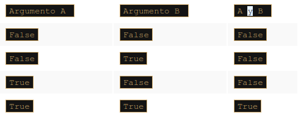

#### or

Un operador de **disyunción** es la palabra `or`. Es un operador binario con una prioridad más baja que `and` (al igual que + en comparación con *). Su tabla de verdad es la siguiente:


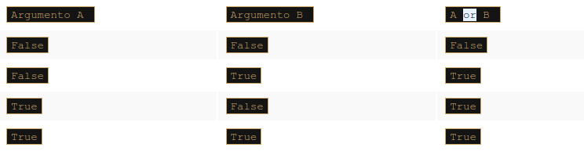

#### not
Además, hay otro operador que se puede aplicar para **condiciones de construcción**. Es un **operador unario** que realiza una *negación lógica*. Su funcionamiento es simple: convierte la verdad en falso y lo falso en verdad.

Este operador se escribe como la palabra `not`, y su prioridad es muy alta: igual que el unario + y -. Su tabla de verdad es simple:

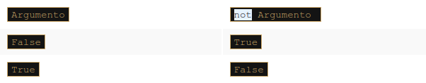


### Expresiones lógicas

Creemos una variable llamada `var` y asignémosle 1. Las siguientes condiciones son **equivalentes** a pares:

```python
var = 1
print(var > 0)
print(not (var <= 0))

>>> True
    True
```

```python
var = 1
print(var != 0)
print(not (var == 0))

>>> True
    True
```


Puedes estar familiarizado con las *leyes de De Morgan*. Dicen que:

* La negación de una conjunción es la disyunción de las negaciones.
* La negación de una disyunción es la conjunción de las negaciones.


Escribamos lo mismo usando Python:

```python
#La negación de una conjunción es la disyunción de las negaciones
not (p and q) == (not p) or (not q)

#La negación de una disyunción es la conjunción de las negaciones
not (p or q) == (not p) and (not q)
```

### Valores lógicos vs. bits individuales

Los operadores lógicos toman sus argumentos como un todo, independientemente de cuántos bits contengan. Los operadores solo conocen el valor: cero (cuando todos los bits se restablecen) significa `False`; no cero (cuando se establece al menos un bit) significa `True`.

El resultado de sus operaciones es uno de estos valores: `False` o `True`. Esto significa que este fragmento de código asignará el valor `True` a la variable `j` si `i` no es cero; de lo contrario, será `False`.

```python
i = 1
j = not not i
```

### Operadores bitwise
Sin embargo, hay cuatro operadores que le permiten **manipular bits de datos individuales**. Se denominan operadores **bitwise**.

Cubren todas las operaciones que mencionamos anteriormente en el contexto lógico, y un operador adicional. Este es el operador xor (como en **o exclusivo**), y se denota como `^` (signo de intercalación).

Aquí están todos ellos:

* `&`  (ampersand) - conjunción a nivel de bits.
* `|`  (barra vertical) - disyunción a nivel de bits.
* `~`  (tilde) - negación a nivel de bits.
* `^`  (signo de intercalación) - exclusivo a nivel de bits o (xor).

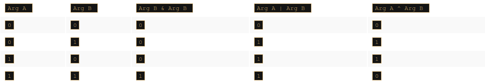

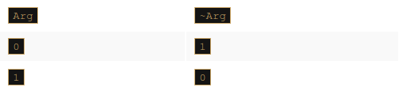

‼️ **Agreguemos un comentario importante**: los argumentos de estos operadores deben ser ***enteros***. No debemos usar flotantes aquí.

* La diferencia en el funcionamiento de los operadores *lógicos* y de *bits* es importante: ***los operadores lógicos no penetran en el nivel de bits de su argumento. Solo les interesa el valor entero final***.
* Los operadores **bitwise** son más estrictos: ***tratan con cada bit por separado***. Si asumimos que la variable entera ocupa 64 bits (lo que es común en los sistemas informáticos modernos), puede imaginar la operación a nivel de bits como una evaluación de 64 veces del operador lógico para cada par de bits de los argumentos. Su analogía es obviamente imperfecta, ya que en el mundo real todas estas 64 operaciones se realizan al mismo tiempo (simultáneamente).

Ahora te mostraremos un ejemplo de la diferencia en la operación entre las operaciones **lógicas** y de **bit**. Supongamos que se han realizado las siguientes tareas:

```python
i = 15
j = 22 
# Si asumimos que los enteros se almacenan con 32 bits,
# la imagen a nivel de bits de las dos variables será la siguiente:

i: 00000000000000000000000000001111
j: 00000000000000000000000000010110 

# Se ejecuta la asignación:

 log = i and j 
"""
Estamos tratando con una conjunción lógica aquí. Vamos a trazar el curso de los cálculos. 
Ambas variables i y j no son ceros, por lo que se considerará que representan a True. 
Al consultar la tabla de verdad para el operador and, podemos ver que el resultado será True. 
No se realizan otras operaciones.
"""
print(log)

>>> True
```

**Ahora la operación a nivel de bits - aquí está**:

```python
bit = i & j
```

El operador `&` operará con **cada par de bits** correspondientes por separado, produciendo los **valores de los bits relevantes** del resultado. Por lo tanto, el resultado será el siguiente:

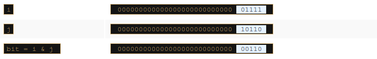

*Estos bits corresponden al valor entero de seis*

***Veamos ahora los operadores de negación***. 

Primero el lógico:

```python
i = 15
logneg = not i 

#La variable logneg se establecerá en False: no es necesario hacer nada más.

print(logneg)

>>> False
```

La negación a nivel de bits es así:

```python
bitneg = ~i 
```

Puede ser un poco sorprendente: el valor de la variable bitneg es -16. Esto puede parecer extraño, pero no lo es en absoluto. Si deseas obtener más información, debes consultar el sistema de números binarios y las reglas que rigen los números de complemento de dos.

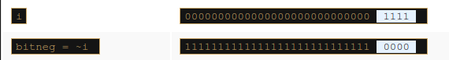

Cada uno de estos operadores de dos argumentos se puede utilizar en forma abreviada. Estos son los ejemplos de sus notaciones equivalentes:

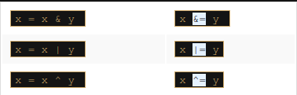

### ¿Cómo tratamos los bits individuales?

Ahora te mostraremos para que puedes usar los operadores de **bitwise**. Imagina que eres un desarrollador obligado a escribir una pieza importante de un sistema operativo. Se te ha dicho que puedes usar una variable asignada de la siguiente forma:

```python
flagRegister = 0x1234
```

La variable almacena la información sobre varios aspectos de la operación del sistema. **Cada bit de la variable almacena un valor de si/no**. También se te ha dicho que solo uno de estos bits es tuyo, el tercero (recuerda que los bits se numeran desde cero y el número de bits cero es el más bajo, mientras que el más alto es el número 31). Los bits restantes no pueden cambiar, porque están destinados a almacenar otros datos. Aquí está tu bit marcado con la letra `x`:

```python
flagRegister = 000000000000000000000000000000x000
```

Es posible que tengas que hacer frente a las siguientes tareas:

1. **Comprobar el estado de tu bit**: deseas averiguar el valor de su bit; comparar la variable completa con cero no hará nada, porque los bits restantes pueden tener valores completamente impredecibles, pero puedes usar la siguiente propiedad de conjunción:

```python
x & 1 = x
x & 0 = 0
```

Si aplicas la operación `&` a la variable `flagRegister` junto con la siguiente imagen de bits:

`00000000000000000000000000001000` 

(observa el 1 en la posición de tu bit) como resultado, obtendrás una de las siguientes cadenas de bits:

* 00000000000000000000000000001000 si tu bit se estableció en 1
* 00000000000000000000000000000000 si tu bit se reseteo a 0

Dicha secuencia de ceros y unos, cuya tarea es tomar el valor o cambiar los bits seleccionados, se denomina **máscara de bits**.

Construyamos una máscara de bits para detectar el estado de tus bits. Debería apuntar a el **tercer bit**. Ese bit tiene el peso de 2³=8. Se podría crear una máscara adecuada mediante la siguiente declaración:

```python
theMask = 8
```

También puedes hacer una secuencia de instrucciones dependiendo del estado de tu bit i, aquí está:

```python
if flagRegister & theMask:
    # mi bit está listo
else:
    # mi bit se restablece
```

2. **Reinicia tu bit**: asigna un cero al bit, mientras que todos los otros bits deben permanecer sin cambios; usemos la misma propiedad de la conjunción que antes, pero usemos una máscara ligeramente diferente, exactamente como se muestra a continuación:

`11111111111111111111111111110111`

Tenga en cuenta que la máscara se creó como resultado de la negación de todos los bits de la variable theMask. Restablecer el bit es simple, y se ve así (elige el que más te guste):

```python
flagRegister = flagRegister & ~theMask

flagregister &= ~theMask
```


3. **Establece tu bit** : asigna un 1 a tu bit, mientras que todos los bits restantes deben permanecer sin cambios; usa la siguiente propiedad de disyunción:

```python
x | 1 = 1
x | 0 = x 
```

Ya estás listo para configurar su bit con una de las siguientes instrucciones:

```python
flagRegister = flagRegister | theMask

flagRegister |= theMask 
```


4. **Niega tu bit**: reemplaza un 1 con un 0 y un 0 con un 1. Puedes utilizar una propiedad interesante del operador ~x:

```python
x ^ 1 = ~x
x ^ 0 = x 
```

Niega tu bit con las siguientes instrucciones:

```python
flagRegister = flagRegister ^ theMask

flagRegister ^= theMask
```

### Desplazamiento izquierdo binario y desplazamiento derecho binario

Python ofrece otra operación relacionada con los bits individuales: **shifting**. Esto se aplica solo a los valores de número entero, y no debe usar flotantes como argumentos para ello.

Ya aplicas esta operación muy a menudo y muy inconscientemente. ¿Cómo multiplicas cualquier número por diez? Echa un vistazo:

```pseint
12345 × 10 = 123450
```

Como puede ver, **multiplicar por diez es de hecho un desplazamiento** de todos los dígitos a la izquierda y llenar el vacío resultante con cero.

¿División entre diez? Echa un vistazo:

```pseint
12340 ÷ 10 = 1234
```

Dividir entre diez no es más que desplazar los dígitos a la derecha.

La computadora realiza el mismo tipo de operación, pero con una diferencia: como dos es la base para los números binarios (no 10), **desplazar un valor un bit a la izquierda corresponde a multiplicarlo por dos**; respectivamente, **desplazar un bit a la derecha es como dividir entre dos** (observe que se pierde el bit más a la derecha).

Los **operadores de cambio** en Python son un par de **dígrafos**: `<<` y `>>`, sugiriendo claramente en qué dirección actuará el cambio.

```python
valor << bits
valor >> bits
```

**El argumento izquierdo de estos operadores es un valor entero cuyos bits se desplazan. El argumento correcto determina el tamaño del turno**.

Esto demuestra que esta operación ciertamente no es conmutativa.

Echa un vistazo a los cambios en la ventana del editor.

```python
var = 17
varRight = var >> 1
varLeft = var << 2
print(var, varLeft, varRight)
```

La invocación final de `print()` produce el siguiente resultado:

`17 68 8` 

🗒️ **Nota**:

`17 // 2 → 8` (desplazarse hacia la derecha en un bit equivale a la división de enteros en dos)
`17 * 4 → 68` (desplazarse hacia la izquierda dos bits es lo mismo que multiplicar números enteros por cuatro).

Y aquí está la **tabla de prioridades** actualizada , que contiene todos los operadores presentados hasta ahora:

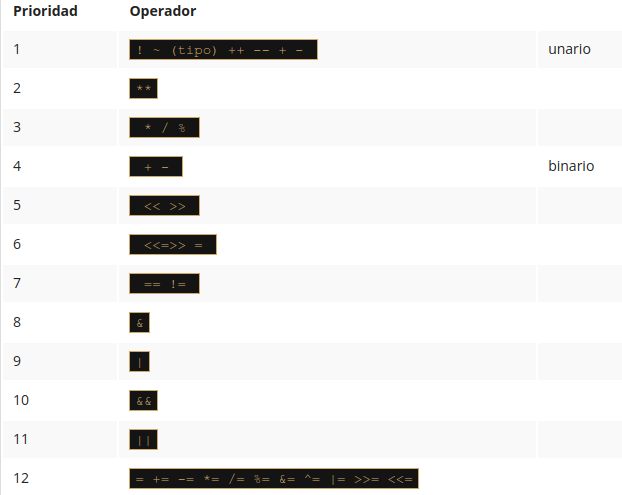

⚜️ **PUNTOS CLAVE** ⚜️

1. Python es compatible con los siguientes operadores lógicos:

* `and` → si ambos operandos son verdaderos, la condición es verdadera, por ejemplo, `(True and True) = True`.
* `or` → si alguno de los **operandos** es verdadero, la condición es verdadera, por ejemplo, `(True or False) = True`.
* `not` → devuelve `False` si el resultado es verdadero y devuelve `True` si es falso, por ejemplo, `not True = False`.

2. Puedes utilizar operadores bit a bit para manipular bits de datos individuales. Los siguientes datos de muestra:

```python
x = 15 # el cual es  0000 1111  en binario.
y = 16 # el cual es  0001 0000  en binario.
```

Se utilizarán para ilustrar el significado de operadores bit a bit en Python. Analiza los ejemplos a continuación:

* `&` hace un bit a bit `and` (y), por ejemplo, `x & y = 0`, el cual es `0000 0000` en binario.
* `|` hace un bit a bit `or` (o), por ejemplo, `x | y = 31`, el cual es `0001 1111` en binario.
* `˜` hace un bit a bit `not` (no), por ejemplo, `˜ x = 240`, el cual es `1111 0000` en binario.
* `^` hace un bit a bit `xor`, por ejemplo, `x ^ y = 31`, el cual es `0001 1111` en binario.
* `>>` hace un desplazamiento bit a bit a la derecha, por ejemplo, `y >> 1 = 8`, el cual es `0000 1000` en binario.
* `<<` hace un desplazamiento bit a bit a la izquierda, por ejemplo, `y << 3 = 128`, el cual es `1000 0000` en binario.

**Ejercicio 1**

¿Cuál es la salida del siguiente fragmento de código?

```python
x = 1
y = 0

z = ((x == y) and (x == y)) or not(x == y)    
print(not(z))
```

respuesta:
```python
False
```

**Ejercicio 2**

¿Cuál es la salida del siguiente fragmento de código?

```python
x = 4
y = 1

a = x & y
b = x | y
c = ~ x
d = x ^ 5
e = x >> 2
f = x << 2

print(a, b, c, d, e, f)
```

Respuesta
```python
 0 5 -5 1 1 16
```


## 3.1.4 Listas

**¿Por qué necesitamos listas?**

Puede suceder que tengas que leer, almacenar, procesar y, finalmente, imprimir docenas, quizás cientos, tal vez incluso miles de números. ¿Entonces que? ¿Necesitas crear una variable separada para cada valor? ¿Tendrás que pasar largas horas escribiendo declaraciones como la que se muestra a continuación?

```python
var1 = int(input())
var2 = int(input())
var3 = int(input())
var4 = int(input())
var5 = int(input())
var6 = int(input())
...
```


Vamos a crear una variable llamada `numeros`; se le asigna no solo un número, sino que se llena con una lista que consta de cinco valores (nota: la lista **comienza con un corchete abierto y termina con un corchete cerrado** ; el espacio entre los corchetes es llenado con cinco números separados por comas).

```python
numeros = [ 10, 5, 7, 2, 1] 
```


`numeros` es una **lista que consta de cinco valores, todos ellos números enteros** de longitud cinco dado que constan de cinco elementos

* una lista puede tener **diferentes tipos de datos**: int, float, str, incluso otras listas
*  una lista está **siempre numerados desde cero**
* una lista **es una colección de elementos, pero cada elemento es un escalar**.


### Listas de indexación 

¿Cómo cambias el valor de un elemento seleccionado en una lista?

Vamos a asignar un nuevo valor de `111` al **primer elemento** en la lista:

```python
numeros = [10, 5, 7, 2, 1]
print("Contenido de la lista original:", numeros) # imprime el contenido de la lista original

numeros[0] = 111 
print("Nuevo contenido de la lista:", numeros) # contenido de la lista actual

>>> Contenido de la lista original: [10, 5, 7, 2, 1]
>>> Nuevo contenido de la lista: [111, 5, 7, 2, 1]
```

Y ahora queremos copiar el valor del **quinto elemento al segundo elemento**

```python
numeros = [10, 5, 7, 2, 1]
print("Contenido de la lista original:", numeros) # imprimiendo contenido de la lista original.

numeros[0] = 111
print("\nPrevio contenido de la lista:", numeros) # imprimiendo contenido de la lista anterior.

numeros[1] = numeros[4]  # copiando el valor del quinto elemento al segundo
print("Nuevo contenido de la lista:", numeros) # imprimiendo el contenido de la lista actual.

>>> Contenido de la lista original: [10, 5, 7, 2, 1]
>>> Previo contenido de la lista: [111, 5, 7, 2, 1]
>>> Nuevo contenido de la lista: [111, 1, 7, 2, 1]
```


El valor dentro de los corchetes que selecciona un elemento de la lista se llama un **índice**, mientras que la operación de seleccionar un elemento de la lista se conoce como **indexación**.


### Accediendo al contenido de una lista

Se puede acceder a cada uno de los elementos de la lista por separado. Por ejemplo, se puede imprimir:

```python
print(numeros[0]) # accediendo al primer elemento de la lista. 
```

Suponiendo que todas las operaciones anteriores se hayan completado con éxito, el fragmento enviará `111` a la consola.

Como puedes ver en el editor, la lista también puede imprimirse como un todo, como aquí:

```python
print(numeros) # imprimiendo la lista completa.
```

Como probablemente hayas notado antes, Python decora la salida de una manera que sugiere que todos los valores presentados forman una lista. La salida del fragmento de ejemplo anterior se ve así:

```python
[111, 1, 7, 2, 1]
```


### La función `len()`

La longitud **de una lista** puede variar durante la ejecución. Se pueden agregar nuevos elementos a la lista, mientras que otros pueden eliminarse de ella. Esto significa que la lista es una **entidad muy dinámica**.

Si deseas verificar la longitud actual de la lista, puedes usar una función llamada `len()` (su nombre proviene de *length - longitud*).

La función toma el nombre de la lista **como un argumento y devuelve el número de elementos almacenados actualmente** dentro de la lista (en otras palabras, la longitud de la lista).

### Eliminando elementos de una lista

Cualquier elemento de la lista puede ser **eliminado** en cualquier momento, esto se hace con una instrucción llamada `del` (eliminar). 

:notebook:**Nota**:  `del` es una instrucción, no una función. :exclamation:

Tienes que apuntar al elemento que quieres eliminar, desaparecerá de la lista y la longitud de la lista se reducirá en uno.

Mira el fragmento de abajo. ¿Puedes adivinar qué salida producirá? Ejecuta el programa en el editor y comprueba.

```python
del numeros[1] 
print(len(numeros)) 
print(numeros) 

>>> [111, 7, 2, 1]
```


:warning: **No puedes acceder a un elemento que no existe** , no puedes obtener su valor ni asignarle un valor. Ambas instrucciones causarán ahora errores de tiempo de ejecución :warning:

```python
print(numeros[4])
numeros[4] = 1 

>>> Traceback (most recent call last):
  File "<stdin>", line 1, in <module>
IndexError: list assignment index out of range
```


### Los índices negativos son válidos 


Puede parecer extraño, pero los índices negativos son válidos y pueden ser muy útiles.

Un elemento con un índice igual a `-1` es **el último en la lista**.

```python
print(numeros[-1])
```

El código del ejemplo mostrará `1`. Ejecuta el programa y comprueba.


Del mismo modo, el elemento con un índice igual a `-2` es **el anterior al último en la lista**.

```python
print(numeros[-2])
```

El fragmento de ejemplo mostrará `2`.

El último elemento accesible en nuestra lista es `numeros[-4]` (el primero). ¡No intentes ir más lejos! :no_good:


**LABORATORIO** 🥽️🥼️

**Tiempo estimado**

5 minutos

**Nivel de dificultad**

Muy fácil

**Objetivos**

Familiarizar al estudiante con:

- Usar instrucciones básicas relacionadas con listas.
- Crear y modificar listas.

**Escenario**

Había una vez un sombrero. El sombrero no contenía conejo, sino una lista de cinco números: `1`, `2`, `3`, `4` y `5`.

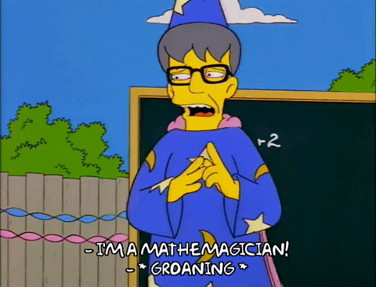

Tu tarea es:

- Escribir una línea de código que solicite al usuario que reemplace el número central en la lista con un número entero ingresado por el usuario (paso 1).
- Escribir una línea de código que elimine el último elemento de la lista (paso 2).
- Escribir una línea de código que imprima la longitud de la lista existente (paso 3).

¿Listo para este desafío?


```python
listaSombrero = [1, 2, 3, 4, 5] # Esta es una lista existente de números ocultos en el sombrero.

# Paso 1: escribe una línea de código que solicite al usuario
# para reemplazar el número de en medio con un número entero ingresado por el usuario.
numero = int(input("ingresa un número: "))

listaSombrero[len(listaSombrero) // 2] = numero

# Paso 2: escribe aquí una línea de código que elimine el último elemento de la lista.
del listaSombrero[-1]

# Paso 3: escribe aquí una línea de código que imprima la longitud de la lista existente.
print(len(listaSombrero))

print(listaSombrero)
```


### Funciones vs Métodos

* Función:  **no pertenece a ningún dato** obtiene datos, puede crear nuevos datos y (generalmente) produce un resultado

* Método: 

  1. **tipo específico de función** se comporta como una función y se parece a una función, pero difiere en la forma en que actúa y en su estilo de invocación

  2. Un método hace todas las cosas de una función, pero también puede **cambiar el estado de una entidad seleccionada**.

     

:information_source: **Un método es propiedad de los datos para los que trabaja, mientras que una función es propiedad de todo el código**. :information_source:

Esto también significa que invocar un método requiere alguna especificación de los datos a partir de los cuales se invoca el método.

En general, una invocación de función típica puede tener este aspecto:

```python
resultado =  funcion(argumento)
```

La función toma un argumento, hace algo y devuelve un resultado.

```python
resultado =  data.method(arg)  
```

Nota: el nombre del método está precedido por el nombre de los datos que posee el método. A continuación, se agrega un **punto**, seguido del **nombre del método** y un par de **paréntesis que encierran los argumentos**.

El método se comportará como una función, pero puede hacer algo más: puede **cambiar el estado interno de los datos** a partir de los cuales se ha invocado.

### Agregar elementos a una lista

#### append()

Un nuevo elemento puede ser *añadido* al final de la lista existente:

```python
lista = [1, 2, 3, 4]
valor = 5
lista.append(valor)

print(lista)

>>> [1, 2, 3, 4, 5]
```

Dicha operación se realiza mediante un método llamado `append()`. Toma el valor de su argumento y lo coloca **al final de la lista** que posee el método.

#### insert()

El método `insert()` es un poco más inteligente: puede agregar un nuevo elemento **en cualquier lugar de la lista**, no solo al final.

```python
lista = [1, 2, 3, 4, 5]
lista.insert(0,0)
print(len(numeros))
print(numeros)

>>> 6
[0, 1, 2, 3, 4, 5]
```

Toma dos argumentos:

- El primero muestra la ubicación requerida del elemento a insertar. Nota: todos los elementos existentes que ocupan ubicaciones a la derecha del nuevo elemento (incluido el que está en la posición indicada) se desplazan a la derecha, para hacer espacio para el nuevo elemento.
- El segundo es el elemento a insertar.

### Agregando elementos a una lista: continuación

Puedes **iniciar la vida de una lista creándola vacía** (esto se hace con un par de corchetes vacíos) y luego agregar nuevos elementos según sea necesario.

Echa un vistazo al fragmento en el editor. Intenta adivinar su salida después de la ejecución del bucle `for`. Ejecuta el programa para comprobar si tenías razón.

Será una secuencia de números enteros consecutivos del `1` hasta `5`.

```text
0 -> i+1

0 -> 0+1 = 1
0 -> 1+1 = 2,1
0 -> 2+1 = 3,2,1
0 -> 3+1 = 4,3,2,1
0 -> 4+1 = 5,4,3,2,1
```


```python
miLista = [] # creando una lista vacía

for i in range(5):
    miLista.insert(0, i + 1)

print(miLista)

>>> [5, 4, 3, 2, 1]
```


### Listas en acción


Dejemos de lado las listas por un breve momento y veamos un tema intrigante.

Imagina que necesitas reorganizar los elementos de una lista, es decir, revertir el orden de los elementos: el primero y el quinto, así como el segundo y cuarto elementos serán intercambiados. El tercero permanecerá intacto.


Pregunta: ¿Cómo se pueden intercambiar los valores de dos variables?

Echa un vistazo al fragmento:

```python
variable1 = 1 
variable2 = 2
variable2 = variable1
variable1 = variable2 
```

Si haces algo como esto, **perderás el valor previamente almacenado**en`variable2`. Cambiar el orden de las tareas no ayudará. Necesitas una tercera variable **que sirva como almacenamiento auxiliar**.

Así es como puedes hacerlo:

```python
variable1 = 1 
variable2 = 2
auxiliar = variable1 
variable1 = variable2 
variable2 = auxiliar 
```

Python ofrece una forma más conveniente de hacer el intercambio, echa un vistazo:

```python
variable1 = 1 
variable2 = 2
variable1, variable2 = variable2, variable1 
```

Claro, efectivo y elegante, ¿no?

Ahora puedes **intercambiar** fácilmente los elementos de la lista para **revertir su orden**:

```python
miLista = [10, 1, 8, 3, 5] 
miLista [0], miLista [4] = miLista [4], miLista [0]
miLista [1], miLista [3] = miLista [3], miLista [1] 
print(miLista) 
```

Ejecuta el fragmento. Su salida debería verse así:

```python
[5, 3, 8, 1, 10]
```

Se ve bien con cinco elementos.


¿Seguirá siendo aceptable con una lista que contenga 100 elementos? No, no lo hará.

¿Puedes usar el bucle `for` para hacer lo mismo automáticamente, independientemente de la longitud de la lista? Si, si puedes.

------

Así es como lo hemos hecho:

```python
miLista = [10, 1, 8, 3, 5]
longitud = len(miLista)  

for i in range (longitud // 2):
    miLista[i], miLista[longitud-i-1] = miLista[longitud-i-1], miLista[i]
    
print(miLista) 
```

:notebook: Nota:

- Hemos asignado la variable `longitud` a la longitud de la lista actual (esto hace que nuestro código sea un poco más claro y más corto).
- Hemos lanzado el ciclo `for` para que se ejecute a través de su cuerpo `longitud // 2` veces (esto funciona bien para listas con longitudes pares e impares, porque cuando la lista contiene un número impar de elementos, el del medio permanece intacto).
- Hemos intercambiado el elemento i (desde el principio de la lista) por el que tiene un índice igual a `(longitud-i-1)` (desde el final de la lista); en nuestro ejemplo, for `i` igual a `0` la `(longitud-i-1)` da `4`; for `i` igual a `3`, da `3`: esto es exactamente lo que necesitábamos.

Las listas son extremadamente útiles y las encontrarás muy a menudo.


**LABORATORIO** 🥽️🥼️

**Tiempo estimado**

10-15 minutos

**Nivel de dificultad**

Fácil

**Objetivos**

Familiarizar al estudiante con:

- Crear y modificar listas simples.
- Utilizar métodos para modificar listas.

**Escenario**

Los Beatles fueron uno de los grupos de música más populares de la década de 1960 y la banda más vendida en la historia. Algunas personas los consideran el acto más influyente de la era del rock. De hecho, se incluyeron en la compilación de la revista *Time* de las 100 personas más influyentes del siglo XX.

La banda sufrió muchos cambios de formación, que culminaron en 1962 con la formación de John Lennon, Paul McCartney, George Harrison y Richard Starkey (mejor conocido como Ringo Starr).


Escribe un programa que refleje estos cambios y le permita practicar con el concepto de listas. Tu tarea es:

- Paso 1: Crea una lista vacía llamada `beatles`.
- Paso 2: Emplea el método `append()` para agregar los siguientes miembros de la banda a la lista: `John Lennon`, `Paul McCartney` y `George Harrison`.
- Paso 3: Emplea el ciclo`for` y el `append()` para pedirle al usuario que agregue los siguientes miembros de la banda a la lista: `Stu Sutcliffe`, y `Pete Best`.
- Paso 4: Usa la instrucción `del` para eliminar a `Stu Sutcliffe` y `Pete Best` de la lista.
- Paso 5: Usa el método `insert()` para agregar a `Ringo Starr` al principio de la lista.

Por cierto, ¿eres fan de los Beatles?


### ⚜️ PUNTOS CLAVE ⚜️

1. La lista **es un tipo de dato** en Python que se utiliza para **almacenar múltiples objetos**. Es una **colección ordenada y mutable** de elementos separados por comas entre corchetes, por ejemplo:

   ```python
   miLista = [1, None, True, "Soy una cadena", 256, 0
   ```

2. Las listas se pueden **indexar y actualizar** , por ejemplo:

   ```python
   miLista  = [1, 1, None, True, 'Soy una cadena', 256, 0] 
   print(miLista[3]) # salida: soy una cadena 
   print(miLista[-1]) # salida: 0 
   miLista[1] = '?' 
   print(miLista) # salida: [1, '?', True, 'Soy una cadena', 256, 0] 
   miLista.insert(0, "first") 
   miLista.append("last") 
   print(miLista ) # salida: ['first', 1, '?', True, 'Soy una cadena', 256, 0, 'last'] 
   ```

3. Las listas pueden estar **anidadas**, por ejemplo:

   ```python
   python miLista = [1, 'a', ["lista", 64, [0, 1], False]]
   ```

4.  Los elementos de la lista y las listas se pueden **eliminar**, por ejemplo:

   ```python
   miLista = [1, 2, 3, 4] 
   del miLista[2]
   print(miLista) # salida: [1, 2, 4] 
   del miLista  # borra toda la lista 
   ```

5. Las listas pueden ser **iteradas** mediante el uso del bucle `for`, por ejemplo:
   ```python
   miLista = ["blanco", "purpura", "azul", "amarillo", "verde"]
   for color in miLista:
       print(color)
   ```

6. La función `len()` se puede usar para **verificar la longitud de la lista**, por ejemplo:

   ```python
   miLista = ["blanco", "purpura", "azul", "amarillo", "verde"] 
   print(len(miLista)) # la salidas es 5 
   del miLista[2] 
   print (len(miLista)) # la salidas es 4 
   ```


7. Una invocación típica de **función** tiene el siguiente aspecto: `resultado = funcion(argumento)`, mientras que una invocación típica de un **método** se ve así: `resultado = data.method(arg)`.


## 3.1.5 Ordenando listas simples

### Ordenamiento burbuja


Se han inventado muchos algoritmos de clasificación, que difieren mucho en velocidad, así como en complejidad. Vamos a mostrar un algoritmo muy simple, fácil de entender, pero desafortunadamente, tampoco es muy eficiente. Se usa muy raramente, y ciertamente no para listas extensas.

Digamos que una lista se puede ordenar de dos maneras:

- Ascendente (o más precisamente, no descendente): si en cada par de elementos adyacentes, el primer elemento no es mayor que el segundo.
- Descendente (o más precisamente, no ascendente): si en cada par de elementos adyacentes, el primer elemento no es menor que el segundo.

En las siguientes secciones, ordenaremos la lista en orden ascendente, de modo que los números se ordenen de menor a mayor.


Intentaremos utilizar el siguiente enfoque: tomaremos el primer y el segundo elemento y los compararemos; si determinamos que están en el orden incorrecto (es decir, el primero es mayor que el segundo), los intercambiaremos; Si su orden es válido, no haremos nada. Un vistazo a nuestra lista confirma lo último: los elementos 01 y 02 están en el orden correcto, así como `8<10`.

Ahora observa el segundo y el tercer elemento. Están en las posiciones equivocadas. Tenemos que intercambiarlos:

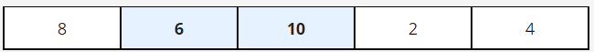


Vamos más allá y observemos los elementos tercero y cuarto. Una vez más, esto no es lo que se supone que es. Tenemos que intercambiarlos:

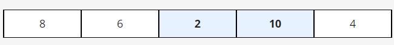

Ahora comprobemos los elementos cuarto y quinto. Si, ellos también están en las posiciones equivocadas. Ocurre otro intercambio:

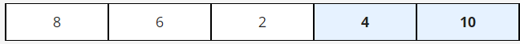

Ahora, por un momento, intenta imaginar la lista de una manera ligeramente diferente, es decir, de esta manera:

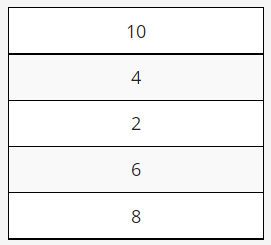

Observa - El `10` está en la parte superior. Podríamos decir que flotó desde el fondo hasta la superficie, al igual que las burbujas **en una copa de champán**. El método de clasificación deriva su nombre de la misma observación: se denomina **ordenamiento de burbuja**.

Ahora comenzamos con el segundo paso a través de la lista. Miramos el primer y el segundo elemento, es necesario un intercambio:

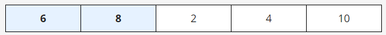

Tiempo para el segundo y tercer elemento: también tenemos que intercambiarlos:

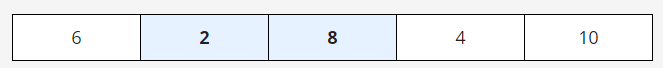

Ahora el tercer y cuarto elementos, y la segunda pasada, se completa, ya que `8` ya está en su lugar:

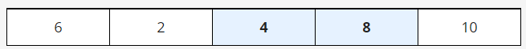

Comenzamos el siguiente pase inmediatamente. Observe atentamente el primer y el segundo elemento: se necesita otro cambio:

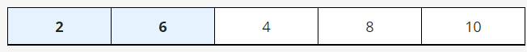

Ahora `6` necesita ir a su lugar. Cambiamos el segundo y el tercer elemento:

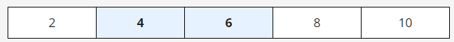

La lista ya está ordenada. No tenemos nada más que hacer. Esto es exactamente lo que queremos.

Como puedes ver, la esencia de este algoritmo es simple: **comparamos los elementos adyacentes y, al intercambiar algunos de ellos, logramos nuestro objetivo**


### Ordenando una lista :white_check_mark:

¿Cuántos pases necesitamos para ordenar la lista completa?

Resolvamos este problema de la siguiente manera: **introducimos otra variable**, su tarea es observar si se ha realizado algún intercambio durante el pase o no. Si no hay intercambio, entonces la lista ya está ordenada, y no hay que hacer nada más. Creamos una variable llamada `swapped`, y le asignamos un valor de `False` para indicar que no hay intercambios. De lo contrario, se le asignará `True`.

```python
miLista = [8, 10, 6, 2, 4] # lista para ordenar

for i in range(len(miLista) - 1): # necesitamos (5 - 1) comparaciones
    if miLista[i] > miLista[i + 1]: # compara elementos adyacentes
        miLista[i], miLista [i + 1] = miLista[i + 1], miLista[i] # si terminamos aquí significa que tenemos que intercambiar los elementos.

```

Deberías poder leer y comprender este programa sin ningún problema:

```python
miLista = [8, 10, 6, 2, 4] # lista para ordenar
swapped = True # lo necesitamos verdadero (True) para ingresar al bucle while

while swapped:
    swapped = False # no hay swaps hasta ahora
    for i in range(len(miLista) - 1):
        if miLista[i] > miLista[i + 1]:
            swapped= True # ocurrió el intercambio!
            miLista[i], miLista[i + 1] = miLista[i + 1], miLista[i]

print(miLista)
```


Python, sin embargo, tiene sus propios mecanismos de clasificación. Nadie necesita escribir sus propias clases, ya que hay un número suficiente de **herramientas listas para usar**.

Te explicamos este sistema de clasificación porque es importante aprender como procesar los contenidos de una lista y mostrarte como puede funcionar la clasificación real.

Si quieres que Python ordene tu lista, puedes hacerlo de la siguiente manera:

```python
miLista = [8, 10, 6, 2, 4]
miLista.sort() 
print(miLista) 
```

Es tan simple como eso.

La salida del fragmento es la siguiente:

```python
[2, 4, 6, 8, 10] 
```


### ⚜️ PUNTOS CLAVE ⚜️

1. Puedes usar el método `sort()` para ordenar los elementos de una lista, por ejemplo:

   ```python
   lst = [5, 3, 1, 2, 4]
   print(lst) 
   lst.sort()
   print(lst) # salida: [1, 2, 3, 4, 5]
   ```

2. También hay un método de lista llamado `reverse()`, que puedes usar para invertir la lista, por ejemplo:

   ```python
   lst = [5, 3, 1, 2, 4] print(lst)     lst.reverse() print (lst) # salida: [4, 2, 1, 3, 5]
   ```
   


**Ejercicio 1** :muscle:

¿Cuál es la salida del siguiente fragmento de código?

```python
lst = ["D", "F", "A", "Z"]
lst.sort ()
print(lst)
```


**Ejercicio 2** 🏋🏻

¿Cuál es la salida del siguiente fragmento de código?

```python
a = 3
b = 1
c = 2
lst = [a, c, b]
lst.sort() 
print(lst)
```


**Ejercicio 3** :muscle:

¿Cuál es la salida del siguiente fragmento de código?

```python
a = "A" 
b = "B"
c = "C"
d = "" 
lst = [a, b, c, d] 
lst.reverse() 
print(lst)
```


## 3.1.6 Operaciones con listas

### :warning:  **La vida al interior de una lista** :warning:

Ahora queremos mostrarte una característica importante y muy sorprendente de las listas, que las distingue de las variables ordinarias.

Queremos que lo memorices, ya que puede afectar tus programas futuros y causar graves problemas si se olvida o se pasa por alto.

Echa un vistazo al fragmento de código:

```python
lista1 = [1]
lista2 = lista1
lista1[0] = 2
print(lista2)

>>> [2]
```

El programa:

- Crea una lista de un elemento llamada `lista1`.
- La asigna a una nueva lista llamada `lista2`.
- Cambia el único elemento de `lista1`.
- Imprime la `lista2`.

La parte sorprendente es el hecho de que el programa mostrará como resultado: `[2]`, no `[1]`, que parece ser la solución obvia.

Las listas (y muchas otras entidades complejas de Python) se almacenan de diferentes maneras que las variables ordinarias (escalares).

Se podría decir que:

- El nombre de una variable ordinaria es el **nombre de su contenido**. :heavy_exclamation_mark:
- El nombre de una lista es el nombre de una ubicación de memoria **donde se almacena la lista**. :flags:

:eyes: La asignación: `lista2 = lista1`copia el nombre de la matriz, no su contenido. En efecto, los dos nombres (`lista1` y `lista2`) **identifican la misma ubicación en la memoria de la computadora**. Modificar uno de ellos afecta al otro, y viceversa.

¿Cómo se soluciona esto? :question:

### Rodajas poderosas

Afortunadamente, la solución está al alcance de su mano: su nombre es **rodaja**.

Una rodaja es un elemento de la sintaxis de Python que permite **hacer una copia nueva de una lista, o partes de una lista**.

En realidad, copia el contenido de la lista, no el nombre de la lista. Esto es exactamente lo que necesitas. Echa un vistazo al fragmento de código a continuación:

```python
lista1 = [1]
lista2 = lista1[:]
lista1[0] = 2
print(lista2)

>>> [1]
```

Esta parte no visible del código descrito como `[:]` puede producir una lista completamente nueva.

Una de las formas más generales de la rodaja es la siguiente:

```python
miLista[inicio:fin]
```

Como puedes ver, se asemeja a la indexación, pero los dos puntos en el interior hacen una gran diferencia.

Una rodaja de este tipo **crea una nueva lista (de destino), tomando elementos de la lista de origen: los elementos de los índices desde el principio hasta el `fin-1`**.

Nota: no hasta el `fin`, sino hasta `fin-1`. Un elemento con un índice igual a `fin` es el primer elemento el cual **no participa en la segmentación**.

Es posible utilizar valores negativos tanto para el inicio como para el fin(al igual que en la indexación).

Echa un vistazo al fragmento:

```python
miLista = [10, 8, 6, 4, 2]
nuevaLista = miLista [1:3]
print(nuevaLista)

>>> [8, 6]
```

La lista `nuevaLista` contendrá `inicio-fin` (3-1=2) elementos, los que tienen índices iguales a `1` y `2` (pero no `3`)

La salida del fragmento es: `[8, 6]`

### Rodajas índices negativos

Observa el fragmento de código a continuación:

```python
miLista[inicio:fin]
```

Para repetir:

- `inicio` es el índice del primer elemento **incluido en la rodaja**.
- `fin` es el índice del primer elemento **no incluido en la rodaja.**


Así es como **los índices negativos** funcionan con la rodaja:

```python
miLista = [10, 8, 6, 4, 2] 
nuevaLista = miLista [1:-1]
print(nuevaLista)

>>> [8, 6, 4]
```

El resultado del fragmento es: `[8, 6, 4]`.

Si el`inicio` especifica un elemento que se encuentra más allá del descrito por `fin` (desde el punto de vista inicial de la lista), la rodaja estará **vacía**:

```python
miLista = [10, 8, 6, 4, 2] 
nuevaLista = miLista [-1:1] 
print(nuevaLista)

>>> []
```


### Rodajas: continuación

Si omites `inicio` en tu rodaja, se supone que deseas obtener un segmento que comienza en el elemento con índice `0`.

En otras palabras, la rodaja sería de esta forma:

```python
miLista[:fin]
```

Es un equivalente más compacto:

```python
miLista[0:fin]
```

Observa el fragmento de código a continuación:

```python
miLista = [10, 8, 6, 4, 2]
nuevaLista = miLista[:3] 
print(nuevaLista)
```

Es por esto que su salida es: `[10, 8, 6]`.

Del mismo modo, si omites el `fin` en tu rodaja, se supone que deseas que el segmento termine en el elemento con el índice `len(miLista)`.

En otras palabras, la rodaja sería de esta forma:

```python
miLista[inicio:]
```

Es un equivalente más compacto:

```python
miLista[inicio:len(miLista)]
```

Observa el siguiente fragmento de código:

```python
miLista = [10, 8, 6, 4, 2]
nuevaLista = miLista[3:] 
print(nuevaLista)
```

Por lo tanto, la salida es: `[4, 2]`.

La instrucción `del` descrita anteriormente puede **eliminar más de un elemento de la lista a la vez, también puede eliminar rodajas**:

```python
miLista = [10, 8, 6, 4, 2] del miLista[1:3]  print(miLista)
```

Nota: En este caso, la rodaja **¡no produce ninguna lista nueva!**

La salida del fragmento es:`[10, 4, 2]`.

También es posible eliminar **todos los elementos** a la vez:

```python
miLista = [10, 8, 6, 4, 2] del miLista[:]  print(miLista)
```

La lista se queda vacía y la salida es: `[]`.

Al eliminar la rodaja del código, su significado cambia dramáticamente.

Echa un vistazo:

```python
miLista = [10, 8, 6, 4, 2] del miLista  print(miLista)
```

La instrucción `del` **eliminará la lista, no su contenido**.

La función `print()` de la última línea del código provocará un error de ejecución.


### Operadores `in` y `not`

Python ofrece dos operadores muy poderosos, capaces de **revisar la lista para verificar si un valor específico está almacenado dentro de la lista o no**.

Estos operadores son:

```python
elem in miLista 
elem not in miLista 
```

El primero de ellos (`in`) verifica si un elemento dado(su argumento izquierdo) está actualmente almacenado en algún lugar dentro de la lista(el argumento derecho) - el operador devuelve `True` en este caso.

El segundo (`not in`) comprueba si un elemento dado (su argumento izquierdo) está ausente en una lista - el operador devuelve `True` en este caso.

------

Observa el código en el editor. El fragmento muestra ambos operadores en acción. ¿Puedes adivinar su salida? Ejecuta el programa para comprobar si tenías razón.

```python
miLista = [0, 3, 12, 8, 2]

print(5 in miLista)
print(5 not in miLista)
print(12 in miLista)

>>> False
True
True
```


### Listas - más detalles

Ahora queremos mostrarte algunos programas simples que utilizan listas.

El primero de ellos intenta encontrar el mayor valor en la lista. Mira el código:

```python
miLista = [17, 3, 11, 5, 1, 9, 7, 15, 13]
mayor = miLista[0]

for i in range(1, len(miLista)):
   if miLista [i]> mayor:
        mayor = miLista[i]

print(mayor)
```


El concepto es bastante simple: asumimos temporalmente que el primer elemento es el más grande y comparamos la hipótesis con todos los elementos restantes de la lista.

El código da como resultado el`17`(como se espera).

------

El código puede ser reescrito para hacer uso de la forma recién introducida del ciclo `for`:

```python
miLista = [17, 3, 11, 5, 1, 9, 7, 15, 13]
mayor = miLista[0] 
for i in miLista:    
    if i > mayor:        
        mayor = i 

print(mayor)
```

El programa anterior realiza una comparación innecesaria, cuando el primer elemento se compara consigo mismo, pero esto no es un problema en absoluto.

El código da como resultado el `17` también (nada inusual).

------

Si necesitas ahorrar energía de la computadora, puedes usar una rodaja:

```python
miLista = [17, 3, 11, 5, 1, 9, 7, 15, 13]
mayor = miLista[0] 
for i in miLista[1:]:   
    if i > mayor:       
        mayor = i 
print(mayor)
```


### Listas - algunos programas simples

Ahora encontremos la ubicación de un elemento dado dentro de una lista:

```python
miLista = [1, 2, 3, 4, 5, 6, 7, 8, 9, 10]
Encontrar = 5
Encontrado = False

for i in range(len(miLista)):
    Encontrado = miLista[i] == Encontrar
    if Encontrado:
        break

if Encontrado:
    print("Elemento encontrado en el índice", i)
else:
    print("ausente")
```


:notebook: Nota:

- El valor buscado se almacena en la variable `Encontrar`.
- El estado actual de la búsqueda se almacena en la variable `Encontrado` (`True`/`False`).
- Cuando `Encontrado` se convierte en `True`, se sale del bucle `for`.

---

Supongamos que has elegido los siguientes números en la lotería: `3`, `7`, `11`, `42`, `34`, `49`.

Los números que han salido sorteados son: `5`, `11`, `9`, `42`, `3`, `49`.

La pregunta es: ¿A cuántos números le has atinado?

 ```python
 sorteados = [5, 11, 9, 42, 3, 49]
 seleccionados = [3, 7, 11, 42, 34, 49]
 aciertos = 0
 
 for numeros in seleccionados:
     if numeros in sorteados:
         aciertos += 1
 
 print(aciertos)
 ```

:notebook: Nota:

- La lista `sorteados` almacena todos los números ganadores.
- La lista de `seleccionados` almacena con números con que se juega.
- La variable `aciertos` cuenta tus aciertos.

La salida del programa es: `4`.

### LABORATORIO

**Tiempo estimado**

10-15 minutos

**Nivel de dificultad**

Fácil

**Objetivos**

Familiarizar al estudiante con:

- Indexación de listas.
- Utilizar operadores`in` y `not in`.

**Escenario**

Imagina una lista: no muy larga ni muy complicada, solo una lista simple que contiene algunos números enteros. Algunos de estos números pueden estar repetidos, y esta es la clave. No queremos ninguna repetición. Queremos que sean eliminados.

Tu tarea es escribir un programa que elimine todas las repeticiones de números de la lista. El objetivo es tener una lista en la que todos los números aparezcan no más de una vez.

Nota: Asume que la lista original está ya dentro del código, no tienes que ingresarla desde el teclado. Por supuesto, puedes mejorar el código y agregar una parte que pueda llevar a cabo una conversación con el usuario y obtener todos los datos.

Sugerencia: Te recomendamos que crees una nueva lista como área de trabajo temporal, no necesitas actualizar la lista actual.

```python
miLista = [1, 2, 4, 4, 1, 4, 2, 6, 2, 9]
#
# coloca tu código aquí
#

lista = miLista[:]
unique = []

for num in lista[0:]:
    if num not in unique:
        unique.append(num)

print("La lista solo con elementos únicos:")
print(unique)
```


### ⚜️ PUNTOS CLAVE ⚜️

1. Si tienes una lista `l1`, la siguiente asignación: `l2 = l1` no hace una copia de la lista `l1`, pero hace que las variables `l1` y `l2` **apunten a la misma lista en la memoria** . Por ejemplo:

   ```python
   vehiculosUno = ['carro', 'bicicleta', 'moto']
   print(vehiculosUno) # salida: ['carro', 'bicicleta', 'moto']
   
   vehiculosDos = vehiculosUno
   del vehiculosUno[0] # borra 'carro'
   print(vehiculosDos) # salida: ['bicicleta', 'moto']
   ```

   

2. Si deseas copiar una lista o parte de la lista, puede hacerlo haciendo uso de **rodajas(slicing)**:

   ```python
   colores = ['rojo', 'verde', 'naranja']
   
   copiaTodosColores = colores[:] # copia la lista completa
   copiaParteColores = colores[0:2] # copia parte de la lista
   ```

3. También puede utilizar **índices negativos** para hacer uso de rodajas. Por ejemplo:

   ```python
   listaMuestra = ["A", "B", "C", "D", "E"]
   nuevaLista = listaMuestra[2:-1]
   print(nuevaLista) # salida: ['C', 'D']
   ```

4. Los parámetros `inicio` y `fin`son **opcionales** al partir en rodajas una lista: `lista[inicio:fin]`, por ejemplo:

   ```python
   miLista = [1, 2, 3, 4, 5]
   rodajaUno = miLista [2:]
   rodajaDos = miLista [:2]
   rodajaTres = miLista [-2:]
   
   print(rodajaUno) # salidas: [3, 4, 5]
   print(rodajaDos) # salidas: [1, 2]
   print(rodajaTres) # salidas: [4, 5]
   ```

5. Puedes **eliminar rodajas** utilizando la instrucción `del`:

   ```python
   miLista = [1, 2, 3, 4, 5]
   del miLista [0:2]
   print(miLista) # salida: [3, 4, 5]
   
   del miLista[:]
   print(miLista) # elimina el contenido de la lista, genera: []
   ```

   

6. Puedes probar si algunos elementos **existen en una lista o no** utilizando las palabras clave `in` y `not in`, por ejemplo:

   ```python
   miLista = ["A", "B", 1, 2]
   
   print("A" in miLista) # salida: True
   print("C" not in miLista) # salida: False
   print(2 not in miLista) # salidas: False
   ```

   


## 3.1.7 Listas en aplicaciones Avanzadas


### Listas dentro de listas

Las listas pueden constar de escalares (es decir, números) y elementos de una estructura mucho más compleja (ya has visto ejemplos como cadenas, booleanos o incluso otras listas en las lecciones del Resumen de la Sección anterior). Veamos más de cerca el caso en el que los elementos de una lista **son solo listas**.

A menudo encontramos estos **arreglos** en nuestras vidas. Probablemente el mejor ejemplo de esto sea un **tablero de ajedrez**.


Un tablero de ajedrez está compuesto de filas y columnas. Hay ocho filas y ocho columnas. Cada columna está marcada con las letras de la A a la H. Cada línea está marcada con un número del uno al ocho.

La ubicación de cada campo se identifica por pares de letras y dígitos. Por lo tanto, sabemos que la esquina inferior derecha del tablero (la que tiene la torre blanca) es A1, mientras que la esquina opuesta es H8.

Supongamos que podemos usar los números seleccionados para representar cualquier pieza de ajedrez. También podemos asumir que **cada fila en el tablero de ajedrez es una lista**.

```python
fila = []

for i in range(8):
    row.append(PEON_BLANCO)
```

Crea una lista que contiene ocho elementos que representan la segunda fila del tablero de ajedrez: la que está llena de peones (supón que `PEON_BLANCO` es un **símbolo predefinido** que representa un peón blanco).

El mismo efecto se puede lograr mediante una **comprensión de lista**, la sintaxis especial utilizada por Python para completar o llenar listas masivas.

Una comprensión de lista es en realidad una lista, pero **se creó sobre la marcha durante la ejecución del programa, y no se describe de forma estática**.

Echa un vistazo al fragmento:

```python
fila = [PEON_BLANCO for i in range(8)]
```

La parte del código colocada dentro de los paréntesis especifica:

- Los datos que se utilizarán para completar la lista (`PEON_BLANCO`)
- La cláusula que especifica cuántas veces se producen los datos dentro de la lista (`for i in range(8)`)

---

Permítenos mostrarte otros **ejemplos de comprensión de lista**:

**Ejemplo 1**:

```python
cuadrados = [x ** 2 for x in range(10)]
```

El fragmento de código genera una lista de diez elementos y rellena con cuadrados de diez números enteros que comienzan desde cero (0, 1, 4, 9, 16, 25, 36, 49, 64, 81)

**Ejemplo 2**:

```python
dos = [2 ** i for i in range(8)]
```

El fragmento crea un arreglo de ocho elementos que contiene las primeras ocho potencias del numero dos (1, 2, 4, 8, 16, 32, 64, 128)

**Ejemplo 3**:

```python
probabilidades = [x for x in cuadrados if x % 2 != 0] 
```

El fragmento hace una lista con solo los elementos impares de la lista `cuadrados`


### Arreglos bidimensionales

Supongamos también que un **símbolo predefinido** denominado `EMPTY` designa un campo vacío en el tablero de ajedrez.

Entonces, si queremos crear una lista de listas que representan todo el tablero de ajedrez, se puede hacer de la siguiente manera:

```python
tablero  = []

for i in range(8):
    fila = [EMPTY for i in range(8)]
    tablero.append(fila)
```


:notebook: Nota:

- La parte interior del bucle crea una fila que consta de ocho elementos(cada uno de ellos es igual a `EMPTY`) y lo agrega a la lista del `tablero`.
- La parte exterior se repite ocho veces.
- En total, la lista `tablero` consta de 64 elementos (todos iguales a `EMPTY`).

Este modelo imita perfectamente el tablero de ajedrez real, que en realidad es una lista de elementos de ocho elementos, todos ellos en filas individuales. Resumamos nuestras observaciones:

- Los elementos de las filas son campos, ocho de ellos por fila.
- Los elementos del tablero de ajedrez son filas, ocho de ellos por tablero de ajedrez.

La variable `tablero` ahora es un **arreglo bidimensional**. También se le llama, por analogía a los términos algebraicos, una **matriz**.

Como las listas de comprensión puede ser **anidadas**, podemos acortar la creación del tablero de la siguiente manera:

```python
tablero = [[EMPTY for i in range(8)] for j in range(8)]
```

La parte interna crea una fila, y la parte externa crea una lista de filas.


### Acceso a arreglos bidimensionales

El acceso al campo seleccionado del tablero requiere dos índices: el primero selecciona la fila; el segundo: el número del campo dentro de la fila, el cual es un número de columna.

Echa un vistazo al tablero de ajedrez. Cada campo contiene un par de índices que se deben dar para acceder al contenido del campo:


Echando un vistazo a la figura que se muestra arriba, coloquemos algunas piezas de ajedrez en el tablero. Primero, agreguemos todas las torres:

```python
tablero[0][0] = TORRE
tablero[0][7] = TORRE
tablero[7][0] = TORRE
tablero[7][7] = TORRE
```

Si deseas agregar un caballo a C4, hazlo de la siguiente manera:

```python
tablero[4][2] = CABALLO
```

Y ahora un peón a E5:

```python
tablero[3][4] = PEON
```


### Aplicaciones avanzadas


Profundicemos en la naturaleza multidimensional de las listas. Para encontrar cualquier elemento de una lista bidimensional, debes usar dos *coordenadas*:

- Una vertical (número de fila).
- Una horizontal (número de columna).

Imagina que desarrollas una pieza de software para una estación meteorológica automática. El dispositivo registra la temperatura del aire cada hora y lo hace durante todo el mes. Esto te da un total de 24 × 31 = 744 valores. Intentemos diseñar una lista capaz de almacenar todos estos resultados.

Primero, debes decidir qué tipo de datos sería adecuado para esta aplicación. En este caso, sería mejor un `float`, ya que este termómetro puede medir la temperatura con una precisión de 0.1 ℃.

Luego tomarás la decisión arbitraria de que las filas registrarán las lecturas cada hora exactamente (por lo que la fila tendrá 24 elementos) y cada una de las filas se asignará a un día del mes (supongamos que cada mes tiene 31 días, por lo que necesita 31 filas). Aquí está el par apropiado de comprensiones(`h` es para las horas, `d`para el día):

```python
temps = [[0.0 for h in range (24)] for d in range (31)]
```

Toda la matriz está llena de ceros ahora. Puede suponer que se actualiza automáticamente utilizando agentes de hardware especiales. Lo que tienes que hacer es esperar a que la matriz se llene con las mediciones.

---

Ahora es el momento de determinar la temperatura promedio mensual del mediodía. Suma las 31 lecturas registradas al mediodía y divida la suma por 31. Puedes suponer que la temperatura de medianoche se almacena primero. Aquí está el código:

```python
temps = [[0.0 for h in range(24)] for d in range (31)]
#
# la matriz se actualiza mágicamente aquí
#

suma = 0.0

for day in temps:
    suma += day[11]

promedio= suma / 31

print("Temperatura promedio al mediodía:", promedio)
```

:notebook: Nota: La variable `day` utilizada por el bucle `for` no es un escalar: cada paso a través de la matriz `temps` lo asigna a la siguiente fila de la matriz; Por lo tanto, es una lista. Se debe indexar con `11` para acceder al valor de temperatura medida al mediodía.

---

Ahora encuentra la temperatura más alta durante todo el mes, ve el código:

```python
temps = [[0.0 for h in range (24)] for d in range (31)]
#
# la matriz se actualiza mágicamente aquí
#

mas_alta = -100.0

for day in temps:
    for temp in day:
        if temp > mas_alta:
            mas_alta = temp

print("La temperatura más alta fue:", mas_alta)
```


:notebook: Nota:

- La variable `day` itera en todas las filas de la matriz `temps`.
- La variable `temp` itera a través de todas las mediciones tomadas en un día.

Ahora cuenta los días en que la temperatura al mediodía fue de al menos 20 ℃:

```python
temps = [[0.0 for h in range(24)] for d in range(31)]
#
# la matriz se actualiza mágicamente aquí
#

hotDays = 0

for day in temps:
    if day[11] > 20.0:
        hotDays += 1

print(hotDays, " fueron los días calurosos.")
```


### Arreglos tridimencionales

Python no limita la profundidad de la inclusión lista en lista. Aquí puedes ver un ejemplo de un arreglo tridimensional:

Imagina un hotel. Es un hotel enorme que consta de tres edificios, de 15 pisos cada uno. Hay 20 habitaciones en cada piso. Para esto, necesitas un arreglo que pueda recopilar y procesar información sobre las habitaciones ocupadas/libres.

Primer paso: El tipo de elementos del arreglo. En este caso, sería un valor booleano (`True`/`False`).

Paso dos: Análisis de la situación. Resume la información disponible: tres edificios, 15 pisos, 20 habitaciones.

Ahora puedes crear el arreglo:

```python
habitaciones =[[[False for r in range(20)] for f in range(15)] for t in range(3)]
```

El primer índice (`0` a `2`) selecciona uno de los edificios; el segundo(`0` a `14`) selecciona el piso, el tercero (`0` a `19`) selecciona el número de habitación. Todas las habitaciones están inicialmente desocupadas.

Ahora ya puedes reservar una habitación para dos recién casados: en el segundo edificio, en el décimo piso, habitación 14:

```python
habitaciones[1][9][13] = True 
```

y desocupa el segundo cuarto en el quinto piso ubicado en el primer edificio:

```python
habitaciones[0][4][1] = False 
```

Verifica si hay disponibilidad en el piso 15 del tercer edificio:

```python
vacante = 0

for numeroHabitacion in range(20):
    if not habitaciones[2][14][numeroHabitacion]:
        vacante += 1
```

La variable `vacante` contiene `0` si todas las habitaciones están ocupadas, o en dado caso el número de habitaciones disponibles.


### ⚜️ PUNTOS CLAVE ⚜️

1.  **La comprensión de listas** te permite crear nuevas listas a partir de las existentes de una manera concisa y elegante. La sintaxis de una lista de comprensión es la siguiente:
   
   ```python
   [expresión for elemento in lista if condicional]
   ```
   su equivalente es
   ```python
   for elemento in lista:
       if condicional:
           expresión
   ```

Este es un ejemplo de una lista de comprensión: el código siguiente crea una lista de cinco elementos con los primeros cinco números naturales elevados a la potencia de 3:

```python
cubos = [num ** 3 for num in range (5)]
print(cubos) # salidas: [0, 1, 8, 27, 64]
```


2. Puedes usar **listas anidadas** en Python para crear **matrices** (es decir, listas bidimensionales). Por ejemplo:

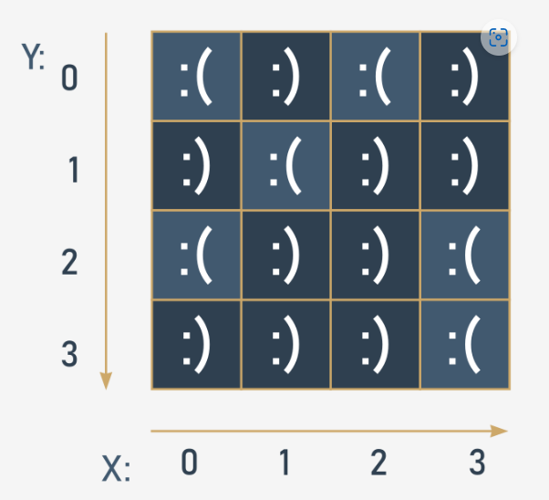

```python
# Una tabla de cuatro columnas y cuatro filas: un arreglo bidimensional (4x4)

table = [[":(", ":)", ":(", ":)"],
         [":)", ":(", ":)", ":)"],
         [":(", ":)", ":)", ":("],
         [":)", ":)", ":)", ":("]]

print(tabla)
print(tabla [0][0]) # salida: ':('
print(tabla [0][3]) # salida: ':)'
```


3. Puedes anidar tantas listas en las listas como desee y, por lo tanto, crear listas n-dimensionales, por ejemplo, arreglos de tres, cuatro o incluso sesenta y cuatro dimensiones. Por ejemplo:

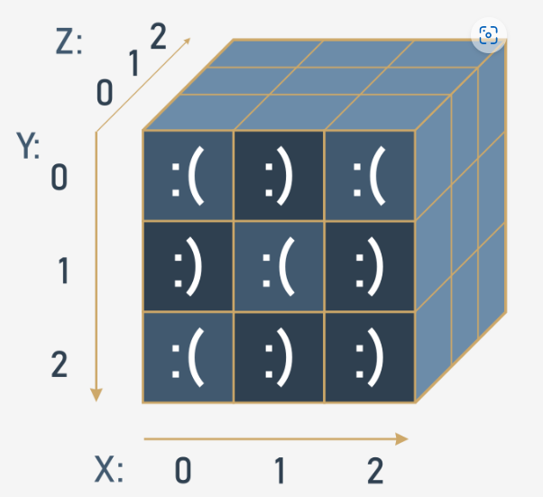

```python
# Cubo - un arreglo tridimensional (3x3x3)

cubo = [[[':(', 'x', 'x'],
         [':)', 'x', 'x'],
         [':(', 'x', 'x']],

        [[':)', 'x', 'x'],
         [':(', 'x', 'x'],
         [':)', 'x', 'x']],

        [[':(', 'x', 'x'],
         [':)', 'x', 'x'],
         [':)', 'x', 'x']]]

print(cubo)
print(cubo [0][0][0]) # salida: ':('
print(cubo [2][2][0]) # salida: ':)'
```

