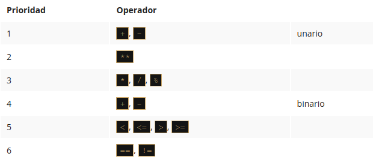

# Módulo 3

En este módulo, aprenderás sobre:

* Valores booleanos.
* Instrucciones if-elif-else.
* Bucles while y for.
* Control de flujo.
* Operaciones lógicas y bit a bit.
* Listas y arreglos.

*****

## 3.1.1 Tomando decisiones en Python 🐍️


### Preguntas y respuestas


Un programador escribe un programa y **el programa hace preguntas**.

Una computadora ejecuta el programa y **proporciona las respuestas**. El programa debe ser capaz de **reaccionar de acuerdo con las respuestas recibidas**.

Afortunadamente, las computadoras solo conocen dos tipos de respuestas:

* Si, es cierto.
* No, esto es falso.

Nunca obtendrás una respuesta como Déjame pensar 🤔️ ..., no lo sé 😒️, o probablemente sí, pero no lo sé con seguridad 🙃️

***Para hacer preguntas, Python utiliza un conjunto de operadores muy especiales***. 

### Comparación: operador de igualdad 

Pregunta: ¿**Son dos valores iguales**?

Para hacer esta pregunta, se utiliza el ```==``` Operador (igual igual).

No olvides esta importante distinción:

* ```=``` es un operador de asignación, por ejemplo, ```a = b``` assigna a la varable a el valor de b.
* ```==``` es una pregunta ¿**Son estos valores iguales**?; ```a == b``` compara a y b.

Es un **operador binario** *con enlazado a la izquierda*. Necesita dos argumentos y verifica si son iguales. ‼️


**Ejercicios**

Ahora vamos a hacer algunas preguntas. Intenta adivinar las respuestas.

1. ¿Cuál es el resultado de la siguiente comparación?

```python
2 == 2
```

**True (verdadero)** - por supuesto, 2 es igual a 2. Python responderá True (Recuerda este par de literales predefinidos, True y False - También son palabras clave de Python).

2. ¿Cuál es el resultado de la siguiente comparación?

```python
2 == 2.
```

Esta pregunta no es tan fácil como la primera. Por suerte, Python es capaz de convertir el valor entero en su equivalente real, y en consecuencia, la respuesta es **True**

3. Cuál es el resultado de la siguiente comparación?

```python
1 == 2
```

Esto debería ser fácil. La respuesta será (o mejor dicho, siempre es) **False**.

### Igualdad: El operador igual a (==)

El operador ```==``` (igual a) compara los valores de dos operandos. Si son iguales, el resultado de la comparación es **True**. Si no son iguales, el resultado de la comparación es **False**.

Observa la comparación de igualdad a continuación: ¿Cuál es el resultado de esta operación?

```python
var == 0
```

⚠️ Ten en cuenta que no podemos encontrar la respuesta si no sabemos qué valor está almacenado actualmente en la variable (var).

Ahora imagina a un programador que sufre de insomnio, y tiene que contar las ovejas negras y blancas por separado siempre y cuando haya exactamente el doble de ovejas negras que de las blancas 😮‍💨️

La pregunta será la siguiente:

```python
ovejasNegras == 2 * ovejasBlancas
```

Debido a la baja prioridad de el operador == ,la pregunta será tratada como la siguiente:

```python
ovejasNegras == (2 * ovejaBlancas)
```

Entonces, vamos a practicar la comprensión del operador ==  ¿Puedes adivinar la salida del código a continuación?

```python
var = 0 # asignando 0 a var
print(var == 0)

var = 1 # asignando 1 a var
print(var == 0)

>>> True
    False
```


### Desigualdad: el operador no es igual a (!=)

El operador ```!=``` (no es igual a) también compara los valores de dos **operandos**. Aquí está la diferencia: si son iguales, el resultado de la comparación es **False**. Si no son iguales, el resultado de la comparación es **True**.

Ahora echa un vistazo a la comparación de desigualdad a continuación: ¿Puedes adivinar el resultado de esta operación?


```python
var = 0 # asignando 0 a var
print(var != 0)

var = 1 # asignando 1 a var
print(var != 0)

>>> False
    True
```

### Operadores de Comparación: Mayor que

También se puede hacer una pregunta de comparación usando el operador ```>``` (mayor que).

Si deseas saber si hay más ovejas negras que blancas, puedes escribirlo de la siguiente manera:

```python
ovejasNegras > ovejasBlancas # mayor que.
```

**True** lo confirma; **False** lo niega.


### Operadores de Comparación: Mayor o igual que

El operador mayor que tiene otra variante especial, una variante no estricta, pero se denota de manera diferente que la notación aritmética clásica: ```>=``` (mayor o igual que).

Hay dos signos subsecuentes, no uno.

Ambos operadores (estrictos y no estrictos), así como los otros dos que se analizan en la siguiente sección, ***son operadores binarios con enlace en el lado izquierdo***, y su prioridad es mayor que la mostrada por ```==``` y ```!=```

Si queremos saber si tenemos que usar un gorro o no, nos hacemos la siguiente pregunta:

```python
centigradosAfuera ≥ 0.0 # mayor o igual a
``` 

### Operadores de Comparación: Menor o igual que

Como probablemente ya hayas adivinado, los operadores utilizados en este caso son: El operador ```<``` (menor que) y su hermano **no estricto**: ```<=``` (menor o igual que).

Mira este ejemplo simple:

```python
velocidadMph < 85 # menor que. Estricto
velocidadMph ≤ 85 # menor o igual que. No estricto
```

Vamos a comprobar si existe un riesgo de ser multados (la primera pregunta es estricta, la segunda no).


Ahora necesitamos actualizar nuestra tabla de prioridades , y poner todos los nuevos operadores en ella. Ahora se ve como a continuación:



**LABORATORIO** 🥽️🥼️

**Tiempo Estimado**

5 minutos

**Nivel de dificultad**

Muy Fácil

**Objetivos**

* Familiarizarse con la función input().
* Familiarizarse con los operadores de comparación en Python.

**Escenario**

Usando uno de los operadores de comparación en Python, escribe un programa simple de dos líneas que tome el parámetro n como entrada, que es un entero, e imprime False si n es menor que 100, y True si n es mayor o igual que 100.

No debes crear ningún bloque if (hablaremos de ellos muy pronto). Prueba tu código usando los datos que te proporcionamos.

**Datos de prueba**

Ejemplo de entrada 
```python
55
```

Resultado esperado: False

Ejemplo de entrada
```python
99
```

Resultado esperado: False

Ejemplo de entrada
```python
100
```

Resultado esperado: True


### Condiciones y ejecución condicional

Para tomar decisiones, Python ofrece una instrucción especial. Debido a su naturaleza y su aplicación, se denomina **instrucción condicional** (o declaración condicional).

Existen varias variantes de la misma. Comenzaremos con la más simple, aumentando la dificultad lentamente.

La primera forma de una declaración condicional, que puede ver a continuación, está escrita de manera muy informal pero figurada:

```python
if cierto_o_no:
    hacer_esto_si_cierto
```

Esta declaración condicional consta de los siguientes elementos, estrictamente necesarios en este orden:

* La palabra clave if.
* Uno o más espacios en blanco.
* Una expresión (una pregunta o una respuesta) cuyo valor se interpretar únicamente en términos de True (cuando su valor no sea cero) y False (cuando sea igual a cero).
* Unos dos puntos seguido de una nueva línea.
* Una instrucción con sangría o un conjunto de instrucciones (se requiere absolutamente al menos una instrucción); la sangría se puede lograr de dos maneras: insertando un número particular de espacios (la recomendación es usar cuatro espacios de sangría), o usando el tabulador; nota: si hay mas de una instrucción en la parte con sangría, la sangría debe ser la misma en todas las líneas; aunque puede parecer lo mismo si se mezclan tabuladores con espacios, **es importante que todas las sangrías sean exactamente iguales Python 3 no permite mezclar espacios y tabuladores para la sangría** ⚠️

*¿Cómo funciona esta declaración?*

Si la expresión cierto_o_no representa la verdad (es decir, su valor no es igual a cero),la(s) declaración(es) con sangría se ejecutará.
Si la expresión cierto_o_no no representa la verdad (es decir, su valor es igual a cero), las declaraciones con sangría se omitirá , y la siguiente instrucción ejecutada será la siguiente al nivel de la sangría original.

En la vida real, a menudo expresamos un deseo:

```python
si el clima es bueno, 
    saldremos a caminar
después, almorzaremos
```

Como puedes ver, almorzar NO es una actividad condicional y no depende del clima.

Sabiendo que condiciones influyen en nuestro comportamiento y asumiendo que tenemos las funciones sin parámetros *irACaminar()* y *almorzar()*, podemos escribir el siguiente fragmento de código:

```python
if ClimaEsBueno:
    irAcaminar()
almorzar()
```


### Ejecución condicional: La declaración if

Si un determinado desarrollador de Python sin dormir se queda dormido cuando cuenta 120 ovejas, y el procedimiento de inducción del sueño se puede implementar como una función especial llamada `dormirSoñar()`, todo el código toma la siguiente forma:

```python
if contadordeOvejas >= 120: #evalúa una expresión de prueba.
    dormirSoñar() #se ejecuta si la expresión de prueba es Verdadera. 
```

***Hemos dicho que las declaraciones condicionales deben tener sangría***. Esto crea una estructura muy legible, demostrando claramente todas las rutas de ejecución posibles en el código.

Echa un vistazo al siguiente código:

```python
if contadorOvejas >= 120:
    hacerCama()
    tomarDucha()
    dormirSoñar()
alimentarPerros()
```

Como puedes ver, tender la cama, tomar una ducha y dormir y soñar se ejecutan condicionalmente, cuando `contadorOvejas` alcanza el límite deseado.

Alimentar a los perros, sin embargo, siempre se hace (es decir, la función `alimentarPerros()` no tiene sangría y no pertenece al bloque `if`, lo que significa que siempre se ejecuta).

### Ejecución condicional: la declaración if-else

Comenzamos con una frase simple que decía: *Si el clima es bueno, saldremos a caminar*.

**Nota**: no hay una palabra sobre lo que sucederá si el clima es malo. Solo sabemos que no saldremos al aire libre, pero no sabemos que podríamos hacer. Es posible que también queramos planificar algo en caso de mal tiempo 🤔️

Podemos decir, por ejemplo: *Si el clima es bueno, saldremos a caminar, de lo contrario, iremos al cine*


Python nos permite expresar dichos planes alternativos. Esto se hace con una segunda forma, ligeramente mas compleja, de la declaración condicional, la declaración `if-else` :

```python
if condición_true_or_false:
    ejecuta_si_condición_true
 else: 
    ejecuta_si_condición_false
```

Por lo tanto, hay una nueva palabra: `else` - esta es una *palabra reservada* ‼️

La parte del código que comienza con else dice que hacer si no se cumple la condición especificada por el if (observa los **dos puntos** después de la palabra).

La ejecución de `if-else` es la siguiente:

* Si la condición se evalúa como `Verdadero` (su valor **no es igual a cero**), la instrucción `ejecuta_si_condición_true` se ejecuta, y la declaración condicional llega a su fin.
* Si la condición se evalúa como `Falso` (**es igual a cero**), la instrucción `ejecuta_si_condición_false` se ejecuta, y la declaración condicional llega a su fin.

### La declaración if-else: más de ejecución condicional

Al utilizar esta forma de declaración condicional, podemos describir nuestros planes de la siguiente manera:

```python
if climaEsBueno:
    irACaminar()
else:
    irAlCine()
almorzar()
```

Si el clima es bueno, saldremos a caminar. De lo contrario, iremos al cine. No importa si el clima es bueno o malo, almorzaremos después (después de la caminata o después de ir al cine).

Todo lo que hemos dicho sobre la sangría funciona de la misma manera dentro de la rama `else` :

```python
if climaEsBueno:
    irACaminar()
    Diviertirse()
else:
    irAlCine()
    disfrutaLaPelicula()
almorzar()
```

### Declaraciones if-else anidadas

Ahora, analicemos dos casos especiales de la declaración condicional.

Primero, considera el caso donde la instrucción colocada después del `if`  es otro `if`.

😶‍🌫️️ Lee lo que hemos planeado para este domingo. Si hay buen clima, saldremos a caminar. Si encontramos un buen restaurante, almorzaremos allí. De lo contrario, vamos a comer un sandwich. Si hay mal clima, iremos al cine. Si no hay boletos, iremos de compras al centro comercial más cercano.

Escribamos lo mismo en Python. Considera cuidadosamente el código aquí:

```python
if climaEsBueno:
    if encontramosBuenRestaurante:
        almorzar()
    else:
        comerSandwich() 
else:
    if hayBoletosDisponibles:
        irAlCine()
    else:
        irDeCompras()
```

**Aquí hay dos puntos importantes**:

* Este uso de la declaración `if` se conoce como anidamiento; recuerda que cada `else` se refiere al `if` que se encuentra en el **mismo nivel de sangría**; se necesita saber esto para determinar cómo se relacionan los *`ifs`* y los *`elses`*.
* Considera como la sangría **mejora la legibilidad** y hace que el código sea más fácil de entender y rastrear.

### La declaración elif

El segundo caso especial presenta otra nueva palabra clave de Python: `elif`. Como probablemente sospechas, es una forma más corta de `else-if`.

`elif` se usa para **verificar más de una condición**, y para **detener** cuando se encuentra la primera declaración verdadera.

Nuestro siguiente ejemplo se parece a la anidación, pero las similitudes son muy leves. Nuevamente, cambiaremos nuestros planes y los expresaremos de la siguiente manera: si hay buen clima, saldremos a caminar, de lo contrario, si obtenemos entradas, iremos al cine, de lo contrario, si hay mesas libres en el restaurante, vamos a almorzar; si todo falla, regresaremos a casa y jugaremos ajedrez 🤔️

¿Has notado cuantas veces hemos usado la palabra de lo *contrario*? Esta es la etapa en la que la palabra clave `elif` desempeña su función.

Escribamos el mismo escenario usando Python:

```python
if climaBueno:
    iraCaminar()
elif hayBoletosDisponibles:
    IralCine()
elif mesasLibres:
    almorzar()
else:
    jugarAjedrezEnCasa()
```

La forma de ensamblar las siguientes declaraciones `if-elif-else` a veces se denomina **cascada**.

Observa de nuevo como la sangría **mejora la legibilidad del código**.

‼️ Se debe prestar atención adicional a este caso:

* No debes usar `else` sin un `if` precedente.
* `else` siempre es **la última rama de la cascada**, independientemente de si has usado elif o no.
* `else` es una parte **opcional** de la cascada, y puede omitirse.
* Si hay una rama `else` en la cascada, solo se ejecuta una de todas las ramas.
* Si no hay una rama `else`, es posible que no se ejecute ninguna de las opciones disponibles.


Esto puede sonar un poco desconcertante, pero ojalá que algunos ejemplos simples ayuden a comprenderlo mejor. 

### Analizando ejemplos de código

Ahora te mostraremos algunos programas simples pero completos. No los explicaremos en detalle, porque consideramos que los comentarios (y los nombres de las variables) dentro del código son guías suficientes.

**Todos los programas resuelven el mismo problema: encuentran el número mayor y lo imprimen**.


Ejemplo 1:

Comenzaremos con el caso más simple: ¿Cómo identificar el mayor de los dos números? :

```python
#lee dos números
numero1 = int (input("Ingresa el primer número:"))
numero2 = int (input("Ingresa el segundo número:"))

#elegir el número más grande
if numero1> numero2:
    nmasGrande = numero1
else:
    nmasGrande = numero2

#imprimir el resultado
print("El número más grande es:", nmasGrande)
```

****

Ejemplo 2:

Ahora vamos a mostrarte un hecho intrigante. Python tiene una característica interesante, mira el código a continuación:

```python
#lee dos números
numero1 = int (input("Ingresa el primer número:"))
numero2 = int (input("Ingresa el segundo número:"))

#elegir el número más grande
if numero1 > numero2: nmasGrande = numero1
else: nmasGrande = numero2

#imprimir el resultado
print("El número más grande es: ", nmasGrande)
```

🗒️ **Nota**: si alguna de las ramas de `if-elif-else` contiene una sola instrucción, puedes codificarla de forma más completa (no es necesario que aparezca una línea con sangría después de la palabra clave), pero solo continúa la línea después de los dos puntos).

Sin embargo, este estilo puede ser engañoso, y no lo vamos a usar en nuestros programas futuros, pero definitivamente vale la pena saber si quieres leer y entender los programas de otra persona.

****

Ejemplo 3

*Encontremos el mayor de los tres números.*

Suponemos que el primer valor es el más grande. Luego verificamos esta hipótesis con los dos valores restantes.

Observa el siguiente código:

```python
#lee tres números
numero1 = int (input("Ingresa el primer número:"))
numero2 = int (input("Ingresa el segundo número:"))
numero3 = int (input("Ingresa el tercer número:"))

#asumimos temporalmente que el primer número
#es el más grande
#lo verificaremos pronto
nmasGrande = numero1

#comprobamos si el segundo número es más grande que el mayor número actual
#y actualiza el número más grande si es necesario
if numero2 > nmasGrande:
    nmasGrande = numero2

#comprobamos si el tercer número es más grande que el mayor número actual
#y actualiza el número más grande si es necesario
if numero3 > nmasGrande:
    nmasGrande = numero3

#imprimir el resultado
print("El número más grande es:", nmasGrande)
```


Este método es significativamente más simple que tratar de encontrar el número más grande comparando todos los pares de números posibles (es decir, el primero con el segundo, el segundo con el tercero y el tercero con el primero). Intenta reconstruir el código por ti mismo.

### Pseudocódigo e introducción a los ciclos o bucles

Ahora deberías poder escribir un programa que encuentre el mayor de cuatro, cinco, seis o incluso diez números.

Ya conoces el esquema, por lo que ampliar el tamaño del problema no será particularmente complejo.

¿Pero qué sucede si te pedimos que escribas un programa que encuentre el mayor de doscientos números? ¿Te imaginas el código?

Necesitarás doscientas variables. Si doscientas variables no son lo suficientemente complicadas, intenta imaginar la búsqueda del número más grande de un millón.

Imagina un código que contiene 199 declaraciones condicionales y doscientas invocaciones de la función `input()`. Por suerte, no necesitas lidiar con eso. Hay un enfoque más simple.

Por ahora ignoraremos los requisitos de la sintaxis de Python e intentaremos analizar el problema sin pensar en la programación real. En otras palabras, intentaremos escribir el **algoritmo**, y cuando estemos contentos con él, lo implementaremos.

En este caso, utilizaremos un tipo de notación que no es un lenguaje de programación real (no se puede compilar ni ejecutar), pero está formalizado, es conciso y se puede leer. Se llama **pseudocódigo**.

Veamos nuestro pseudocódigo a continuación:

```pseint
línea 01  numeroMayor = -999999999
línea 02  numero = int(input())
línea 03  if numero == -1:
línea 04  print(numeroMayor)
línea 05  exit()
línea 06  if numero > numeroMayor:
línea 07  numeroMayor = numero
línea 08  vaya a la línea 02
```

Qué está pasando en él?

* En primer lugar, podemos simplificar el programa si, al comienzo del código, asignamos la variable `numeroMayor` con un valor que será más pequeño que cualquiera de los números ingresados. Usaremos `-999999999` para ese propósito.
* En segundo lugar, asumimos que nuestro algoritmo no sabrá por adelantado cuántos números se entregarán al programa. Esperamos que el usuario ingrese todos los números que desee; el algoritmo funcionará bien con cien y con mil números. ¿Cómo hacemos eso?
* Hacemos un trato con el usuario: cuando se ingresa el valor `-1`, será una señal de que no hay más datos y que el programa debe finalizar su trabajo.
* De lo contrario, si el valor ingresado no es igual a `-1`, el programa leerá otro número, y así sucesivamente.

El truco se basa en la suposición de que cualquier parte del código se puede realizar más de una vez, precisamente, tantas veces como sea necesario.

La ejecución de una determinada parte del código más de una vez se denomina bucle. El significado de este término es probablemente obvio para ti.

Las líneas 02 a 08 forman un bucle. Los pasaremos tantas veces como sea necesario para revisar todos los valores ingresados.

Python a menudo viene con muchas funciones integradas que harán el trabajo por ti. Por ejemplo, para encontrar el número más grande de todos, puede usar una función incorporada de Python llamada `max()`. Puedes usarlo con múltiples argumentos. Analiza el código de abajo:

```python
#lee tres números
numero1 = int(input("Ingresa el primer número:"))
numero2 = int(input("Ingresa el segundo número:"))
numero3 = int(input("Ingresa el tercer número:"))

#verifica cuál de los números es el mayor
#y pásalo a la variable de mayor número

numeroMayor = max(numero1,numero2,numero3)

#imprimir el resultado
print("El número más grande es:", numeroMayor)
```

De la misma manera, puedes usar la función `min()` para devolver el número más bajo. 

Vamos a hablar sobre estas (y muchas otras) funciones pronto. Por el momento, nuestro enfoque se centrará en la ejecución condicional y los bucles para permitirte ganar más confianza en la programación y enseñarte las habilidades que te permitirán comprender y aplicar los dos conceptos en tu código. Entonces, por ahora, no estamos tomando atajos.

**LABORATORIO** 🥽️🥼️

**Tiempo estimado**

5-10 minutos

**Nivel de dificultad**

Fácil

**Objetivos**

* Familiarizarse con la función input().
* Familiarizarse con los operadores de comparación en Python.
* Familiarizarse con el concepto de ejecución condicional.

**Escenario**

Espatifilo, más comúnmente conocida como la planta de Cuna de Moisés o flor de la paz, es una de las plantas para interiores más populares que filtra las toxinas dañinas del aire. Algunas de las toxinas que neutraliza incluyen benceno, formaldehído y amoníaco.


Imagina que tu programa de computadora ama estas plantas. Cada vez que recibe una entrada en forma de la palabra Espatifilo, grita involuntariamente a la consola la siguiente cadena:  *"¡Espatifilo es la mejor planta de todas!"* 


Escribe un programa que utilice el concepto de ejecución condicional, tome una cadena como entrada y que:

* Imprima el enunciado "Si, ¡El Espatifilo es la mejor planta de todos los tiempos!"  en la pantalla si la cadena ingresada es "Espatifilo".
* Imprima "No, ¡quiero un gran Espatifilo!" si la cadena ingresada es "espatifilo".
* Imprima  "¡Espatifilo! ¡No [entrada]!"  de lo contrario. Nota: [entrada] es la cadena que se toma como entrada.

Prueba tu código con los datos que te proporcionamos. ¡Y hazte de un Espatifilo también!


**Datos de prueba**

Entrada de muestra: `espatifilo`

Resultado esperado: `No, ¡quiero un gran Espatifilo!`

Entrada de ejemplo: `pelargonio`

Resultado esperado: `!Espatifilo! ¡No pelargonio!`

Entrada de muestra: `Espatifilo`

Resultado esperado: `Si, ¡El Espatifilo es la mejor planta de todos los tiempos!`

**LABORATORIO** 🥽️🥼️

**Tiempo estimado**

10-15 minutos

**Nivel de dificultad**

Fácil/Medio

**Objetivos**

Familiarizar al estudiante con:

* Utilizar la instrucción `if-else` para ramificar la ruta de control.
* Construir un programa completo que resuelva problemas simples de la vida real.

**Escenario**

Érase una vez una tierra - una tierra de leche y miel, habitada por gente feliz y próspera. La gente pagaba impuestos, por supuesto, su felicidad tenía límites. El impuesto más importante, denominado Impuesto Personal de Ingresos (IPI, para abreviar) tenía que pagarse una vez al año y se evaluó utilizando la siguiente regla:

* Si el ingreso del ciudadano no era superior a 85,528 pesos, el impuesto era igual al 18% del ingreso menos 556 pesos y 2 centavos (esta fue la llamada exención fiscal ).
* Si el ingreso era superior a esta cantidad, el impuesto era igual a 14,839 pesos y 2 centavos, más el 32% del excedente sobre 85,528 pesos.

Tu tarea es escribir una calculadora de impuestos.

Debe aceptar un valor de punto flotante: el ingreso.
A continuación, debe imprimir el impuesto calculado, redondeado a pesos totales. Hay una función llamada `round()` que hará el redondeo por ti, la encontrarás en el código de esqueleto del editor.

🗒️ **Nota**: Este país feliz nunca devuelve dinero a sus ciudadanos. Si el impuesto calculado es menor que cero, solo significa que no hay impuesto (el impuesto es igual a cero). Ten esto en cuenta durante tus cálculos.

Observa el código en el editor: solo lee un valor de entrada y genera un resultado, por lo que debes completarlo con algunos cálculos inteligentes.

Prueba tu código con los datos que hemos proporcionado.

```python
ingreso=float(input("Ingrese el ingreso anual:"))

#
#Coloca tu código aquí.
#

impuesto=round(impuesto, 0)
print("El impuesto es: ", impuesto, "pesos")
```

**Datos de prueba**

Entrada de muestra: `10000`

Resultado esperado: `El impuesto es: 1244.0 pesos`

Entrada de muestra: `100000`

Resultado esperado: El impuesto es: 19470.0 pesos

Entrada de muestra: `1000`

Resultado esperado: `El impuesto es: 0.0 pesos`

Entrada de muestra: `-100`

Resultado esperado: `El impuesto es: 0.0 pesos`


