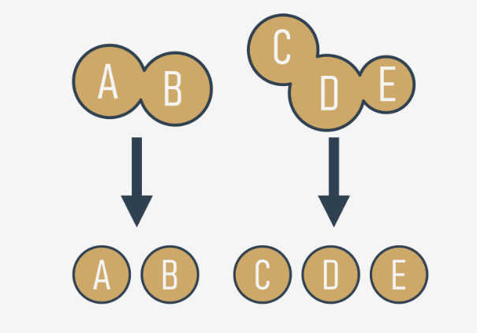
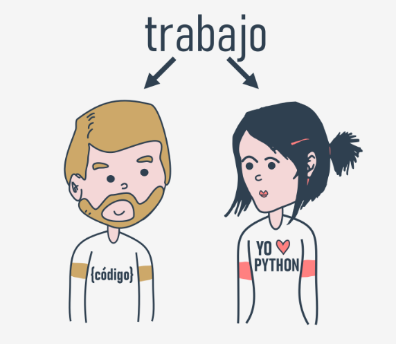
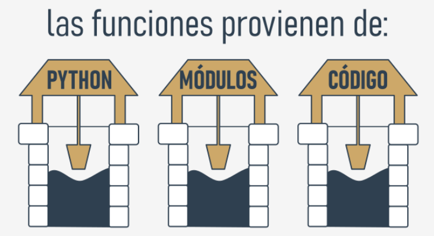
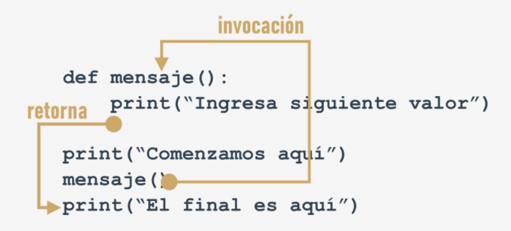

# Módulo 4

**En este módulo, aprenderás:**

- Cómo definir y utilizar funciones.
- Cómo pasar argumentos y las distintas formas de hacerlo.
- El alcance de los nombres.
- Tuplas y diccionarios.
- Procesamiento de datos.

---

## 4.1.1 Funciones

**¿Por qué necesitamos funciones?**

Puede suceder que el algoritmo que se desea implementar sea tan complejo que el código comience a crecer de manera incontrolada y, de repente, ya no se puede navegar por él tan fácilmente. :tired_face: 

Se puede intentar solucionar este problema comentando el código, pero pronto te darás cuenta que esto empeorará la situación - **demasiados comentarios hacen que el código sea más difícil de leer y entender**. Algunos dicen que **una función bien escrita debe ser comprensible con tan solo una mirada**.

Un buen desarrollador **divide el código** (o mejor dicho: el problema) en piezas aisladas, y **codifica cada una de ellas en la forma de una función**.

Esto simplifica considerablemente el trabajo del programa, debido a que cada pieza se codifica por separado y consecuentemente se prueba por separado. A este proceso se le llama comúnmente **descomposición**.




:exclamation: :eyes:   Existe una segunda condición: **si un fragmento de código se hace tan extenso que leerlo o entenderlo se hace complicado, considera dividirlo pequeños problemas por separado e implementa cada uno de ellos como una función independiente**.

Esta descomposición continua hasta que se obtiene un conjunto de funciones cortas, fáciles de comprender y probar :sparkles:

---


### Descomposición 

Es muy común que un programa sea tan largo y complejo que no puede ser asignado a un solo desarrollador, y en su lugar un **equipo de desarrolladores** trabajarán en el. El problema, debe ser dividido entre varios desarrolladores de una manera en que se pueda asegurar su eficiencia y cooperación.



Es inconcebible que más de un programador deba escribir el mismo código al mismo tiempo, por lo tanto, el trabajo debe de ser dividido entre todos los miembros del equipo.

Este tipo de descomposición tiene diferentes propósitos, no solo se trata de **compartir el trabajo**, sino también de **compartir la responsabilidad** entre varios desarrolladores.

Cada uno debe escribir un conjunto bien definido y claro de funciones, las cuales al ser **combinadas dentro de un módulo** (esto se clarificara un poco mas adelante) nos dará como resultado el producto final.

:exclamation: :eyes: Esto nos lleva directamente a la tercera condición: si se va a dividir el trabajo entre varios programadores, **se debe descomponer el problema para permitir que el producto sea implementado como un conjunto de funciones escritas por separado empacadas juntas en diferentes módulos**.

**De dónde provienen las funciones**

En general, las funciones provienen de al menos tres lugares:

- De Python mismo: varias funciones (como `print()`) son una **parte integral de Python**, y siempre están disponibles sin algún esfuerzo adicional del programador; se les llama a estas funciones **funciones integradas**.
- De los **módulos preinstalados** de Python: muchas de las funciones, las cuales comúnmente son menos utilizadas que las integradas, están disponibles en módulos instalados juntamente con Python; para poder utilizar estas funciones el programador debe realizar algunos pasos adicionales (se explicará acerca de esto en un momento).
- **Directamente del código**: tu puedes escribir tus propias funciones, colocarlas dentro del código, y usarlas libremente.
- Existe una posibilidad más, pero se relaciona con clases, se omitirá por ahora.




----


### Escribir funciones

**Tu primer función**

Observa el fragmento de código

```py
print("Ingresa un valor: ")
a = int(input())

print("Ingresa un valor: ")
b = int(input())

print("Ingresa un valor: ")
c = int(input())
```

Es bastante sencillo, es un ejemplo de como **transformar una parte de código que se esta repitiendo en una función**.

¿Es posible separar ese código *repetido*, darle un nombre y hacerlo reutilizable? Significaría que **el cambio hecho en un solo lugar será propagado a todos los lugares donde se utilice**.

 Es posible, esto es exactamente para lo que existen las funciones, pero ¿cómo es que se crea dicha función? :question: 

Así es como se ve la definición más simple de una función:

```python
def nombreFuncion():
	cuerpoFuncion
```

- Siempre comienza con la **palabra reservada `def`** (que significa *definir*)
- Después de `def` va el **nombre de la función** (las reglas para darle nombre a las funciones son las mismas que para las variables).
- Después del nombre de la función, hay un espacio para un par de **paréntesis** (ahorita no contienen algo, pero eso cambiará pronto).
- La línea debe de terminar con **dos puntos**.
- La línea inmediatamente después de `def` marca el comienzo del **cuerpo de la función** - donde varias o (al menos una). **instrucción anidada**, será ejecutada cada vez que la función sea invocada; nota: la **función termina donde el anidamiento termina**, se debe ser cauteloso.


A continuación se **definirá** la función. Se llamará `mensaje`

```python
def mensaje():
    print("Ingresa un valor: ")
```

La función es muy sencilla, pero completamente **utilizable**. Se ha nombrado `mensaje`, pero eso es opcional, tu puedes cambiarlo. Hagamos uso de ella.

```python
def mensaje():
    print("Ingresa un valor: ")

print("Se comienza aquí.")
mensaje()
print("Se termina aquí.")

>>> Se comienza aquí.
Ingresa un valor: 
Se termina aquí.
```

---

### El funcionamiento de las funciones



La imagen intenta mostrar el proceso completo:

- Cuando se **invoca** una función, Python recuerda el lugar donde esto ocurre y *salta* hacia dentro de la función invocada.
- El cuerpo de la función es entonces **ejecutado**.
- Al llegar al final de la función, Python **regresa** al lugar inmediato después de donde ocurrió la invocación.

:warning: **Consideraciones** :warning:

1. **No se debe invocar una función antes de que se haya definido.**

   * Recuerda: Python lee el código de arriba hacia abajo. No va a adelantarse en el código para determinar si la función invocada esta definida mas adelante, el lugar correcto para definirla es antes de ser invocada.

   * ```python
     print("Se comienza aquí.")
     mensaje()
     print("Se termina aquí.")
     
     def mensaje():
         print("Ingresa un valor: ")
       
     >>> NameError: name 'mensaje' is not defined
     ```

2. **Una función y una variable no pueden compartir el mismo nombre**

   * ```python
     def mensaje():
         print("Ingresa un valor: ")
     
     mensaje = 1
     ```

   * El asignar un valor al nombre "mensaje" causa que Python olvide su rol anterior. La función con el nombre de `mensaje` ya no estará disponible.

Regresemos al ejemplo inicial para implementar la función de manera correcta:

```python
def mensaje():
    print("Ingresa un valor: ")

mensaje()
a = int(input())
mensaje()
b = int(input())
mensaje()
c = int(input())
```


El modificar el mensaje de entrada es ahora sencillo: se puede hacer con solo **modificar el código una única vez** - dentro del cuerpo de la función.

---

### ⚜️ PUNTOS CLAVE ⚜️

1. Una **función** es un bloque de código que realiza una tarea especifica cuando la función es llamada (invocada). Las funciones son útiles para hacer que el código sea reutilizable, que este mejor organizado y más legible. Las funciones contienen parámetros y pueden regresar valores.

2. Existen al menos cuatro tipos de funciones básicas en Python:

   - **Funciones integradas** las cuales son partes importantes de Python (como lo es la función `print()`). Puedes ver una lista completa de las funciones integradas de Python [aquí]( https://docs.python.org/3/library/functions.html)
   - También están las que se encuentran en **módulos pre-instalados** (se hablará acerca de ellas en el *Módulo 5* de este curso).
   - **Funciones definidas por el usuario** las cuales son escritas por los programadores para los programadores, puedes escribir tus propias funciones y utilizarlas libremente en tu código.
   - Las funciones `lambda` (aprenderás acerca de ellas en el *Módulo 6* del curso).

3. Las funciones propias se pueden definir utilizando la palabra reservada `def` y con la siguiente sintaxis:

   * ```python
     def tuFuncion (parámetros opcionales):
         # el cuerpo de la función
     ```

   * Se puede definir una función sin que haga uso de argumentos, por ejemplo: 

   * ```python
     def mensaje():    # definiendo una función
         print("Hola")    # cuerpo de la función
     
     mensaje()    # invocación de la función 
     ```

   * También es posible definir funciones con argumentos, como la siguiente que contiene un solo parámetro:

   * ```python
     def hola(nombre):    # definiendo una función
         print("Hola,", nombre)    # cuerpo de la función
     
     
     nombre = input("Ingresa tu nombre: ")
     
     hola(nombre)    # invocación de la función
     ```

---

## 4.1.2 Cómo las funciones se comunican con su entorno

### Funciones con parámetros

